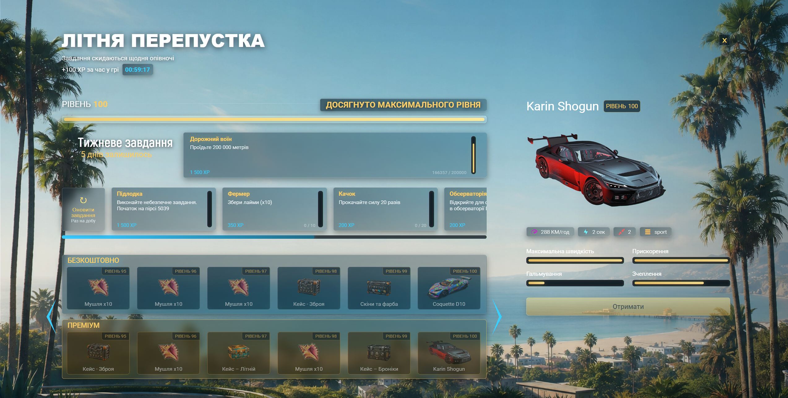
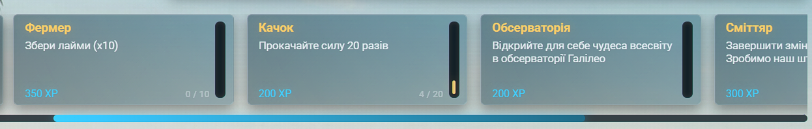
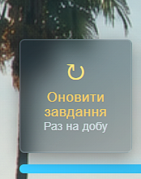
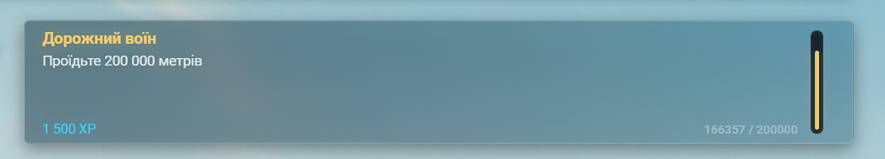
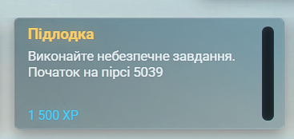
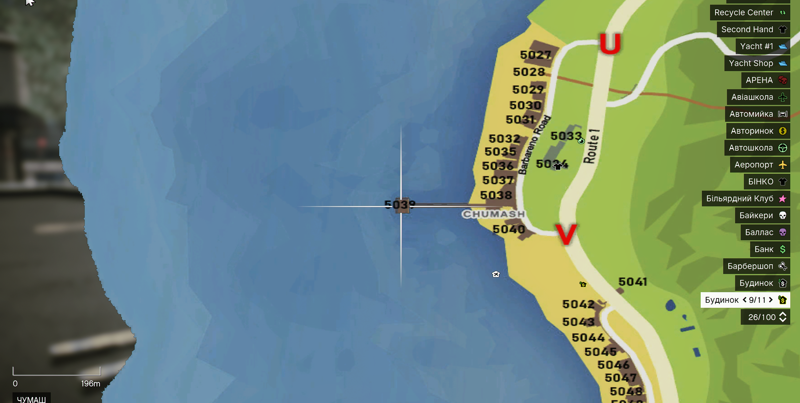

# Батлпас

Батлпас — система прогресу з нагородами за гру та виконання завдань. Ви можете розвивати його легальною роботою, подорожами штатом, кримінальними активностями та іншими ігровими механіками — головне, щоб дія відповідала умові завдання.

## Як відкрити

Натисніть **`F10`**.

У меню доступні:

- поточний **рівень** і **XP**;
- **щоденні** та **тижневі** завдання;
- **безкоштовна** та **преміум**-лінії нагород;
- кнопка **«Оновити завдання»** (деталі нижче).


Щоденні нагороди в [меню сервера](server-menu.md) і нагороди батлпаса забираються в **різних** меню. Перевіряйте обидва після входу в гру.


## Як нараховується досвід

| Джерело | Скільки |
| --- | --- |
| Виконання завдань | Залежить від завдання (див. опис у меню) |
| Час у грі | **100 XP** кожні **60 хвилин** активної гри |
| Тижневі завдання | **1 500 XP** за кожне |

Після виконання завдання натисніть на нього в меню, щоб **забрати XP**. Нагороди за рівні забираються окремо — кнопкою **«Отримати»** на картці винагороди.

### Рівні та нагороди

Кожен новий рівень вимагає **1 000 XP** (перший рівень — після набору 1 000 XP від старту).

У батлпасі є дві лінії:

| Лінія | Доступ |
| --- | --- |
| **Безкоштовна** | Для всіх гравців |
| **Преміум** | Потрібен преміум-доступ (оформлення через меню батлпаса) |

Серед нагород: гроші, предмети, одяг, транспорт, лутбокси. Перед отриманням:

1. Звільніть місце в [інвентарі](../character/inventory.md).
2. Якщо нагорода пропонує **вибір кольору одягу** — перегляньте варіанти до підтвердження.
3. Нагорода-транспорт потрапить на паркінг **«Куби»** (Legion Square) — ліміт кількості авто не діє.

## Щоденні завдання

Щодня ви отримуєте **5 завдань**. Вони можуть стосуватися робіт, подорожей, спорту, криміналу та інших активностей на сервері.

| Параметр | Значення |
| --- | --- |
| Кількість | **5** на день |
| Оновлення | Щодня о **00:00** за **київським часом** |
| Після оновлення | Новий набір завдань; незавершені з попереднього дня зникають |

### Приклади типів завдань

| Тип | Що робити |
| --- | --- |
| **Відвідати місце** | Доїхати до точки на мапі (мерія, гора Чиліад, аеропорт тощо) |
| **Пробіг / плавання / біг** | Набрати вказану відстань (метри в описі) |
| **Робота** | Виконати зміну: таксі, будівництво, рибалка, фермерство тощо |
| **Транспорт** | Проїхати певну відстань на BMX, човні, авто певного класу |

Деякі завдання з’являються лише за певних умов (рівень роботи, фермерський рівень, відсутність банди тощо). Якщо завдання здається «неможливим» — перевірте опис повністю.

### Заміна завдання (раз на добу)

Якщо одне з щоденних завдань не підходить, його можна **оновити**:

1. Відкрийте батлпас → вкладка завдань.
2. Натисніть **«Оновити завдання»** (ліва картка в ряду daily).
3. Підтвердіть дію другим натисканням протягом 5 секунд.

| Правило | Деталі |
| --- | --- |
| Ліміт | **1 раз на добу** |
| Що змінюється | Лише **незавершені** щоденні завдання |
| Вже виконані | Залишаються без змін |
| Усі 5 виконано | Оновлення недоступне до наступного дня |


Витрачайте заміну на завдання, яке реально важко виконати сьогодні — другого шансу до опівночі за Києвом не буде.


## Тижневі завдання

Тижневі завдання потребують більше часу, але дають **1 500 XP** кожне. Таймер тижня відображається в меню батлпаса.

### «Дорожній воїн»

Проїдьте на транспорті **200 000 метрів** за тиждень. Підходить будь-який клас авто — головне, щоб ви були за кермом.

### «Підлодка»

Виконайте небезпечне завдання на **північному узбережжі** (квадрат **5039** на мапі).

1. Приїдьте на пірс у районі північного узбережжя.
2. Підніміться на пірс і знайдіть NPC із біноклем.
3. Взаємодійте з ним і оберіть **«Start Heist»**, щоб розпочати.

**Підготовка (обов’язково):**

| Що мати | Навіщо |
| --- | --- |
| Зброя + набої | Бойові сцени всередині завдання |
| Медикаменти | Відновлення здоров’я |
| Бронежилет | Захист під час перестрілки |

Не починайте без повного спорядження — повернутися за набоями всередині завдання складно.

## З чого почати новачку

1. Відкрийте батлпас (`F10`) і прочитайте всі 5 щоденних завдань.
2. Оберіть 1–2, що збігаються з вашими планами на сесію (робота, поїздка в інший район).
3. Виконайте дію в грі й перевірте прогрес у меню.
4. Заберіть XP натисканням на завершене завдання.
5. Коли відкриється рівень — заберiть нагороду й звільніть інвентар заздалегідь.

## Якщо завдання не зарахувалося

1. Звірте формулювання: схожа дія може **не** відповідати умові (інша робота, інший клас транспорту).
2. Закрийте та знову відкрийте меню батлпаса.
3. Для завдань з відвідуванням місця — переконайтесь, що ви в зоні (інколи потрібно зупинити авто або зайти в будівлю).
4. Якщо прогрес не змінився після правильної дії — `F4` → **«Скарги / питання»**: назва завдання, що зробили, приблизний час.
