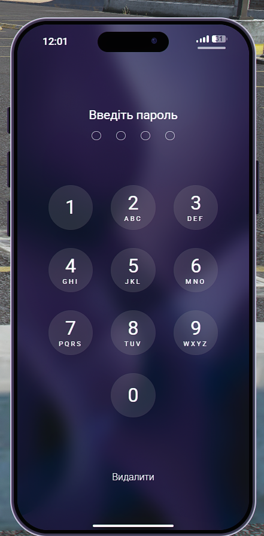
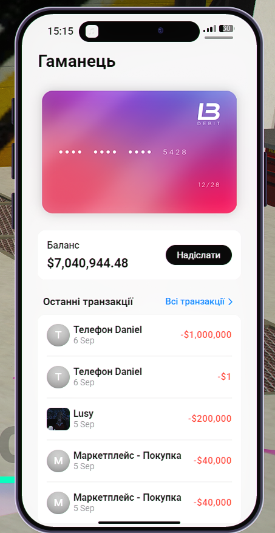
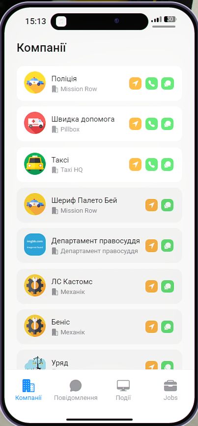
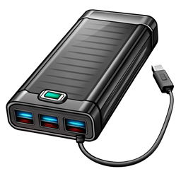

# Телефон

Смартфон — головний інструмент зв'язку, фінансів, навігації та пошуку послуг у штаті. Через нього ви телефонуєте іншим мешканцям, керуєте грошима, дивитесь оголошення, знаходите роботу та викликаєте служби.

Без предмета **«Телефон»** в [інвентарі](../character/inventory.md) меню не відкриється — навіть якщо натиснути клавішу.

## Як відкрити та закрити

- **Відкрити / закрити телефон** — `M`

Перед відкриттям переконайтесь, що не відкрите інше меню (інвентар, меню сервера, банк тощо).

## Розблокування

Після натискання `M` спочатку з’являється **екран блокування**.

<figure><figcaption></figcaption></figure>

1. Натисніть **білу смужку** внизу екрана.
2. Якщо встановлений пароль — введіть **4-значний код**.
3. Після правильного коду відкриється головний екран.


На сервері крадіжка даних телефону вимкнена — пароль можна не встановлювати. Для новачків це зручніше: одразу потрапляєте на головний екран.


Якщо пароль увімкнений:

<figure><figcaption></figcaption></figure>

## Головний екран

Усі застосунки розташовані на **двох сторінках** головного екрана. Гортайте вліво / вправо, щоб переглянути повний список.

<figure><figcaption></figcaption></figure>

<figure><figcaption></figcaption></figure>

## Застосунки телефону

### Соціальні мережі та медіа

- **Пташка** — Соцмережа: дописи, стрічка, спілкування з мешканцями штату
- **Інста-пік** — Фото та прямі трансляції
- **TikTут** — Короткі відеоролики
- **Музика** — Прослуховування музики _(наразі не працює)_

Після отримання телефону варто зареєструвати акаунт у **«Пташці»** і написати про своє прибуття — мешканці часто відповідають новачкам і допомагають з орієнтацією.

### Торгівля та фінанси

- **Торгова площадка** — Оголошення гравців: купівля / продаж транспорту, речей тощо (дублює [маркетплейс](marketplace.md))
- **Гаманець** — Баланс банку, історія операцій, перекази (див. нижче)
- **Gcoin** — Робота з Gcoin на сервері

### Транспорт і житло

- **Гараж** — Список ваших авто: стан, геолокація на вулиці або номер гаражу
- **Мій будинок** — Нерухомість: адреса на карті, керування ключами

**Гараж** — якщо авто залишили на вулиці, у застосунку видно **геолокацію** на мапі. Якщо машина в гаражі — показується, **в якому саме**.

<figure><figcaption></figcaption></figure>

<figure><figcaption></figcaption></figure>

### Навігація та утиліти

- **Карти** — Навігація, пошук точок на мапі
- **Погода** — Поточні погодні умови
- **Годинник** — Час
- **Калькулятор** — Розрахунки
- **Нотатки** — Особисті текстові записи
- **Диктофон** — Запис аудіо
- **Browser** — Внутрішньоігровий браузер

### Зв'язок

- **Телефон** — Дзвінки за номером
- **Повідомлення** — SMS між гравцями
- **Контакти** — Список контактів, дзвінки, обмін номерами
- **Пошта** — Електронна пошта; сповіщення про взлом авто, знищення майна тощо
- **Послуги** — Дзвінок і повідомлення в служби штату (див. нижче)

### Робота та спеціальні сервіси

- **Праця** — Вакансії та працевлаштування — зручно для новачків
- **Дарк-нет** — Нелегальні зв’язки між кримінальними угрупуваннями
- **Налаштування** — Параметри телефону, пароль, зовнішній вигляд
- **Застосунки** — Додаткові програми

## Гаманець

Застосунок для роботи з грошима: перегляд балансу, історія транзакцій, перекази іншим гравцям. Дублює функції [банку](bank.md).

<figure><figcaption></figcaption></figure>

### Переказ грошей

1. Відкрийте **«Гаманець»**.
2. Оберіть **переказ**.
3. **Одержувач має бути у ваших контактах** — спочатку обміняйтесь контактами (див. розділ «Контакти»).
4. Вкажіть суму та підтвердіть операцію.

<figure><figcaption></figcaption></figure>

Для переказу потрібен **Citizen ID / Passport ID** одержувача (не тимчасовий ID над головою). Свій ID дивіться в [меню сервера](server-menu.md).


Перевіряйте ID і суму перед підтвердженням. Повернення помилкового переказу — лише через домовленість з одержувачем у RP.


## Послуги

У **«Послуги»** зібрані державні та цивільні організації: поліція, шериф, EMS, таксі, механіки, бізнеси тощо.

<figure><figcaption></figcaption></figure>

- **Подивитись список служб** — Відкрити «Послуги» → прокрутити список
- **Подзвонити** — Натиснути кнопку дзвінка біля потрібної служби
- **Написати** — Надіслати повідомлення — воно збережеться, навіть якщо ніхто офлайн

Це зручний спосіб **знайти роботу в бізнесі**: напишіть у заклад, де хочете працювати, або домовтесь про зустріч.

## Контакти

1. Відкрийте **«Контакти»**.
2. Угорі натисніть рядок **«Телефон (Ваше ім’я)»** — відкриється ваш власний контакт.
3. Справа натисніть **«Поділитись»**.
4. Оберіть гравця поруч, з яким хочете обмінятись контактом.

Після обміну можна дзвонити, писати SMS і переказувати гроші через «Гаманець».

## Підзарядка телефону

- **Павербанк**; Де купити: **«Діджитал Ден»** (див. [Магазини](shops.md)); Дія: Використати в інвентарі — підзаряджає телефон

## Телефон і рація

- **Телефон** — Цивільне життя: дзвінки, банк, оголошення, послуги
- **Рація** — Службовий / груповий зв’язок на частотах (див. [Рація](radio.md))

Це різні предмети в інвентарі. Телефон не замінює рацію на службі.

## Якщо телефон не працює

- **Меню не відкривається** — Чи є предмет **«Телефон»** в інвентарі
- **Нічого не відбувається при `M`** — Закрийте інвентар, меню сервера, банк
- **Телефон загублено** — Купіть новий у **«Діджитал Ден»** (\~1 200$ за базову ціну власника)
- **Не бачите переказ** — Чи додано одержувача в **контакти**


Новий телефон — окремий предмет. Після покупки покладіть його в інвентар і переконайтесь, що він не в сховищі будинку чи багажнику.

