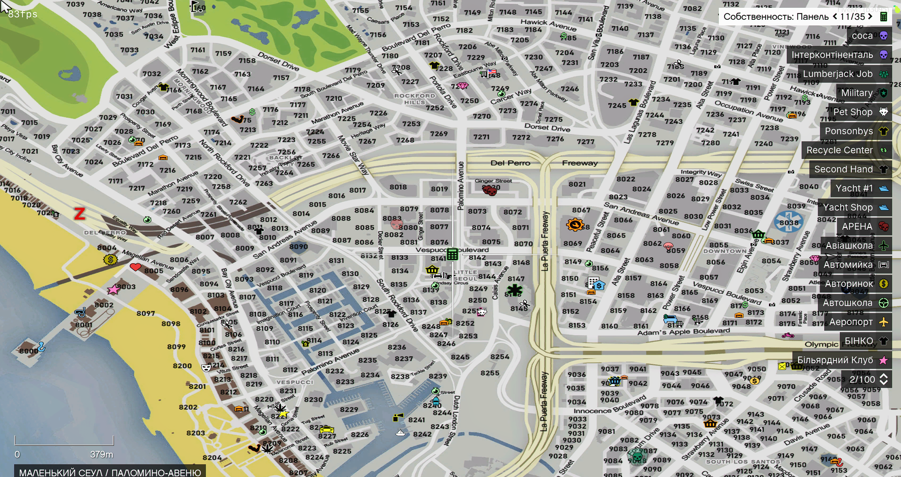

# Рація

Тримайте зв'язок із командою чи організацією на відстані: рація передає ваш голос усім, хто налаштований на ту саму **хвилю** (частоту), незалежно від того, як далеко ви одне від одного. Нею користуються державні структури, організації, підрозділи та всі, кому потрібен зв'язок на відстані.

## Голос поруч і рація

Це **різні** речі, тож не плутайте їх.

**Голос поруч** — чують лише ті, хто поруч. Дальність (шепіт / нормально / крик) перемикаєте **`~`** — див. [Керування](controls.md).

**Рація** — чують усі на **одній хвилі**, незалежно від того, як далеко ви від'їхали. Спочатку підключіться до хвилі в меню рації (див. нижче), а потім говорите, **утримуючи `9`** — без підключення до хвилі клавіша нічого не передає. Якщо `9` не зручна, перепризначте її в **Налаштування → Призначення клавіш → FiveM** — шукайте рядок **«Говорити в рацію»** (pma-voice):

<figure><figcaption>
Рядок «Говорити в рацію» (pma-voice) у налаштуваннях FiveM
</figcaption></figure>

Перед першим ефіром увімкніть голосовий чат у FiveM і оберіть мікрофон — без цього не працює ні рація, ні голос поруч.

## Де придбати рацію

Рацію продають у **«Діджитал Ден»** — магазинах електроніки. На мапі (`P`) шукайте бліп  **«Магазин електроніки Діджитал Ден»**. У штаті **два** таких магазини:

<figure><figcaption>
Little Seoul / Palomino Avenue
</figcaption></figure>

<figure><figcaption>
Mirror Park / Nikola Avenue
</figcaption></figure>

Знайдіть **Діджитал Ден** на мапі, підійдіть до каси й відкрийте меню магазину. Серед товарів знайдіть **Рацію**, оберіть її та підтвердьте покупку.

<figure><figcaption>
Рація в розділі «Електроніка» (~**$3 500**)
</figcaption></figure>

## Хвилі: які доступні

Хвилі **1–10** призначені лише для **державної служби на зміні** (поліція, шериф, EMS, військові; на **9–10** також DOJ). Хвилі **11–500** доступні всім гравцям — сім'ям, бізнесам, подіям, приватним каналам.

Спроба зайти на **1–10** без службової роботи на зміні завершиться помилкою — це службовий діапазон, не «зайнята частота».


Для координації з друзями обирайте хвилю **від 11** (наприклад, `42` або `123.45`) і домовляйтесь про неї в RP.


## Підключення до хвилі

1. Відкрийте рацію в [інвентарі](../character/inventory.md) (`Tab` → **ПКМ** → **Використати**).
2. Введіть хвилю у поле на дисплеї — ціле число **від 11 до 500** (дробові значення теж підтримуються, наприклад `23.33`).
3. Перевірте введення й натисніть **зелену кнопку** (зелена трубка).

<figure><figcaption>
Введення хвилі на дисплеї; зліва/справа — регулювання гучності; зелена / червона кнопки — підключити / відключити
</figcaption></figure>

Після підключення ви чутимете всіх на цій хвилі й зможете відповідати, **утримуючи `9`**.

Щоб залишити поточну хвилю, відкрийте рацію та натисніть **червону кнопку** (червона трубка). Стрілками **вгору / вниз** біля дисплея регулюйте гучність — наскільки голосно чути інших на хвилі; сама частота при цьому **не** змінюється.

## Правила ефіру

Радіозв'язок є частиною RP-процесу, тому передавайте лише доречну IC-інформацію: службові повідомлення, запити на допомогу, координаційні команди чи орієнтування. Говоріть коротко й зрозуміло, дотримуйтеся субординації своєї організації та не засмічуйте ефір сторонніми повідомленнями.


Не передавайте через IC-рацію OOC-інформацію, якщо це заборонено правилами сервера.

