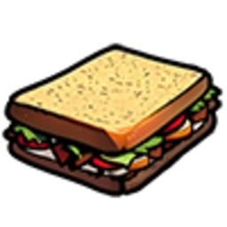
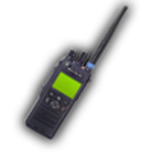
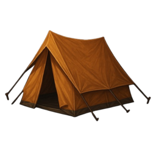
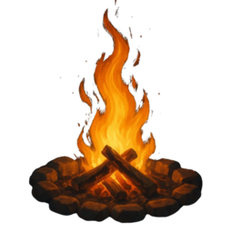
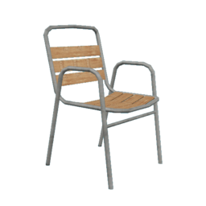

# Магазини

У штаті є десятки торгових точок: від звичайних крамниць з фіксованим асортиментом до **магазинів під керуванням гравців**, де ціни й наявність залежать від власника бізнесу.

## Два типи магазинів

| Тип | Хто визначає ціни | Як відкрити меню |
| --- | --- | --- |
| **Звичайний магазин** | Сервер (фіксований список) | Підійдіть до продавця / каси → **`E`** / **`лівий Alt`** ([Керування](controls.md)) |
| **Магазин гравця** | Власник бізнесу (у межах мін./макс.) | Підійдіть до точки продажу → `E` → **«Відкрити магазин»** |

### Важливі відмінності

- У **магазинах гравців** товар може **закінчитись**, якщо власник не поповнив склад.
- У **звичайних** асортимент стабільний, але не всі речі там продаються.
- Власник може **перейменувати** магазин — орієнтуйтесь на бліп на мапі або каталог у [мерії](city-hall.md).
- Оплата: **готівка** або **картка** (банківський рахунок) — залежно від меню.

## Де що шукати

| Потрібно | Куди звернутися | На мапі |
| --- | --- | --- |
| Їжа та напої | Магазини **24/7**, кафе |  «Магазин» |
| Телефон, рація, павербанк | **«Діджитал Ден»** |  «Магазин електроніки Діджитал Ден» |
| Бандаж, аптечка | **Аптека** (Палето-Бей та інші 24/7) |  «Магазин» |
| Гаманець, тексти законів | **«Документи»** в [мерії](city-hall.md) |  Мерія |
| Спортивне харчування | **Спортзал** |  «Спортзал» |
| Спорядження для відпочинку | **«Магазин барбекю»** |  «Магазин барбекю» |
| Зброя, патрони | **Ammunation** |  Зброя |
| Інструменти, ремонт | **YouTool**, **Benny's** |  Побутовий / тюнінг |
| Речі інших гравців | [Маркетплейс](marketplace.md) |  «Маркетплейс» |

Якщо потрібний бізнес складно знайти — вкладка **«Бізнеси в місті»** в [центрі зайнятості](city-hall.md) або запит у **«Послуги»** [телефону](phone.md).

## Як зробити покупку

1. Приїдьте до магазину та підійдіть до каси або точки продажу.
2. Відкрийте меню через **`E`** / **`лівий Alt`** ([Керування](controls.md)) або підказку на екрані.
3. Оберіть **категорію** (у магазинах гравців).
4. Додайте товар і кількість, перевірте **ціну** та **спосіб оплати**.
5. Підтвердіть покупку.
6. Перевірте [інвентар](../character/inventory.md) — предмет має з’явитись у слотах.

Деякі точки доступні лише певним роботам (поліція, медики, уряд). Якщо меню не відкривається — перевірте посаду.


У магазинах гравців ціна може відрізнятись від таблиць нижче: власник задає її в межах дозволеного діапазону. Таблиці показують **базову / типову** вартість.


## Магазини 24/7

Найпоширеніша мережа крамниць. Без власника зазвичай доступні категорії **«Їжа»** та **«Напої»**; з власником — також алкоголь, побутове, аптека (залежить від магазину).

### Їжа

| Предмет | Базова ціна | Ефект |
| --- | --- | --- |
|  Тост з сиром | ~200$ | Відновлює голод (~20%) |
|  Сендвіч | ~250$ | Перекус, відновлення голоду |
| Цукерки Twerks | ~150$ | Легкий перекус |
| Цукерки Snikkel | ~200$ | Легкий перекус |

### Напої

| Предмет | Базова ціна | Ефект |
| --- | --- | --- |
|  Вода | ~500$ | Вгамовує спрагу |
|  Кола | ~400$ | Вгамовує спрагу |
| Спранк | ~500$ | Газований напій |
| Енергетик | ~700$ | Освіжає, знімає втому |

### Аптека (не в кожному 24/7)

| Предмет | Базова ціна | Призначення |
| --- | --- | --- |
|  Бандаж | ~50$ | Легке лікування поранень |
|  Аптечка | ~5 000$ | Серйозніше відновлення здоров’я |

## «Діджитал Ден»

Магазин електроніки. Типова стартова точка для телефону та рації.

| Предмет | Базова ціна | Навіщо |
| --- | --- | --- |
|  Телефон | ~1 200$ | Відкриває меню телефону (`M`) |
|  Рація | ~3 500$ | Зв’язок на частотах |
|  Павербанк | ~500$ | Підзарядка телефону |
| Гоночний планшет (Гонки GPS) | ~1 000$ | Вуличні [гонки](../transport/racing.md) |
| Соціальний трекер | ~20 000$ | Додатковий гаджет |

## «Магазин барбекю»

Окрема державна точка (не магазин гравця). Асортимент для пікніків і приготування на природі.

| Категорія | Приклади | Ціна від |
| --- | --- | --- |
| Спорядження | Намет, багаття, шатро, стілець, стіл, прожектор | 300$–2 500$ |
| Продукти | Цибуля, перець, ковбаски, соуси, спеції | 2$–650$ |

  

## YouTool та Benny's

| Магазин | Що продає | Приклади |
| --- | --- | --- |
| **YouTool** | Побутове, інструменти |  Відмичка ~500$, ремонтний набір ~5 000$, бінокль, феєрверки |
| **Benny's** | Тюнінг і запчастини | Деталі для [тюнінгу](../transport/tuning.md), замовлення на обслуговування |

## Ammunation

Продаж зброї, патронів і косметичних скінів на зброю. Для вогнепальної зброї потрібна **ліцензія** — оформлюється окремо. Детальніше в гайді по документах і законах.

## Якщо товару немає

1. Спробуйте **інший магазин** тієї ж мережі.
2. Напишіть власнику через **«Послуги»** в [телефоні](phone.md).
3. Для спеціального спорядження відкрийте гайд відповідної [роботи](city-hall.md) або [бізнесу](../business/twenty-four-seven.md).

## Якщо ви власник бізнесу

| Параметр | Значення |
| --- | --- |
| Максимум власних магазинів | **3** |
| Максимум роботи найманим | **2** (окрім власних) |
| Панель власника | Службова зона → `E` → **«Відкрити панель власника»** |
| Постачання | Товар треба **закуповувати і доставляти** — без цього полиці порожні |

Детальніше про ведення бізнесу — у розділі [Магазин 24/7](../business/twenty-four-seven.md).


На початку гри варто мати запас їжі та води на одну поїздку. Використовуйте їх через інвентар і стежте за [статусами персонажа](../character/statuses.md).

