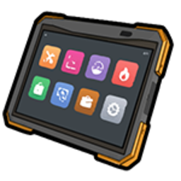

# Автомайстерня

Повноцінний сервіс: ремонт, тюнінг, нітро, планове обслуговування. **Benny's** також продає запчастини як окремий [магазин гравця](twenty-four-seven.md).

## Для клієнта

1. Заїдьте в зону майстерні (підйомник / бай).
2. Зверніться до [механіка](../jobs/mechanic.md) IC або через **«Послуги»** в [телефоні](../basics/phone.md).
3. Дочекайтесь виконання робіт, сплатіть рахунок.

Без механіка на зміні — [самообслуговування](../transport/tuning.md) в зонах **Customs** на мапі.

## Для власника / механіка

### Планшет механіка

| Інструмент | Як відкрити |
| --- | --- |
| **Планшет механіка** | `Tab` → предмет у [інвентарі](../character/inventory.md) → **ПКМ**  → **Використати** |
| Посада **механік** | Потрібна для робіт у зоні СТО |
| Склад | Запчастини Benny's або закупівля в [магазинах](../basics/shops.md) |

У планшеті: замовлення на ремонт / тюнінг, склад деталей, рахунок клієнту.

Заробіток: маржа на роботах + продаж деталей.

## Зони самообслуговування

| Орієнтир | Де |
| --- | --- |
| Доки LS | Південь міста |
| Марина | Захід LS |
| Sandy Shores | Пустеля |

Деталі — [Тюнінг](../transport/tuning.md).

## Поради

- Передпродажне ТО — популярна послуга для [шоурумів](showroom.md).
- Якщо механік на зміні — не чекайте в зоні підйомника без IC-звернення.
