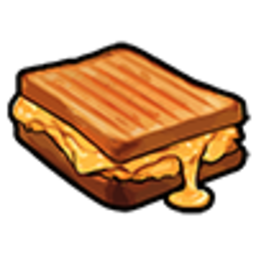
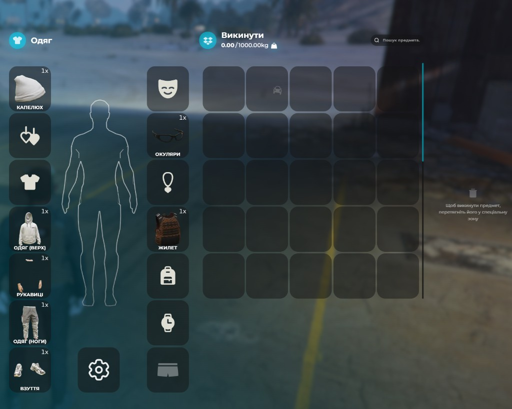

# Інвентар

Інвентар зберігає все, що носить персонаж: їжу, одяг, інструменти, документи, зброю та цінності. Від нього залежить виживання, заробіток і безпека речей під час пограбувань.

## Основні параметри

- **Слотів** — **60** (частина зарезервована під одяг)
- **Переносна вага** — **25 кг** без рюкзака (з рюкзаком — [35–50 кг](inventory.md#слоти-одягу-та-рюкзаки))
- **Відкрити інвентар** — `Tab`
- **Другий інвентар (багажник, сховище)** — `F2`
- **Швидка панель (hotbar)** — `Z`


Якщо вага перевищена, нові предмети не додадуться, поки ви не звільните місце або не зменшите навантаження — наприклад, знімете рюкзак із важкими речами.


## Як відкрити та користуватись

Натисніть **`Tab`** — відкриється вікно інвентаря з вашим персонажем. **Лівий клік**  бере, кладе й перетягує предмети між слотами; **ПКМ**  на предметі відкриває контекстне меню дій. Перетягніть потрібну річ на швидку панель (`Z`) — і матимете доступ до неї без відкриття повного інвентаря.

### Дії з предметом (ПКМ )

- **Використати** — їжа, напої, телефон, гаманець, медикаменти
- **Дати** — передати іншому гравцю поруч (з’явиться список людей поблизу)
- **Показати** — документи через гаманець (не плутати з «Дати»)
- **Викинути** — залишити предмет на землі


«Показати» і «Передати» — різні дії. Для документів використовуйте показ через [гаманець](../basics/documents.md), а не передачу картки в руки.


## Дорожня сумка

На старті ви отримуєте дорожню сумку разом із базовим набором (телефон, документи, їжа, вода, гроші — див. [Перші кроки](../getting-started/first-steps.md)).

При [грабежі](../crime/robbery-interaction.md) злочинці не можуть забрати речі із сумки (рюкзака) — лише з кишень основного інвентаря. А ось поліцейський при законному обшуку може переглянути сумку і вилучити нелегальні предмети: наркотики, незареєстровану зброю тощо.

## Слоти одягу та рюкзаки

Частина слотів зарезервована під одяг (верх, низ, взуття, аксесуари). Одяг можна знімати та надягати через інвентар — це змінює вигляд персонажа.

Рюкзаки збільшують максимальну переносну вагу: без рюкзака ліміт **25 кг**, з надітим рюкзаком — **35–50 кг** залежно від моделі (базовий — приблизно 35 кг, покращені — до 50 кг). Рюкзак — окремий предмет: надіньте його як одяг або покладіть у відповідний слот, залежно від меню.

## Їжа та напої

| Предмет                                                                                   | Ефект (орієнтовно) |
| ----------------------------------------------------------------------------------------- | ------------------ |
|  Тост з сиром | \~20% голоду       |
|  Вода          | Вгамовує спрагу    |
|  Кола             | Вгамовує спрагу    |

Їжа та напої псуються з часом — не купуйте надто багато про запас. Купівля — у [магазинах 24/7](../basics/shops.md).

## Зброя та патрони

- Зброя — окремий предмет в інвентарі
- Екіпірування — через «Використати» на предметі зброї
- Патрони заряджаються з інвентаря, якщо є відповідний калібр
- Не носіть зброю на виду без RP-приводу — це привертає увагу поліції

## Документи та гаманець

У слотах інвентаря лежить лише предмет «Гаманець» — ID-картка, права, ліцензії та інші документи зберігаються всередині нього, окремих карток в інвентарі немає.

Відкрити: **`Tab`** → ПКМ на **«Гаманець»** → **«Використати»** → оберіть потрібну картку. Детальніше — [Документи](../basics/documents.md).

Якщо гаманець втрачено, купіть новий на прилавку в [мерії](../basics/city-hall.md) (там же, де підручники з законами).

## Сховища та багажники

- **Будинок** — сховище в [житлі](../housing/house-management.md)
- **Авто** — підійдіть до машини → **`E`** / **`лівий Alt`** ([Керування](../basics/controls.md)) або `F2`
- **Смітники** — іноді можна знайти випадкові речі, але розраховувати на це як на заробіток не варто

При відкритті багажника або сховища з’являться два вікна поруч: ваш інвентар і сховище. Перетягуйте предмети між ними.

## Викинути та підібрати

Перетягніть предмет за межі інвентаря або оберіть **«Викинути»** в меню — на землі з’явиться сумка-проп, яку можуть підібрати інші гравці поруч.

<figure><figcaption>
Зліва — **Одяг**, справа — **«Викинути»** (Drop на вулиці). Перетягніть предмет у сітку або в **спеціальну зону** з іконкою смітника — він опиниться на землі
</figcaption></figure>

### Друге вікно (`Tab`)

Інвентар часто відкривається в двох панелях: зліва — ваші речі, справа — другий контейнер. Назва праворуч змінюється залежно від ситуації:

- **На вулиці** поруч із викинутими речами — **«Викинути»** (Drop): предмети на землі біля вас. Перетягніть із себе в цю панель — викинете; з панелі до себе — підберете
- **В авто** — **Бардачок** (сховище в салоні, не багажник — див. [Керування](../basics/controls.md))
- **Відкрита дорожня сумка** («Використати») — слоти сумки, вкладений інвентар
- **Біля багажника або сховища** — окремий контейнер; зазвичай через **`F2`**, не `Tab` (див. [вище](#сховища-та-багажники))

Якщо нічого з цього не підходить і поруч на землі нічого немає — другого вікна може не бути. Не залишайте цінності на вулиці без нагляду.

## Пограбування інвентаря

Якщо вас обшукують у RP:

- **Грабіжники** — лише кишені, вміст сумки недоступний; з піднятими руками можуть забрати всі дозволені речі, у нокдауні — лише один предмет
- **Поліція** — може обшукати сумку і вилучити нелегал за RP-підставою
- **Гаманець** — для документів; показуйте через нього, а не передавайте картки без потреби

Детальніше — у гайді [Взаємодія під час пограбування](../crime/robbery-interaction.md).


Тримайте в інвентарі мінімум їжі та води на одну поїздку, бандаж або аптечку — і перевіряйте [статуси](statuses.md) персонажа, щоб не впасти в непритомність від голоду.

