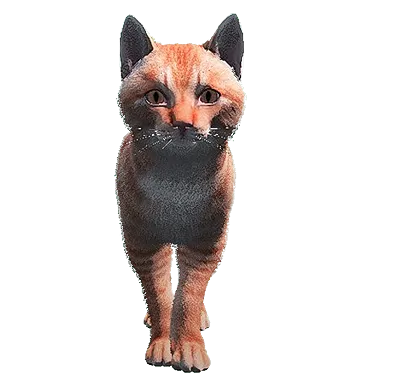
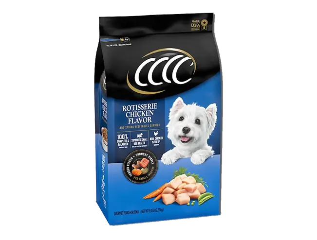
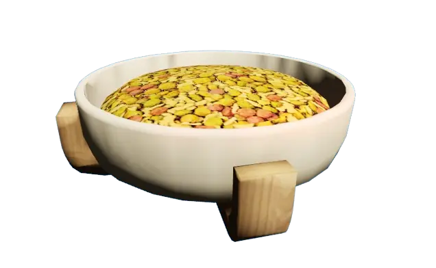
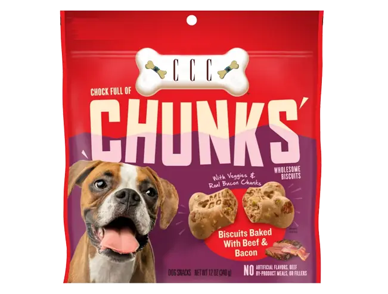
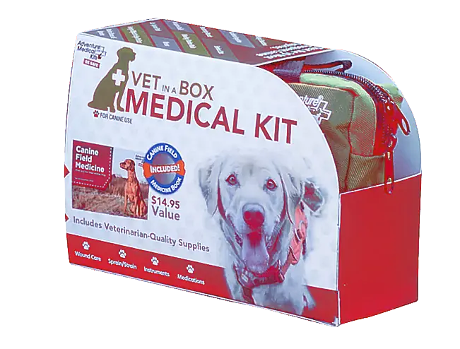
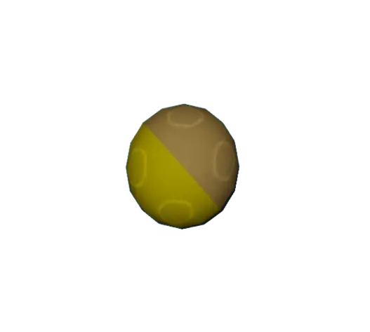
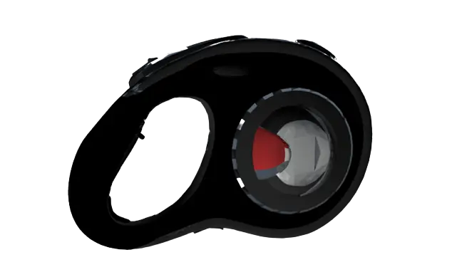
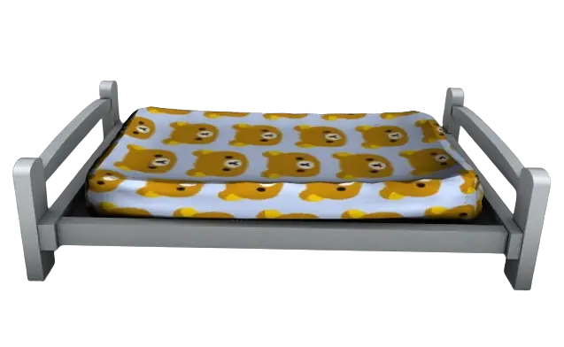
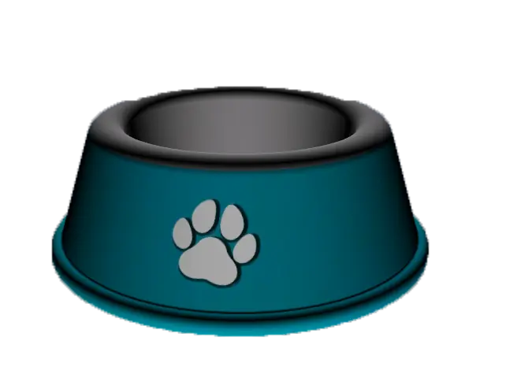

# Домашні улюбленці

На CRIMELAND можна завести **кота або собаку**, одягати їх, годувати та брати з собою в місто. Кожна тварина має власні **стати**, **інвентар** і **настрій**.

## Де відкрити меню

- **Радіальне меню** — **`F1`** → **Улюбленці**
- **Клавіша** — **`I`** (сумка улюбленців)

У сумці ви бачите всіх своїх тварин, можете **викликати** або **прибрати** улюбленця, відкрити його **інвентар** та **статистику**.

## Де купити

На мапі (`P`) — бліп  **«Pet Shop»** (центр міста, біля [кафе](../business/cafe.md)). Підійдіть до NPC-продавця → **`E`** / **`лівий Alt`** ([Керування](../basics/controls.md)).

У магазині доступні:

- **Тварини** — коти, собаки різних порід
- **Одяг** — комірці, капелюхи, взуття, окуляри, маски
- **Аксесуари** — повідок, миски, ліжка, іграшки
- **Догляд** — корм, вода, ліки

### Приклади порід і цін

| Іконка | Улюбленець | Вартість |
| --- | --- | --- |
|  | **Американський кіт (рудий)** | **500 000$** |
|  | **Готвеллер + К9** | **1 000 000$** |
|  | **Англійський бульдог (К9)** | **200 000$** + VIP-монети |
|  | **Далматинець + К9** | **260 000$** + VIP-монети |
|  | **Акіта (передзамовлення)** | VIP-монети |

Частина порід — **VIP** або **передзамовлення**: для покупки та виклику потрібен **активний VIP-статус**. Без VIP куплену раніше VIP-тварину **не вийде викликати**, поки статус не поновиться.


Собаки з позначкою **К9** — для [поліції](../police/k9.md). Купити та викликати їх можуть лише офіцери з відповідною роботою.


## Предмети догляду

Купуйте в зоомагазині й тримайте в **інвентарі улюбленця** — так зручніше годувати на вулиці.

| Іконка | Предмет | Для чого |
| --- | --- | --- |
|  | **Корм** | Відновлює **голод** |
|  | **Вода / миска** | Відновлює **спрагу** |
|  | **Ласощі** | Швидкий перекус, піднімає настрій |
|  | **Аптечка** | Лікування та **відродження** |
|  | **М’яч** | Гра «апорт» — росте **щастя** |
|  | **Повідок** | Контроль руху поруч із вами |
|  | **Ліжко** | Відпочинок, відновлення витривалості |
|  | **Миска** | Постановка вдома або на вулиці |

## Керування на вулиці

Спочатку **викличте** улюбленця з сумки. Поки він поруч (до **5 м**), доступні швидкі дії:

- **`G`** — Слідувати / залишитись на місці
- **`F`** — Меню улюбленця (стати, інвентар, одяг)
- **`H`** — Обійняти (підвищує щастя)
- **`X`** — Скасувати поточну дію

Якщо тварина відстане більше ніж на **40 м**, вона **телепортується** до вас, щоб не загубитись.

### Авто

Наведіть target на машину, коли улюбленець поруч — з’явиться опція **посадити** або **витягнути** з салону.

### Іграшки

Киньте **м’яч** з інвентаря улюбленця — він побіжить принести.

Це витрачає **голод**, **спрагу** та **витривалість**, але піднімає **настрій**.

## Статистика та догляд

Кожна тварина має показники **0–100**:

- **Голод** — падає з часом; при нулі шкодить здоров’ю
- **Спрага** — падає швидше під час слідування
- **Щастя** — низький рівень означає злий настрій
- **Вірність** — висока вірність відкриває додаткові дії
- **Здоров’я** — при нулі тварина **падає**; потрібне лікування

### Як підтримувати

1. Покладіть у **інвентар улюбленця** корм і воду (див. таблицю вище).
2. Відкрийте меню (`F`) → **стати** — годують предмети з інвентаря тварини.
3. **Обіймайте** (`H`) та грайте з іграшками — росте щастя.
4. Не бийте улюбленця — різко падають щастя та вірність.

Якщо тварина **померла**, відкрийте її меню і використайте **аптечку** з інвентаря або зверніться до **ветеринара** (швидке лікування на місці або повне на столі).

## Інвентар улюбленця

У кожної тварини свій **рюкзак** (до **300** слотів; з VIP — **320**):

- одяг і аксесуари;
- корм, вода, ласощі;
- іграшки та ліжко.

Одягніть речі через меню улюбленця. **Повідок** допомагає контролювати рух поруч із вами.

## Трекер на мапі

Коли улюбленець на вулиці, на мапі з’являється **мітка** його місцезнаходження — зручно, якщо він відбіг під час прогулянки.

## Поради

- Тримайте в інвентарі тварини запас **корму** і **води** перед довгою поїздкою.
- Не залишайте улюбленця надовго без догляду — голод і спрага шкодять здоров’ю.
- VIP-породи перевіряйте **до покупки**: без активного VIP виклик недоступний.
- Для службових собак К9 — окремі правила в [розділі K9](../police/k9.md).


Поки улюбленець у **рюкзаку на спині**, **зброя недоступна** — спочатку приберіть тварину, якщо потрібна зброя.

