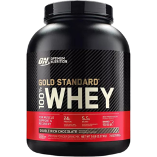
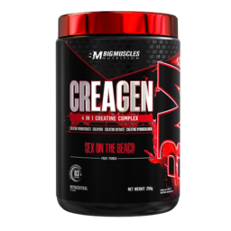
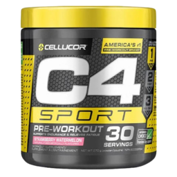

# Спорт

Спортзали на мапі (бліп **«Спортзал»**) — місце для тренувань, душу та прокачки **сили**, **витривалості** і **об’єму легень**. Пов’язано з [статусами](statuses.md).

## Де знайти

- **Мапа** —  бліп **«Спортзал»** (наприклад, **Muscle Sands** на пляжі)
- **[Центр зайнятості](../basics/city-hall.md)** — вкладка **«Бізнеси в місті»** → Спортзал

На сервері кілька залів з однаковою механікою — обирайте найближчий.

## Вхід і оплата

- **Разовий візит** — **1 000$** (Muscle Sands; інші зали можуть мати іншу ціну)
- **Час після оплати** — **10 хв** (Muscle Sands) або **60 хв** (інші зали)
- **Абонемент** — **2 500$** (1 000$ × 2,5), діє **10** або **30 днів** — залежить від локації

1. Підійдіть до стійки → `E` / target → меню входу.
2. Сплатіть разовий візит або абонемент.
3. Користуйтесь тренажерами, поки діє таймер.

Зал може бути **бізнесом гравця** — власник керує ціною в межах ліміту (**до 1 000$** за вхід).

## Тренування

- **Підтягування (chinups)** — Турніки
- **Присідання (squat)** — Силові зони
- **Бокс (box)** — Груші
- **Біг (run)** — Доріжки
- **Штанга (barbell)** — Вільні ваги

1. Підійдіть до вільного тренажера → `E`.
2. Під час вправи натискайте **`SPACE`** у міні-грі реакції (якщо з’явилась підказка).
3. **`F`** — зупинити вправу.

Поза залом **звичайний біг** також трохи підвищує витривалість.

## Добавки та душ

Купуйте в **магазинах спортивного харчування** (категорія «Магазин Спортивного Харчування» у [магазинах гравців](../basics/shops.md)). Використайте предмет з інвентаря **перед або під час** тренування — ефект триває **10 хв** незалежно від того, чи ви в залі.

Кожна добавка дає **два** ефекти на цей час:

1. **На тренуванні** — більший приріст сили, витривалості та об’єму легень.
2. **Поза залом** — повільніше зниження цих статів (без тренувань вони й так падають приблизно раз на годину).

| Добавка | Орієнтовна ціна | На тренуванні | Поза залом |
| --- | --- | --- | --- |
|  Протеїн | **1 000$** | +**10%** до приросту | спад на **20%** повільніший |
|  Креатин | **2 000$** | +**50%** до приросту | спад на **20%** повільніший |
|  Преворкаут | **3 000$** | +**25%** до приросту | спад у **2 рази** повільніший |
| Тестостерон | (рідкісний предмет) | +**150%** до приросту | спад на **30%** повільніший |

Після закінчення дії добавки статистика знову змінюється за звичайними правилами.

**Душ** (**25 сек**) відновлює комфорт після тренування — точки душу в роздягальні (`E`).

## Статистика

**F1** → **Про мене** → **Фізуха** → **Стати** — вікно з поточними показниками.

- **Сила** — більший урон беззброї
- **Витривалість** — вища стаміна, швидший біг без зброї в руках
- **Об’єм легень** — довше під водою
- **Енергія** — потрібна для вправ у залі
- **Гігієна** — комфорт після тренувань; відновлює **душ**

Без регулярних тренувань сила, витривалість і об’єм легень **повільно знижуються** — плануйте візити раз на кілька ігрових днів.

## Навіщо це потрібно

- Менше втоми на довгих [робочих](../jobs/builder.md) змінах.
- Краще плавання на [рибалці](../jobs/fishing.md) та в RP-сценах.
- Доповнення образу спортивного персонажа.
