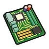
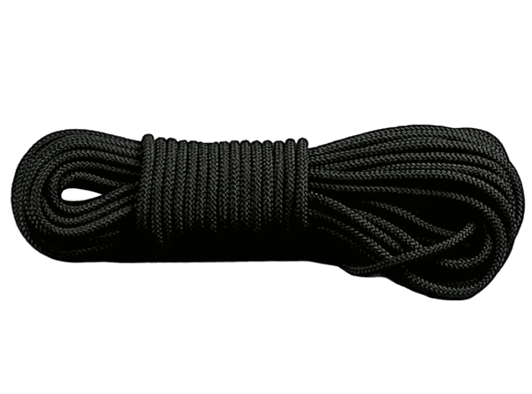
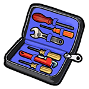
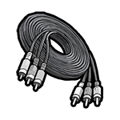
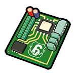
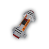
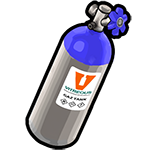
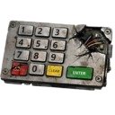
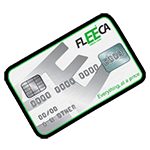

# Банкомати

Банкомати - один із найпопулярніших способів заробітку в кримінальному світі CrimeLand. Гравці можуть використовувати різні методи злому: від звичайного свердління до вибухівки або цифрового злому.

Кожен спосіб має власні вимоги, рівень ризику, винагороду та час відновлення.

## Джекпот-система

Під час будь-якого пограбування банкомата існує шанс отримати додаткову винагороду.

| Параметр         | Значення |
| ---------------- | -------- |
| Шанс спрацювання | 10%      |
| Множник нагороди | x2       |

Якщо джекпот спрацьовує, основна винагорода за пограбування подвоюється.

## Бонус

Окрім основної грошової винагороди, після успішного пограбування банкомата можна отримати додаткові предмети.

**Шанс випадіння бонусу:** 50%.

| Предмет                      | Кількість                                                                                           |
| ---------------------------- | --------------------------------------------------------------------------------------------------- |
| Готівка                      | $500-$1,500                                                                                         |
| Зламана клавіатура           | 
1 шт.

 |
| Техно-брухт                  | 

1-8 шт. 
  |
| Підроблена банківська картка | 1 шт. .png>)                                                |
| Електронний набір            | 1 шт.                                                      |
| Материнська плата банкомата  | 1 шт. .png>)                                              |
| Кабелі банкомата             | 1-2 шт. .png>)                                                 |
| Панель банкомата             | 1 шт. .png>)                                                    |


Підроблена банківська картка використовується для окремого способу пограбування банкоматів без виклику Dispatch.


## Способи пограбування банкоматів

### 1. Виривання банкомата мотузкою

### &#x20;

Один із базових способів пограбування. Для виконання необхідно закріпити мотузку на бампері авто, просвердлити точку кріплення в банкоматі та пройти мінігру. Після цього банкомат можна вирвати за допомогою транспортного засобу.

**Необхідні предмети:**

* Лазерний дриль
* Нейлонова мотузка
* Набір відкруток

**Прибуток:** $7,000-$13,000.

**Особливості:**

* Необхідно використовувати транспорт.
* Після успішної мінігри банкомат потрібно фізично вирвати зі стіни.
* Cooldown: 5 хвилин.

#### Розбір банкомата після виривання

Після успішного виривання банкомата мотузкою він залишається пошкодженим і може бути розібраний на комплектуючі. Отримані деталі використовуються в інших кримінальних активностях або можуть бути продані.

**Етап 1. Зняття панелі**

Для початку розбирання необхідно використати паяльну лампу та запальничку

| Потрібний предмет                                                                                        | Нагорода                                                                                                      |
| -------------------------------------------------------------------------------------------------------- | ------------------------------------------------------------------------------------------------------------- |
| 

Паяльна лампа 
 | 

Панель банкомата x1 
 |

**Етап 2. Демонтаж кабелів**

Після зняття зовнішньої панелі відкривається доступ до внутрішньої проводки.

| Нагорода                                                                                                   |
| ---------------------------------------------------------------------------------------------------------- |
| 

Кабелі банкомата x1 
 |

**Етап 3. Демонтаж материнської плати**

Фінальний етап розбирання банкомата.

| Нагорода                                                                                                                   |
| -------------------------------------------------------------------------------------------------------------------------- |
| 
Материнська плата банкомата x1 

 |

### 2. Свердління банкомата

.png>)

Класичний спосіб злому банкомата за допомогою дриля. Під час виконання існує ризик пошкодження інструмента.

**Необхідний предмет:**

* Дриль

**Прибуток:** $6,000-$12,000.

**Особливості:**

* Приблизно 50% шанс поломки дриля.
* Cooldown: 5 хвилин.

### 3. Використання C4.png>)

Один із найприбутковіших способів пограбування. На банкомат встановлюється заряд C4, а після вибуху відкривається доступ до готівки.

**Необхідний предмет:**

* C4

**Прибуток:** $40,000-$100,000.

**Cooldown:** 5 хвилин.

### 4. Терміт 

Терміт дозволяє пропалити захисні механізми банкомата та отримати доступ до його внутрішнього відсіку.

**Необхідні предмети:**

* Терміт
* Запальничка

**Прибуток:** $25,000-$40,000.

**Cooldown:** 5 хвилин.

### 5. Хакінг банкомата&#x20;

Цифровий спосіб злому банкомата. Для початку достатньо звичайного мобільного телефону. Після запуску процесу необхідно пройти мінігру зі злому системи.

**Необхідний предмет:**

* Мобільний телефон

**Прибуток:** $1,500-$4,000.

**Cooldown:** 10 хвилин.

### 6. Газовий підрив 

Банкомат заповнюється газом, після чого газ підпалюється запальничкою. Метод відрізняється простою механікою та легкою мінігрою.

**Необхідні предмети:**

* Газ для підриву
* Запальничка

**Прибуток:** $3,000-$12,000.

**Cooldown:** 5 хвилин.

### 7. Розбиття банкомата  

Найпростіший спосіб взаємодії з банкоматом. Для виконання достатньо будь-якого важкого інструмента.

**Необхідні предмети:**

* Молоток
* Гайковий ключ
* Будь-який аналогічний інструмент

**Прибуток:** $25-$100 за удар.

**Особливості:**

* Не потребує складної підготовки.
* Підходить для початківців.
* Cooldown: 1 хвилина.

### 8. Використання підробленої банківської картки 

Під час пограбування будинків можна знайти підроблену банківську картку. Вона дозволяє отримати доступ до банкомата без використання вибухівки чи інструментів.

**Необхідний предмет:**

* Підроблена банківська картка

**Прибуток:** $2,000-$15,000.

**Особливості:**

* Не надсилає Dispatch правоохоронним органам.
* Вважається одним із найбезпечніших способів пограбування.
* Cooldown: 5 хвилин.

## Порівняння способів

| Спосіб                      | Прибуток         | Cooldown |
| --------------------------- | ---------------- | -------- |
| Мотузка                     | $7,000-$13,000   | 5 хв     |
| Дриль                       | $6,000-$12,000   | 5 хв     |
| C4                          | $40,000-$100,000 | 5 хв     |
| Терміт                      | $25,000-$40,000  | 5 хв     |
| Хакінг                      | $1,500-$4,000    | 10 хв    |
| Газовий балон               | $3,000-$12,000   | 5 хв     |
| Розбиття                    | $25-$100 за удар | 1 хв     |
| Викрадена банківська картка | $2,000-$15,000   | 5 хв     |


Найбільший потенційний прибуток приносить використання C4, а найбезпечнішим способом вважається використання викраденої банківської картки.



Більшість способів пограбування можуть створювати виклик Dispatch для правоохоронних органів. Спосіб через викрадену банківську картку не викликає Dispatch.


Банкомати є універсальним джерелом доходу для кримінальних гравців. Правильний вибір способу пограбування залежить від вашого бюджету, рівня ризику та доступного спорядження.
