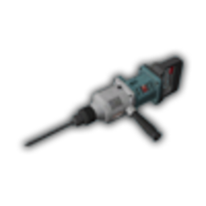
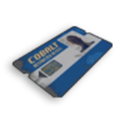

# Пограбування банку

Пограбування банків на CrimeLand — це **контрактні місії** через [планшет контрактів](contract-tablet.md). Три рівні складності: **Fleeca** (малі відділення), **Paleto** (північний банк) та **Pacific** (центральний банк). Кожен контракт купується за **криптовалюту**, вимагає команду, мінімум поліції онлайн і спеціальне обладнання.

> Ігрова механіка. Це ендгейм-крайм. Новачкам — спочатку [банкомати](atms.md) та [24/7](twenty-four-seven.md).

## Загальні правила всіх банків

| Параметр | Як працює |
| --- | --- |
| Старт | Купити контракт у **планшеті** → зібрати команду → прибути на мітку |
| Час на старт | **2 хв** після прийняття — інакше контракт згорає |
| Тривалість місії | **60–120 хв** — потім банк скидається |
| Поліція | Автоматичний **виклик** (код 10-68) при зламі |
| Нагорода | **Мічені купюри**, золоті злитки, рідкісний лут → [відмивка](money-laundering.md) |
| Кулдаун | Після успіху той самий банк недоступний певний час (див. таблицю нижче) |

---

## Порівняння банків

| Банк | Крипто (купівля) | Команда | Поліція | Досвід (репутація) | Кулдаун |
| --- | --- | --- | --- | --- | --- |
| **Fleeca** | 250 | 2–5 | 3+ | 1 000 XP потрібно / +750 XP | 30 хв |
| **Paleto** | 250 | 3–5 | 3+ | 1 000 XP / +2 500 XP | 60 хв |
| **Pacific** | 750 | 4+ | 4+ | 25 000 XP / +5 000 XP | 60 хв |

Після успіху додатково: **криптовалюта** на планшет (125 / 250 / 325 відповідно).

### Орієнтовний дохід (усі точки луту)

Цифри з конфігу контрактів. **Мічені купюри** — номінал у `worth` на пачці (потрібна [відмивка](money-laundering.md)). **Золоті злитки** — продаж у ломбарді **$5 000** за шт. На **кожній** точці сховища **20% шанс** отримати золото замість готівки (не змішується в одній пачці).

| Банк | Точок у сховищі | Якщо все  мічені | Якщо все  золото | Депозитні комірки |
| --- | --- | --- | --- | --- |
| **Fleeca** | 4 візки + 1 пачка | **~$108 000** | **90** злитків (**~$450 000**) | **$40 000–60 000** міченими (2 комірки) |
| **Paleto** | 3 візки + 1 пачка | **~$409 500** | **155** злитків (**~$775 000**) | **$60 000–90 000** міченими (3 комірки) |
| **Pacific** | 49 візок + 18 пачок | **~$6 808 500** | **2 565** злитків (**~$12 825 000**) | **$320 000–480 000** чистої готівки (16 комірок) |


**Реальний забіг** — суміш готівки й золота (20% на точку). **Paleto:** офісний сейф додатково **$20 000–40 000** уже **чистої** готівки. **Pacific:** комірки дають **легальну** готівку, не мічені. Після повної відмивки мічених лишається **~73%** номіналу (комісії складу).


---

## Необхідне обладнання

Купуйте заздалегідь у **чорному ринку** планшета або в крайм-магазинах:

| Предмет | Fleeca | Paleto | Pacific |
| --- | --- | --- | --- |
|  **Підроблена картка** | ✅ Сейф + панель | ✅ Сейф + термінал | ✅ Двері сейфу |
|  **Фантомний USB** | — | ✅ Камери, ПК | ✅ Двері, офіси, підвал |
|  **Великий бур** | ✅ Депозитні комірки | ✅ Депозитні комірки | ✅ Депозитні комірки |
|  **Синя ключ-картка** | — | — | ✅ Вхід у підвал |
|  **Терміт** | (резервний вхід) | — | — |


**Фантомний USB** має **міцність** — кожен злам зношує приблизно **20%** (≈5 використань). **Підроблена картка** псується з часом (термін придатності).


---

## Fleeca Bank (стартовий банк)

**Де:** будь-яке відділення Fleeca на карті (мітка з’являється після старту контракту).

### Покроковий сценарій

1. **Прийміть контракт** у планшеті (мінімум **2 гравці**).
2. Приїдьте до банку — на карті з’явиться **мітка**.
3. **Зламайте панель безпеки** всередині — потрібна **підроблена картка**.
4. Відкрийте **двері сховища** (автоматично після панелі).
5. Заберіть **візки та пачки** у сховищі:
   - Готівка: **~$18 000** (пачка) / **~$22 500** (візок)
   - **20% шанс** — золоті злитки замість готівки
6. **Просвердліть депозитні комірки** (великий бур):
   - $20 000–30 000 міченими
   - Шанс: документи, монети, діаманти, годинники, пістолет

7. **Відхід** — сирена **~45 сек**, поліція вже в дорозі.

### Лут Fleeca (орієнтовно)

| Тип | Мічені купюри | Золото (20% шанс) |
| --- | --- | --- |
|  **Пачка** | **$18 000** | **10** злитків (**~$50 000**) |
|  **Візок** | **$22 500** | **20** злитків (**~$100 000**) |
| **Разом сховище** (4 візки + 1 пачка) | **~$108 000** | до **90** злитків (**~$450 000**) |
| Депозитна комірка (×2) | **$20 000–30 000** міченими + рідкісний лут | — |
| **Максимум за рейд** | **~$148 000–168 000** міченими | або золото замість частини сховища |

---

## Paleto Bank (північ)

**Де:** Paleto Bay, головне відділення банку.

### Відмінності від Fleeca

- Більший банк, **більше камер** і офісів.
- Потрібен **фантомний USB** для кімнати спостереження та комп’ютерів.
- Сигналізація вмикається через **3 хв** після вимкнення «розумних замків».
- Лут у сховищі **крупніший**:

| Тип | Мічені купюри | Золото (20% шанс) |
| --- | --- | --- |
|  **Пачка** | **$72 000** | **20** злитків (**~$100 000**) |
|  **Візок** | **$112 500** | **45** злитків (**~$225 000**) |
| **Разом сховище** (3 візки + 1 пачка) | **~$409 500** | до **155** злитків (**~$775 000**) |
| Офісний сейф | **$20 000–40 000** чистої готівки + документи | — |
| Депозитні комірки (×3) | **$60 000–90 000** міченими + рідкісний лут | — |
| **Максимум за рейд** | **~$469 500–499 500** міченими + сейф | або золото замість частини сховища |

### Покроковий сценарій

1. Знайдіть **електрощит** персоналу — вимкніть розумні замки (без предмета, лише взаємодія).
2. **USB** → кімната спостереження → перегляньте камери (лобі, офіси, коридор).
3. Зламайте **офісні двері** та **комп’ютер** (USB витрачається).
4. Відкрийте **сейф у офісі** — готівка $20k–40k + документи.
5. **Підроблена картка** → панель сховища → забирайте візки.
6. **Депозитні комірки** — як у Fleeca, великим буром.
7. Точка **скасування** контракту — біля входу в банк (якщо щось пішло не так).


Після вимкнення замків у вас **3 хвилини** до сирени. Плануйте маршрут заздалегідь.


---

## Pacific Bank (центральний, ендгейм)

**Де:** центр Лос-Сантоса, головний Pacific Standard.

### Вимоги

- **4+ гравців**, **4+ поліцейських** онлайн.
- **25 000 XP** репутації на планшеті.
- Найбільший набір інструментів: USB, підроблена картка, синя ключ-картка, бури.

### Структура пограбування

```
Вхід (USB + відбиток пальця) → Офіси (USB + коди) → Головний офіс (сейф)
        ↓
Підвал (синя ключ-картка) → Сховище → Депозитні комірки → Відхід
```

### Покроковий сценарій

1. **Загальні двері** — фантомний USB на терміналах + сканер відбитка пальця.
2. **Офіси** — USB на кожних дверях; на **комп’ютерах** зчитайте коди для кейпадів.
3. **Головний офіс** — код з кейпада → сейф з цінностями.
4. **Підвал** — **синя ключ-картка** (витрачається) на панелях безпеки.
5. **Сховище** — підроблена картка, візки з готівкою / золотом / діамантами.
6. **Депозитні комірки** — великий бур, як у менших банках.
7. Точка скасування — у сервісному коридорі банку.

### Лут Pacific

Ті самі номінали, що в Paleto, але **набагато більше точок** у підвалі (49 візок + 18 пачок). Плюс **скриньки з діамантами** на візках (рідше).

| Тип | Мічені купюри | Золото (20% шанс) |
| --- | --- | --- |
|  **Пачка** | **$72 000** | **20** злитків (**~$100 000**) |
|  **Візок** | **$112 500** | **45** злитків (**~$225 000**) |
| **Разом сховище** (49 візок + 18 пачок) | **~$6 808 500** | до **2 565** злитків (**~$12 825 000**) |
| Депозитні комірки (×16) | **$320 000–480 000** **чистої** готівки + рідкісний лут | — |

Сховище — **мічені купюри** → [відмивка](money-laundering.md). Золото здається в ломбард (**$5 000**/злиток) без відмивки.

---

## Ролі в команді

| Роль | Завдання |
| --- | --- |
| **Лідер** | Планшет, координація, таймінг сирени |
| **Хакер** | USB, картки, панелі |
| **Лутер** | Візки, пачки, бур по комірках |
| **Відволікання / водій** | Блокування поліції, транспорт на відхід |
| **Охоронець** | Прикриття на виході (RP + PvP за правилами) |

---

## Після пограбування

1. Розділіть лут **IC** (50/50, за ролями тощо).
2. **Не носіть** мічені пачки відкрито — це доказ для копів.
3. Відмийте через [склад](money-laundering.md) або зону банди.
4. Кулдаун банку — плануйте наступний контракт (Fleeca / cargo / [казино](casino-robbery.md)).

## Пов’язані гайди

- [Планшет контрактів](contract-tablet.md) — купівля та репутація
- [Банкомати](atms.md) — тренування перед банком
- [Відмивка](money-laundering.md) — мічені купюри після луту
