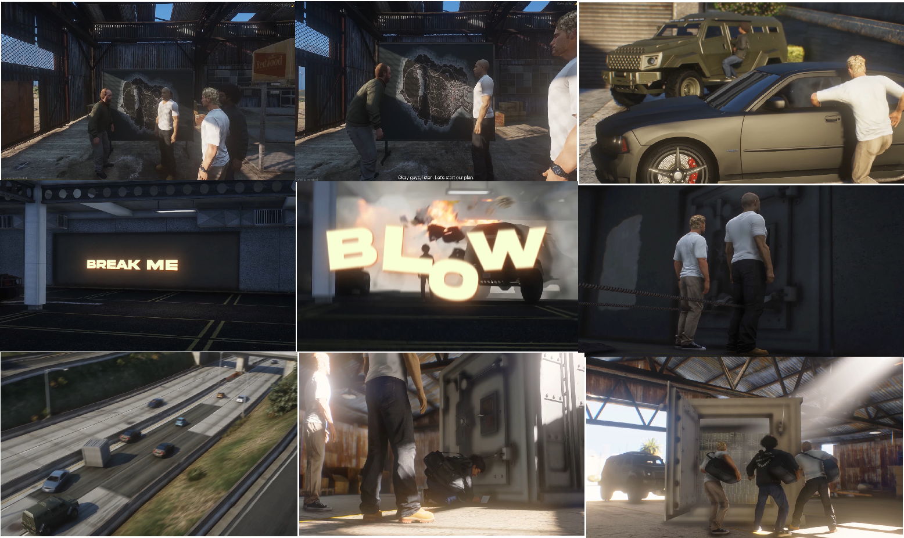
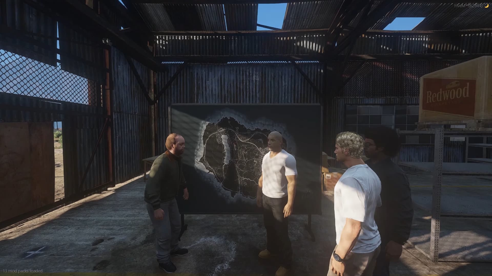
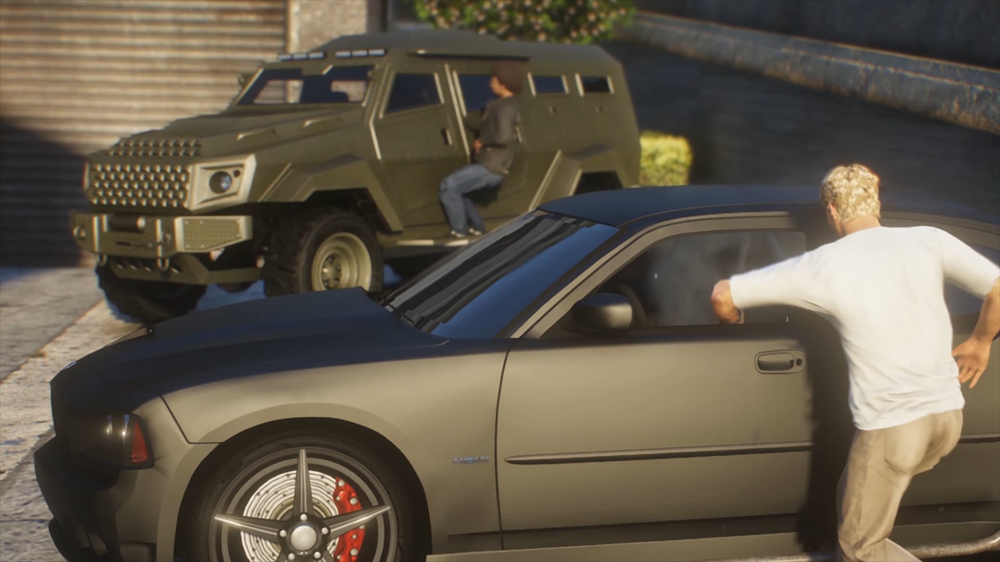
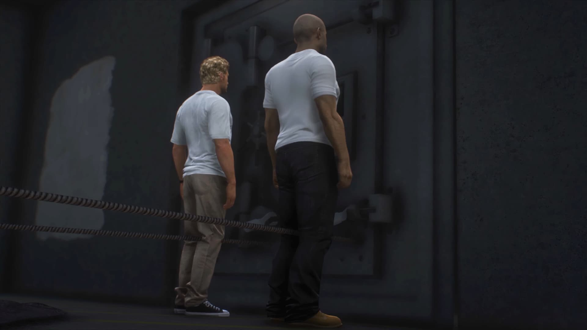
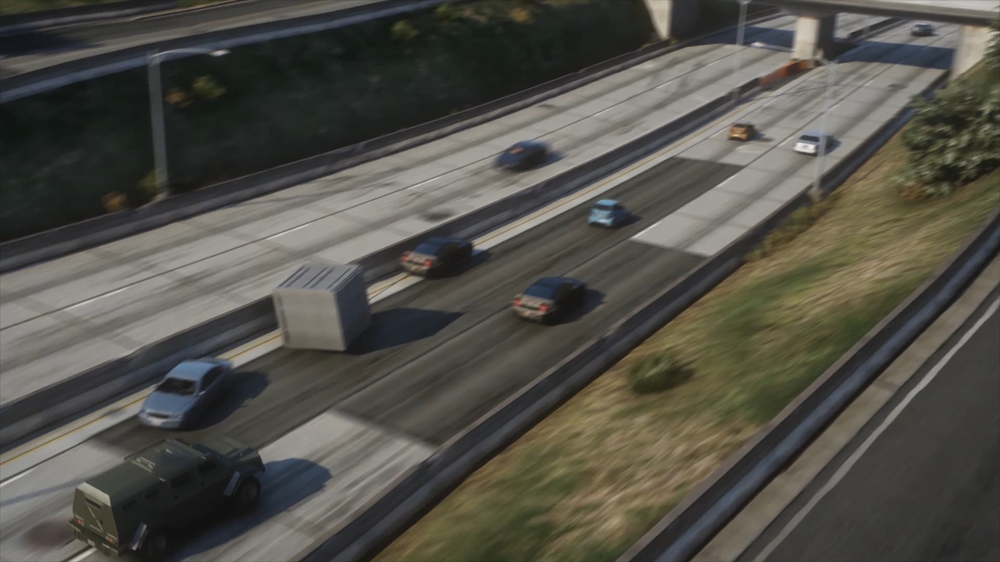
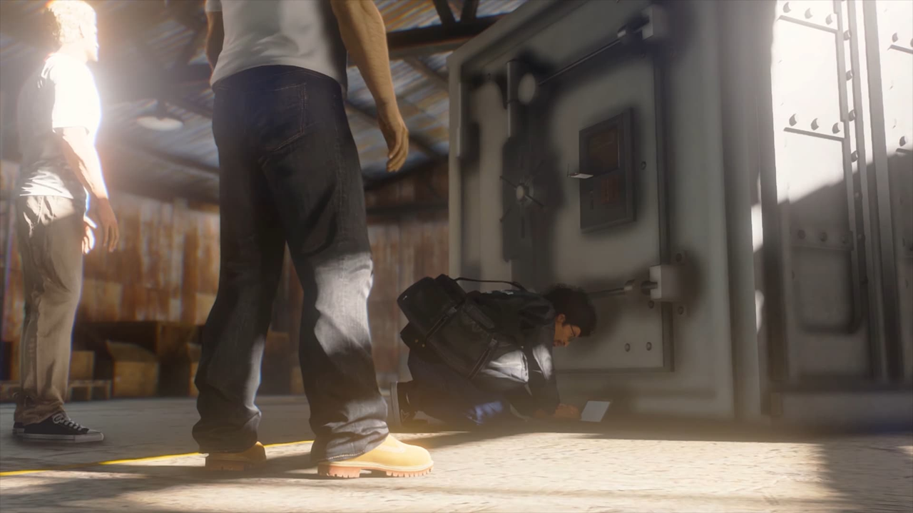
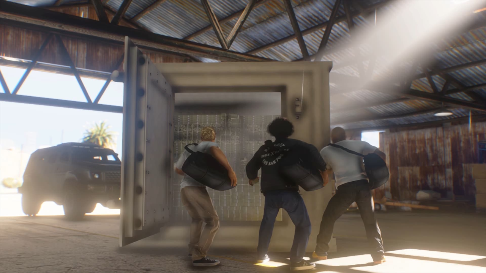

# Великий сейф

Три гравці, три машини, один багатотонний сейф — і сцена, як з **«Форсаж 5»**: витягнути сейф з будівлі тросами, протащити через місто і розкрити в **ангарі Sandy Shores**. Це не швидкий наїзд на [магазин](twenty-four-seven.md), а повноцінна операція на всю команду.

**Мінімум поліції:** 3 · **Команда:** рівно 3 · **Час очікування:** 5 хв · **У сейфі:** $1 200 000 (ділиться між учасниками) · **Збір однієї пачки:** 10 сек


Виклик для поліції летить **на старті**. Якщо **загинув хоч один** учасник або втратили сейф чи ключовий транспорт — місія провалена.


## Де знайти Lester

На мапі (`P`) шукайте  **«Свалку»** в Sandy Shores. Поруч стоїть **Lester** і **дошка з планом** — окремого бліпа «Великий сейф» немає, далі GPS сам підкине мітки.

Лідер підходить до Lester і через **`E`** / **`лівий Alt`** ([Керування](../basics/controls.md)) → **«Почати пограбування Сховища»**; решта — **«Приєднатися до команди»**. Lester проводить **кат-брифінг** — на дошці видно маршрут, варто переглянути, поки збираєтесь.

## Що взяти з собою

| Іконка | Предмет | Примітка |
| --- | --- | --- |
|  | **C4** | Витрачається — підрив стіни біля сейфа |
|  | **Нейлонова мотузка** | Витрачається — троси на сейф і маслкари |
|  | **Фантомний USB** | Витрачається — злам у ангарі |
|  | **Сумка** | Не зникає — без неї готівку не зберете |

C4 і USB — у [магазині нелегальної електроніки](money-laundering.md#що-купити-до-старту), мотузку — у крайм-магазинах. На **фантомний USB** і **мотузку** візьміть запас: міні-гра при зламі може не пройти з першого разу.

## Як проходить операція

Після брифінгу GPS веде до **кар’єру на сході штату**. Там чекають **два маслкари** і **Insurgent** — кожен сідає у свій транспорт і їде до **сейфа в доках LS**.

У доках **Insurgent на повному ході вдаряє в стіну** — стіна обвалюється. На місці берете **гаки** (**`E`**), кріпите **троси** до сейфа і обох маслкарів (**`E`** / **`лівий Alt`**) і **тягнете**, поки сейф не виїде з будівлі. Домовтесь про ролі заздалегідь: хто на маслкарах, хто на Insurgent і хто прикриває.

Коли сейф на волі, GPS веде на **фінішну точку** — **ангар біля звалки** в Sandy Shores або **склад у Grapeseed** (місце обирається на старті). Там **від’єднуєте троси** (**`E`**, «Скинути гак»), потім **`E`** / **`лівий Alt`** → **«Відкрити сховище»** і проходите міні-гру з **фантомним USB**. Після злому збираєте **пачки готівки** — **10 сек** на пачку, потрібна **сумка**.

На дорозі з міста назад головне — **не втратити сейф**. Копи вже в курсі, а вантаж важко керується; зайва перестрілка часто коштує всієї операції.

Готівка **чиста** — [відмивати](money-laundering.md) не потрібно.
