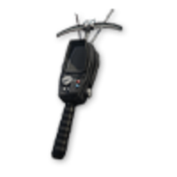

# Викрадення автомобілів (Boosting)

Boosting — контракти на викрадення авто через [планшет](contract-tablet.md). Знайдіть машину, зламайте, зніміть GPS (якщо є), здайте замовнику. Винагорода — **готівка**, **Gcoin**, **репутація**.

Кожен успішний контракт підвищує **XP** у планшеті. Вищий рівень — дорожчі авто (**B → S+**), більші виплати.

## Два типи контракту

| Тип | Класи | Що робити | Що потрібно |
| --- | --- | --- | --- |
| **Відмичка** | **D**, **C** | Знайдіть авто в радіусі GPS, зламайте через взаємодію з авто, заведіть і здайте |  **Відмичка** в інвентарі (не витрачається як предмет) |
| **Keyfob** | **B**, **A** | Знайдіть будинок,  **сканером сигналу** знайдіть ключ, заведіть і здайте |  **Відмичка** +  **сканер сигналу** (чорний ринок [планшета](contract-tablet.md)). На місці може бути **собака** |
| **Keyfob** | **S**, **S+** | Як у B/A, але після викрадення **зніміть GPS** і лише тоді їдьте на здачу |  **Сканер сигналу** +  **фантомний USB** (`hack_usb`) для трекера. **Відмичка не потрібна** |

### Класи D і C — не плутати зі звичайним угоном

На **контракті** boosting (D / C) злам **не** запускається через інвентар (`Tab` → ПКМ → «Використати» на відмичці), як при [звичайному зламі авто](lockpick.md).

1. Прийміть контракт і знайдіть **цільове авто** в зоні GPS
2. Переконайтесь, що  **відмичка є в інвентарі** — без неї гра не дасть почати
3. Підійдіть до машини й оберіть **«Зламай транспорт»**
4. Пройдіть міні-гру, сідайте в авто і їдьте на [точку здачі](#точка-здачі)


Якщо використати відмичку в інвентарі біля контрактного авто — нічого не станеться. Почніть злам через взаємодію з цільовою машиною.


### GPS-трекер (S та S+)

Після викрадення авто **відстежується** — поліція бачить його позначку на мапі. Зніміть трекер  **фантомним USB** (`hack_usb`) **до** точки здачі.

## Класи контрактів

Готівка з контракту — **легальна** (не мічені купюри). **Gcoin** — на планшет; **репутація** — для вищих класів. **Кулдаун** — пауза, поки той самий клас знову з’явиться в планшеті.

| Клас | Репутація | Поліція | Купівля | Готівка | Gcoin | +Реп | Тип | GPS | Кулдаун |
| --- | --- | --- | --- | --- | --- | --- | --- | --- | --- |
| **D** | 0 | — | безкоштовно | $2 500–7 500 | 25 | 10 | Відмичка | — | 10 хв |
| **C** | 25 | — | безкоштовно | $5 000–12 500 | 50 | 15 | Відмичка | — | 20 хв |
| **B** | 100 | — | 50 | $12 500–20 000 | 100 | 20 | Keyfob | — | 30 хв |
| **A** | 200 | — | 100 | $25 000–50 000 | 200 | 25 | Keyfob | — | 40 хв |
| **S** | 350 | **2+** | 200 | $50 000–75 000 | 350 | 50 | Keyfob | ✅ | 50 хв |
| **S+** | 500 | **2+** | 350 | $75 000–100 000 | 500 | 75 | Keyfob | ✅ | 60 хв |


**D / C** — старт для новачків. **B / A** — спорт і суперкари: **відмичка + сканер сигналу**. **S / S+** — донатні та топ-моделі: **сканер + фантомний USB**, GPS, мінімум **2 копи** онлайн; краще **вдвох+**.


## Корисна інформація

- **Час на старт** — **2 хв** після прийняття (у **S+** — **3 хв**)
- **Пошук авто** — мітка в **радіусі ~200 м**; оглядайте вулиці, не лише GPS-лінію
- **Винагорода** — готівка + Gcoin + репутація після здачі NPC
- **Прогресія** — один із найшвидших шляхів набрати XP для [банків](bank-robbery.md) та інших контрактів

## Точка здачі

Після викрадення та зняття трекера (якщо був) на GPS з’явиться **точка здачі** — зелена іконка  **«Місце здачі»** (круг з **доларом**).

- **Де шукати** — частіше **Сенді Шорс** або **Палето-Бей**; точка **випадкова** з пулу
- **На місці** — під’їдьте до маркера, біля NPC-замовника здайте авто
- **Після здачі** — винагорода зараховується автоматично


**GPS може збитися** — маршрут інколи веде не туди. Відкрийте **повну мапу (`P`)** і шукайте зелену іконку  у **Сенді Шорс** / **Палето**. Якщо лінія бреше — їдьте до неї напряму.

