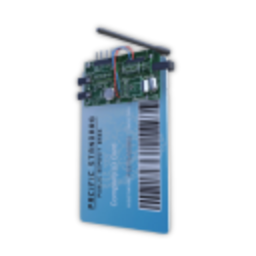
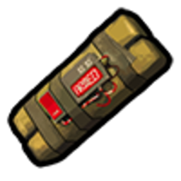
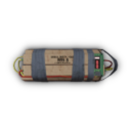
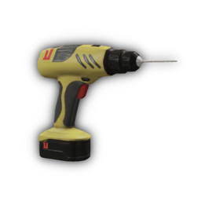
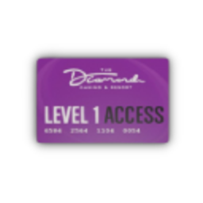

# Пограбування казино

Пограбування **Diamond Casino** — це **найважчий контракт** у [планшеті](contract-tablet.md). Не плутати з легальною грою в [казино](../entertainment/casino.md): тут повноцінна бойова операція з охороною, сейфами, тунелями та підземним сховищем.

> Ігрова механіка. Потрібна велика команда, багато спорядження та досвід з [банками](bank-robbery.md).

## Параметри контракту

| Параметр | Значення |
| --- | --- |
| Вартість (крипто) | **1 250** |
| Мін. гравців | **6** |
| Мін. поліції | **5** |
| Потрібна репутація | **65 000 XP** |
| Час на старт після купівлі | **2 хв** |
| Тривалість місії | **120 хв** |
| Кулдаун після успіху | **120 хв** |
| Нагорода (крипто + XP) | **6 250** крипто, **+2 500 XP** |

Сирена в казино **не вимикається** — тривога лунає до кінця операції.

---

## Необхідне обладнання

Закупіть **до старту** (чорний ринок планшета / крайм-магазини):

| Іконка | Предмет | Де використовується |
| --- | --- | --- |
|  | **Фантомний USB** | Входи, електрощит, міні-сейф, комп’ютери |
|  | **Підроблена картка** | Службові двері, сейфові двері |
|  | **Липка бомба** | Каналізаційний вхід |
|  | **Вибухівка** | Головні двері сховища |
|  | **Малий бур** | Депозитні комірки (скриньки) |
|  | **Ключ-картка казино** | Тунельні термінали |
|  | **Сумка** | Збір луту |

---

## Точки входу

Після старту контракту на карті з’являються **кілька входів** — команда може розділитись:

| Вхід | Опис |
| --- | --- |
| **Дах** | Вхід зверху (потрібен USB на кейпаді) |
| **Бічні входи** | Два входи з північного боку будівлі |
| **Тераса** | Чотири точки з різних сторін даху |
| **Каналізація** | Вхід з півдня міста → під казино (потрібна **липка бомба** на решітці) |


**Каналізація** — найтихіший шлях для частини команди, поки інші відволікають охорону на головному вході.


---

## Покроковий сценарій

### Етап 1. Проникнення

1. Оберіть **1–2 входи** (решта — відволікання).
2. На кожному вході — **USB** + міні-гра на кейпаді.
3. Усередині — **закриті службові двері** (підроблена картка на кейпадах).

### Етап 2. Охорона

- У казино **десятки охоронців** з автоматами — стріляють точно.
- Охорона **не чіпає поліцію** (свої), але гравців убиває без попередження.
- План: **дим**, **броня**, координований штурм — не поодинці.

### Етап 3. Електрощит і міні-сейф

1. Знайдіть **електрощит** у сервісній зоні (USB).
2. Відкриються **захисні двері** до міні-сейфу.
3. **Вимкніть термінал** міні-сейфу (USB).
4. Зламайте **2 комп’ютери** з 6 доступних — тоді відкриється міні-сейф.
5. Заберіть лут + **просвердліть скриньки** (малий бур).

### Етап 4. Тунель

1. Отримайте **ключ-картку казино** (з луту / терміналів).
2. Пройдіть **тунель** — відскануйте відбиток на **2 терміналах** (таймінг ~3 сек кожен).
3. Відкриються двері до **нижнього рівня** (покер-клуб / сховище).

### Етап 5. Головне сховище

1. **Вибухівка** на дверях сховища (затримка **10 сек** після установки).
2. **Підроблена картка** на **7 сейфових дверях** — кожна відкриває свою секцію:
   - Ліва / права / центральна зони
   - Великі та малі сейфові двері
3. Усередині — **візки** та **пачки**:

| Іконка | Тип луту | Орієнтовна цінність |
| --- | --- | --- |
| | Готівка (пачка) | ~$72 000 |
| | Готівка (візок) | ~$112 500 |
|  | **Золото (20% шанс)** | 20–45 злитків |
| | Діаманти (10% шанс) | До 45 скриньок на візку |

4. **Депозитні комірки** по периметру — малий бур: $20k–30k, документи, коштовності, інколи пістолет.

### Етап 6. Відхід

- Точка **скасування** контракту — у підвалі казино (якщо треба злитись).
- Вивозьте лут **транспортом** — пішки з візком по центру = самогубство.
- Готівка з візків — **легальна**; якщо з інших джерел мічені — [відмийте](money-laundering.md).

---

## Ролі команди (6+ гравців)

| Роль | Кількість | Завдання |
| --- | --- | --- |
| Штурм | 2–3 | Охорона, прикриття |
| Хакер | 1–2 | USB, картки, комп’ютери |
| Лутер | 2 | Візки, бури, скриньки |
| Водій | 1 | Машини біля виходів, евакуація |

---

## Поради

1. **Не починайте** без повного набору USB і карток — застрягнете на дверях.
2. Розділіть **каналізацію + дах** — поліція не встигне закрити всі входи.
3. Міні-сейф — **швидкий лут** на старті, поки основна група йде до головного сховища.
4. Після кулдауна 120 хв — плануйте [відмивку](money-laundering.md) великих сум.

## Пов’язані гайди

- [Планшет контрактів](contract-tablet.md)
- [Пограбування банку](bank-robbery.md) — простіші контракти для прокачки XP
- [Банди](gangs.md) — координація великих операцій
