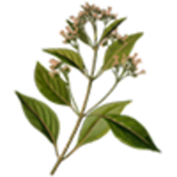

# Кокос

Кокаїновий ланцюг на CrimeLand — це **збір сировини**, **переробка** на контрольованій території та **збут** у нічних закладах. Усі етапи прив’язані до предметів в [інвентарі](../character/inventory.md) та [зон банд](territory-war.md).

> Ігрова механіка. Нелегальна діяльність може призвести до затримання в RP.

## Загальна схема

```
Листя коки → Пакет кокаїну → (100 пакетів) → Цеглина → Продаж за готівку
```

| Етап | Де | Час |
| --- | --- | --- |
| 1. Сировина | **Кайо Періко** (листя біля маєтку картеля) / закупівля IC | — |
| 2. Переробка | Зона **«Кокос»** (банда) | **1 хв** на цикл |
| 3. Збут | Зона **«Продаж кокосу»** (Vanilla Unicorn) | **1 хв** на цикл |

---

## Етап 1. Листя коки

| Іконка | Предмет | Опис |
| --- | --- | --- |
|  | **Листя коки** | Сировина для першої переробки; росте на **Кайо Періко** |

**Звідки взяти:**

- **Збір на острові Кайо Періко** — кущі листя коки ростуть **неподалік маєтку картеля** (східна частина острова). Підійдіть до рослин → **`E`** / **`лівий Alt`** ([Керування](../basics/controls.md)).
- Купівля / обмін у інших гравців.
- Добуток з [пограбувань будинків](houses.md) (випадковий loot).

Тримайте листя в інвентарі або складі банди до переробки.

---

## Етап 2. Переробка (зона «Кокос»)

Потрібен **контроль території** бандою. Зона розташована в **східній частині міста** (район текстильної фабрики).

### Як працює склад зони

1. Відкрийте **склад зони** (`F9` → карта → точка збору).
2. Покладіть у склад **листя коки**.
3. Через **1 хвилину** автоматично з’явиться продукт переробки.

### Рецепти на складі

| Вклад | Результат |
| --- | --- |
| 1× листя коки | 1×  пакет кокаїну |
| 100× пакетів | 100×  цеглина кокаїну |


Без власника зона **не переробляє** — спочатку [захопіть територію](territory-war.md) або домовтесь з контролюючою бандою IC.


---

## Етап 3. Збут (Vanilla Unicorn)

Зона **«Продаж кокосу»** — клуб **Vanilla Unicorn**. Працює як автоматичний скупник через склад зони.

| Що здаєте | Отримуєте | Час |
| --- | --- | --- |
| 1× пакет | **$500** | 1 хв |
| 1× мала цеглина | **$2 000** | 1 хв |
| 1× велика цеглина | **$50 000** | 1 хв |

Готівка з’являється **на складі зони** — заберіть і [відмийте](money-laundering.md), якщо отримали мічені купюри з інших джерел.

---

## Альтернатива: вуличний збут

Менш прибутково, але не потрібна зона:

1. Відкрийте **багажник авто** → **«Барижити»** (див. [Збут нелегалу](illegal-sales.md)).
2. Підходьте до NPC-клієнтів або чекайте в **кутовому режимі**.
3. Пакет кокаїну: **$220–480** за одиницю (залежить від типу клієнта та вашого рівня дилера).

| Тип клієнта | Ризик |
| --- | --- |
| Кайфарик | Часто купує, може **вкрасти** товар (30%) |
| Норміс | Середній шанс покупки, може **викликати поліцію** |
| Снітч | Рідко купує, **часто викликає копів** |

---

## Порівняння збуту

| Спосіб | Пакет (~) | Цеглина (~) | Ризик |
| --- | --- | --- | --- |
| Зона Vanilla Unicorn | $500 / хв | $50 000 / хв | Низький (потрібна територія) |
| Вулиця (оптимальна ціна) | ~$350 | — | Поліція, крадіжка |
| [Маркетплейс](../basics/marketplace.md) | Договірна | Заборонено для наркотиків | Бан за спробу |

## Поради

1. **100 пакетів → цеглина** вигідніше возити однією партією на збут.
2. Контролюйте **зону «Кокос»** разом із [«Продаж кокосу»](territory-war.md) — повний цикл під вашою бандою.
3. Не носіть великі партії без RP-приводу — це привертає LSPD.
4. Поєднуйте з [відмивкою](money-laundering.md) після великих угод.


Залежність від наркотиків — RP-механіка [статусів](../character/statuses.md). Не зловживайте в IC без сюжету.

