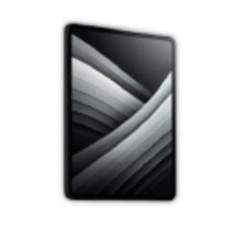

# Планшет контрактів від фракції Intercontinental

 **Контрактний планшет** — вхід у серйозний крайм: пограбування, boosting, чорний ринок, рейтинг. Без нього великі операції недоступні.

## Де купити та як відкрити

1. **Купівля** — **будинок Lester** у місті, предмет  **Контрактний планшет**
2. **Відкриття** — `Tab` → **ПКМ**  на планшеті в [інвентарі](../character/inventory.md) → **Використати**

Планшет лишається у вас назавжди — **Gcoin** і **репутація** прив’язані до нього.

## Репутація

Кожен успішний контракт дає **XP**. Спочатку — простіші завдання й менші виплати; з ростом XP відкриваються складніші пограбування, вищі нагороди та рідкісний лут. Це ваш «досвід у великих справах».

## Що є в планшеті

- **Контракти** — [boosting](car-theft.md), [будинки](houses.md), [банки](bank-robbery.md), [казино](casino-robbery.md), pralni, [контейнери](containers.md)
- **Чорний ринок** — терміт, плазморіз, болгарка, вибухівка, C4, бури, ключ-картки, фантомний USB, набір відмичок
- **Рейтинг** крайм-гравців

Більшість контрактів вимагає підготовки — купуйте спорядження **до** старту, не на місці.

Якщо цілите у великі гроші — планшет купуйте першим. Решта крайму (boosting → банки → казино) будується навколо репутації з нього.
