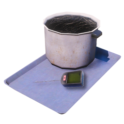
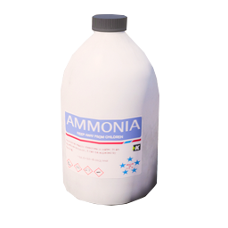
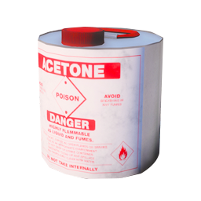
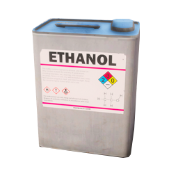
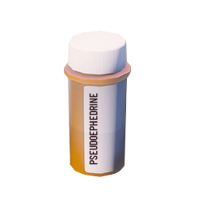
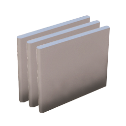

# Гайзенберг (метамфетамін)

«Гайзенберг» — **варіння метамфетаміну** у спеціальному **фургоні / кемпері**. Потрібні прекурсори, набір лабораторії та **контроль температури** на кожному етапі. Чистота реакції визначає, чи отримаєте низьку, середню чи високу якість.

> Ігрова механіка. **Синій дим** з фургона може привернути поліцію. Варіння **під землею та в тунелях заборонене**. Без **протигаза** — отруєння парами.

## З чого почати


У **таборі хіппі**  (пустеля) сидить **Джессі** — вона знає весь ланцюг. Діалог **«Метамфетамін»** → маршрути до прекурсорів, інструментів, місця варіння та **повний рецепт**. Якщо загубились — поверніться до неї.


| Тема в діалозі | Що дізнаєтесь |
| --- | --- |
| Амоніак | Танкери біля Humane Labs |
| Літій | Старі акумулятори на сміттєзвалищі |
| Інші прекурсори | Склад / магазин на виїзді з Sandy Shores |
| Інструменти | Стара хата на заході (обережно — охорона) |
| Де варити | Трейлери / кемпери в пустелі |
| **Рецепт варки** | Покрокова інструкція з температурою **50°C** |

---

## Що зібрати перед варінням

**Усі предмети мають бути в інвентарі до входу у фургон.** Якщо чогось не вистачає — на столі в кемпері не з’явиться.

| Кількість | Предмет | Де взяти |
| ---: | --- | --- |
| 1 |  Набір для приготування метамфетаміну | Точка збору на заході штату (маршрут від Джессі) — **може бути охорона** |
| 1 |  Амоніак | **Цистерни** — 3 біля Humane Labs + 1 у доках LS |
| 1 |  Ацетон | Склад біля Sandy Shores (разом з етанолом і псевдоефедрином) |
| 1 |  Етанол | Там само |
| 1 |  Псевдоефедрин | Там само — **охорона біля складу** |
| **3** |  Літієвий пакет | Купи **старих акумуляторів** (дають кілька пакетів за раз) |

### Амоніак з цистерни

Це **обмежений ресурс**, не безкінечний:

| Правило | Значення |
| --- | --- |
| З однієї цистерни | До **4** пляшок амоніаку |
| Поповнення | **~20 хв** після того, як цистерну **повністю спустошили** |
| Часткове спустошення | Якщо залишилась 1 пляшка — таймер **не** стартує, поки її не заберуть |

Підійдіть до цистерни → **`E`** → **«Відкрити клапан»** → зберіть амоніак.

### Захист

| Предмет | Навіщо |
| --- | --- |
| **Протигаз** (маска на обличчі) | Без маски — сильний ефект «хай» і шкода від парів |
| Фургон з лабораторією | Див. нижче |

---

## Транспорт і вхід

Варіння працює лише в **спеціальних фургонах**:

- **Journey** / **Journey2** — вхід у **ліві** задні двері
- **Camper**, **Rumpo** (лабораторні версії) та аналоги — вхід у **праві** задні двері

Підійдіть до бічних дверей → **`F`** — увійти в режим варіння.

Усередині:

| Дія | Клавіша |
| --- | --- |
| Перетягнути пляшку / казан / лоток | **ЛКМ** (утримувати) |
| Крутити предмет | **Коліщатко миші** |
| Плита (нагрів / вимкнення) | **ЛКМ** по ручках |
| Вийти з режиму варіння | **`F`** (утримувати, щоб зупинити процес) |

---

## Покроковий рецепт

**Цільова температура варіння — 50°C.** Тримайте суміш між **50°C і 70°C** (не вище **+20°C** від цілі — інакше псується чистота). Легкий пар з казана — норма; орієнтуйтесь на **густий дим**.

### Етап 1 — Закладка

Налийте / покладіть у **казан** (порядок не важливий):

1.  Ацетон
2.  Амоніак
3.  Псевдоефедрин
4.  Літієвий пакет — **1 шт.**

### Етап 2 — Перший нагрів

1. Поставте казан на плиту, увімкніть нагрів до **~50°C**.
2. Суміш **почне реагувати** — це літій; температура **різко піде вгору**.
3. **Негайно** вимкніть плиту або **зніміть казан** з вогню.

### Етап 3 — Другий і третій літій

1. Дочекайтесь, поки реакція літію **закінчиться** і температура опуститься **трохи вище 50°C** (не нижче — впаде чистота).
2. Додайте **2-й** літієвий пакет → знову гасите перегрів.
3. Повторіть для **3-го** пакета. Усього **3 літієвих пакети** в суміші.

### Етап 4 — Дотримання температури

Тримайте **50–70°C**, поки з казана йде **густий дим**. Щойно щільний дим зник — переходьте далі.

### Етап 5 — Охолодження перед етанолом

Дайте суміші **охолонути нижче 40°C**.

### Етап 6 — Етанол

1. Додайте  **етанол**.
2. Тримайте **низьку** температуру, поки з казана **не перестане йти дим** (етанол ще реагує).

### Етап 7 — Фінал

1. Охолодіть суміш до **мінімуму** в казані.
2. **Перелийте** у **лоток** на столі.
3. Дочекайтесь **затвердіння** кристалів у лотку — після цього з’явиться повідомлення з **чистотою** партії.


**Перегрів + літій** може **вибухнути** кемпер (шкода вимкнена, але процес зірветься). Не додавайте літій, коли температура вже зависока.


---

## Результат

За **ідеальну** партію без втрат — до **10 одиниць** готового продукту.

| Чистота | Продукт | Ефект (орієнтовно) |
| --- | --- | --- |
| **40%+** |  Низька якість | +броня, −здоров’я, витривалість |
| **75%+** |  Середня якість | Стабільніший ефект, менше шкоди |
| **95%+** |  Висока якість | Максимальний ефект, мінімум побічних |

Якщо реакцію зіпсували — партія **не придатна** («не вдалося виготовити придатний метамфетамін»).

---

## Ризики

| Ризик | Деталі |
| --- | --- |
| **Синій дим** | Дим з фургона видно здалеку — педи в радіусі **~120 м** можуть викликати **поліцію** |
| **Отруєння** | Без протигаза — сильний дебафф від парів |
| **Вибух** | Критичний перегрів під час реакції літію |
| **Охорона** | На точках збору прекурсорів і набору — NPC-охоронці |
| **Конфіскація** | При затриманні — втрата хімікатів і готового продукту |

---

## Збут

| Спосіб | Ціна (орієнтовно) |
| --- | --- |
| [Вуличний збут](illegal-sales.md) (через багажник авто) | Низька: $200–300 / Середня: $500–750 / Висока: $800–999 |
| Договір з гравцем | IC |
| Зона банди | Залежить від контролю території |

Рівень **дилера** у меню [збору](illegal-sales.md) дає **+1%…+5%** до ціни.

---

## Поради

1. **Спочатку зберіть усе** з таблиці вище — не заходьте у фургон «наполовину».
2. Запасіть **кілька цистерн амоніаку** — поповнення лише після повного спустошення.
3. На **3 літієвих пакети** візьміть запас з акумуляторної купи (там видають кілька штук за раз).
4. Варіть **вночі** подалі від магістралей — менше педів, менше викликів копів.
5. Тренуйте **температуру** на перших партіях — висока чистота значно вигідніша на збуті.
6. Не залишайте фургон із **димом** на очах у NPC.

## Зв’язок з іншими гайдами

- [Збут нелегалу](illegal-sales.md) — продаж готового продукту
- [Відмивка](money-laundering.md) — якщо отримали мічені купюри
- [Трава](weed.md) — інший нелегальний ланцюг (інша механіка)
