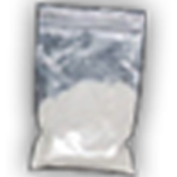
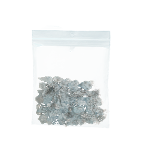
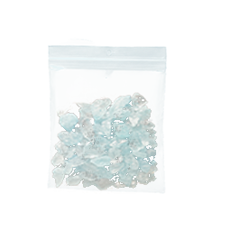
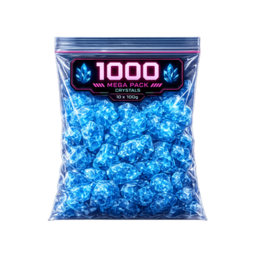

# Збут нелегалу

Вуличний збут — це продаж упакованих наркотиків **NPC-клієнтам** на вулиці. Працює для [трави](weed.md), [коксу](coke.md), [мету](heisenberg.md) та інших нелегальних предметів у [інвентарі](../character/inventory.md). Готівка з угод — звичайна; якщо паралельно маєте мічені купюри з інших джерел — [відмийте](money-laundering.md) їх окремо.

> Ігрова механіка. Продаж наркотиків — привід для LSPD. Дотримуйтесь RP.

## Як почати

1. Приїдьте на **безпечне місце** (не біля LSPD, не на спавні).
2. Майте **хоча б один вид наркотику** в інвентарі.
3. **Відкрийте багажник** свого авто (ключ / кнопка замка).
4. Наведіть курсор на **задню частину авто** (багажник має бути відкритий).
5. Оберіть **«Барижити»** — ви стаєте на точку, клієнти підходять самі.
6. Кожні **~5 секунд** з’являється новий пішохід у радіусі **20 м**.
7. Не відходьте далі **20 м** від місця старту — інакше збут зупиниться.
8. Щоб **зупинити** — знову оберіть **«Барижити»** на відкритому багажнику.


Без **відкритого багажника** опція «Барижити» **не з’явиться**. Спочатку відчиніть кришку, потім цільтесь у зад авто.



Чим довше сидите на точці — тим вищий шанс, що хтось викличе поліцію.


---

## Як проходить угода

1. Клієнт підходить до вас.
2. Відкривається **меню торгівлі** — видно **тип клієнта** (кольорова мітка).
3. Оберіть **наркотик** з інвентаря та **ціну** в дозволеному діапазоні.
4. Клієнт **погоджується**, **відмовляється**, **краде** товар або **викликає копів** — залежно від типу.
5. При успіху гроші йдуть у **готівку**; досвід дилера — у ваш **рівень**.

**Шанс виклику поліції після угоди:** **15%** (окремо від типу клієнта).

---

## Типи клієнтів

| Тип | Шанс купити | Крадіжка | Поліція | EXP за угоду |
| --- | --- | --- | --- | --- |
| **Кайфарик** | 80% | 30% | Рідко | +5 |
| **Тусовщик** | 75% | 10% | Може | +15 |
| **Норміс** | 50% | 10% | Може | +25 |
| **Вуличний дилер** | 60% | 20% | Ні | +30 |
| **Мажор** | 90% | 0% | Іноді | +10 |
| **Залежний** | 70% | 50% | Ні | +5 |
| **Снітч** | 20% | 0% | Часто | +40 |
| **Коп під прикриттям** | 30% (пастка) | 0% | Майже завжди | +50 |


Перед угодою дивіться на **мітку типу** над ім’ям NPC. Червоний «Снітч» або синій «Коп під прикриттям» — найнебезпечніші.


---

## Рівень дилера

Перевірити: у **меню торгівлі** під час збору — рядок **«Рівень лояльності»** і бонус до ціни.

| Рівень | Бонус до ціни |
| --- | --- |
| 1 | +1% |
| 2 | +2% |
| 3 | +3% |
| 4 | +4% |
| 5 | +5% |

Досвід накопичується з **кожної успішної угоди** (кількість залежить від типу клієнта). Один рівень ≈ **10 000 EXP**.

---

## Бонуси від [територій банд](territory-war.md)

| Ситуація | Ефект на збут |
| --- | --- |
| Ваша банда **контролює зону** | **+10%** до виручки |
| У зоні **йде війна** | Лише **50%** від звичайної виручки |

Перевіряйте карту в меню банди (`F9`) перед вибором «точки».

---

## Орієнтовні ціни (оптимальна ціна)

Ціна в меню — між **мінімумом** і **максимумом**. Нижче — **оптимальна** (найкращий баланс «куплять / не обуряться»).

### Трава та косяки

| Предмет | Мін | Оптимум | Макс | Макс. за раз |
| --- | --- | --- | --- | --- |
| Косяк (звичайний) | $200 | $300 | $400 | 6 шт. |
| Косяк (королівський) | $400 | $600 | $800 | 4 шт. |
| Косяк (дикий) | $150 | $200 | $250 | 7 шт. |
| Пакет трави | $1 000 | $1 500 | $2 000 | 2 шт. |
| Цеглина трави | $420 | $530 | $640 | 3 шт. |
| Преміум-пакети (OG Kush, AK47 тощо) | $4 000–8 000 | $6 000–11 500 | $8 000–15 000 | 2 шт. |

### Кокаїн

|   | Предмет | Мін | Оптимум | Макс | Макс. за раз |
| - | --- | --- | --- | --- | --- |
|  | **Пакет кокаїну** | $220 | $350 | $480 | 6 шт. |

Для **оптового збуту** через зону Vanilla Unicorn див. [Кокос](coke.md) — там вищі суми, але потрібна територія.

### Метамфетамін

|   | Якість | Мін | Оптимум | Макс | Макс. за раз |
| - | --- | --- | --- | --- | --- |
|  | **Низька** | $200 | $250 | $300 | 6 шт. |
|  | **Середня** | $500 | $625 | $750 | 5 шт. |
|  | **Висока** | $800 | $900 | $999 | 4 шт. |

### Інше

| Предмет | Оптимум | Макс. за раз |
| --- | --- | --- |
| Екстазі / XTC | ~$350 | 6 шт. |
| Крек | ~$26 | 12 шт. |
| Сира трава (шишки) | $15–46 | 12 шт. |

---

## Порівняння: вулиця vs зона банди

| Критерій | Вуличний збут | Зона збуту (банда) |
| --- | --- | --- |
| Вхідний поріг | Низький | Потрібен контроль території |
| Ціна | Середня, залежить від клієнта | Фіксована, часто вища |
| Ризик поліції | Постійний | Нижчий |
| Час | Миттєво | Часто з затримкою (склад зони) |

---

## Поради дилера

1. Починайте з **дешевих косяків** — менші втрати при крадіжці.
2. У центрі міста більше **снітчів і копів** — краще район з біженцями або промзона.
3. Не продавайте **всю партію одному** «залежному» — 50% шанс крадіжки.
4. Поєднуйте з [відмивкою](money-laundering.md), якщо паралельно заробляєте міченими купюрами.
5. Легальна альтернатива — [цивільні роботи](../jobs/builder.md).


Продаж наркотиків на [маркетплейсі](../basics/marketplace.md) **заборонений** — оголошення знімаються, можливий бан.

