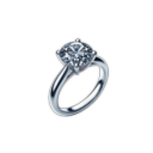
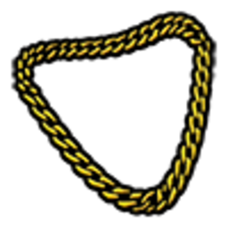
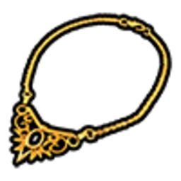

# Ювелірні магазини

Ювелірні магазини є одним із найприбутковіших видів кримінальної діяльності на CrimeLand. Гравцям доступно два варіанти пограбування, які відрізняються складністю, вимогами та рівнем ризику.

На мапі (`P`) обидві точки позначені бліпом  **«Ванджеліко»**.

Доступні два пограбування:

- Мала ювелірка
- Велика ювелірка (Vangelico)

## Мала ювелірка

 Мала ювелірка — **центр міста** (район Legion). Доступна для пограбування без переговорів із правоохоронними органами.

Для початку пограбування необхідно підійти до будь-якої вітрини та скористатися взаємодією через ALT-меню. Після цього потрібно розбити вітрину відповідним інструментом або зброєю та забрати коштовності.

### Вимоги

- Мінімальна кількість поліції

- 2 офіцери поліції онлайн

### Cooldown

- 10 хвилин

### Кількість вітрин

- 6 вітрин

### Предмети для розбиття вітрин

Для пограбування можна використовувати:

- Бейсбольну биту
- Лом
- Молоток
- Гайковий ключ
- Сокиру
- Мачете
- Кій
- Дробовики
- Штурмові гвинтівки
- Снайперські гвинтівки
- Кулемети
### Можлива здобич

З вітрин можуть випадати:

| Предмет | Вартість |
| --- | --- |
|  **Золотий годинник** | **$8 000** |
|  **Діамантове намисто** | **$7 500** |
|  **Діамантове кільце** | **$3 500** |
|  **Розкішний годинник** | **$3 000** |
|  **Золотий ланцюжок** | **$1 800** |
|  **Золотий ланцюжок 10к** | **$1 100** |

## Велика ювелірка (Vangelico)

 **Vangelico** — найбільше та найскладніше пограбування ювелірного магазину на сервері (Rockford Hills, Portola Drive).

На відміну від малої ювелірки, дане пограбування передбачає повноцінну RP-взаємодію між злочинцями та правоохоронними органами.

### Вимоги

- Мінімальна кількість поліції

- 3 офіцери поліції онлайн

### Cooldown

- 15 хвилин

### Кількість вітрин

- 20 вітрин

### Заручник та переговори

Для проведення повноцінного пограбування рекомендується використовувати заручника.

Якщо у грабіжників є заручник, правоохоронні органи будуть проводити переговори та надавати можливість узгодити умови виходу з будівлі.

Під час переговорів сторони можуть домовитися про:

Безпечний вихід із будівлі.
- Зелений коридор.
Час для посадки в транспорт.
Інші умови в межах RolePlay.
### Відсутність заручника

Якщо під час пограбування відсутній заручник, поліція не зобов'язана проводити переговори.

У такому випадку правоохоронні органи можуть ухвалити рішення про негайний або прискорений силовий штурм об'єкта.

Тому наявність заручника є ключовим елементом успішного проведення великої ювелірки.

### Зелений коридор

Після успішних переговорів злочинці можуть отримати зелений коридор для виходу з будівлі та початку втечі.

Фінальне рішення щодо умов виходу залишається за правоохоронними органами та перебігом RP-ситуації.

### Можлива здобич

З вітрин можуть випадати:

| Предмет | Вартість |
| --- | --- |
|  **Скринька з діамантами** | **$10 000** |
|  **Золотий годинник** | **$8 000** |
|  **Діамантове намисто** | **$7 500** |
|  **Діамантове кільце** | **$3 500** |
|  **Розкішний годинник** | **$3 000** |
|  **Золотий ланцюжок** | **$1 800** |
|  **Золотий ланцюжок 10к** | **$1 100** |

### Рідкісні предмети

Найдорожча здобич —  **Скринька з діамантами** (**$10 000**). Окремі вітрини можуть містити лише один такий предмет.
## Порівняння ювелірок
| Параметр | Мала | Велика |
| --- | --- | --- |
| Мінімум поліції | 2 | 3 |
| Кулдаун | 10 хв | 15 хв |
| Кількість вітрин | 6 | 20 |
| Заручник | Не потрібен | Обов'язковий для переговорів |
| RP переговори | Ні | Так |
| Зелений коридор | Ні | Так |
| Штурм поліції | Стандартний | Можливий при відсутності заручника |

Перед початком пограбування рекомендується переконатися у наявності необхідного інструменту, та ознайомитися з актуальними правилами гри.
