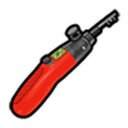

# Відмичка

**Відмичка** — базовий інструмент крайму: відкриття **авто**, **дверей будинків**, **складів** та інших замків у RP-ситуаціях. На сервері є **звичайна** та **просунута** версія — друга для складніших замків (елітні будинки, спецдвері).

> Відмичка — не «магічна кнопка». Описуйте дії в чаті, чекайте реакції власника / поліції.

## Види відмичок

| Предмет | Складність | Типові цілі |
| --- | --- | --- |
| 
Звичайна відмичка

 | Базова | Авто, прості двері, чужі склади |
| 
Просунута відмичка

 | Висока | Елітні будинки, посилені замки |
| **Набір для відмикання** (будинки) | Контрактні будинки | [Пограбування будинків](houses.md) |


При **невдалому** зламі відмичка може **зламатися** (витратиться). Тримайте запас.


---

## Де купити

| Місце | Ціна (орієнтовно) | Що є |
| --- | --- | --- |
| [YouTool](../basics/shops.md) / будівельні магазини | Дешевше | Звичайна відмичка |
| Магазин нелегальної електроніки (відмивка) | ~$100 | Звичайна відмичка |
| Чорний ринок [планшета](contract-tablet.md) | ~$500 | Звичайна відмичка |
| Крайм-ринок / гравці IC | Договірна | Обидва види |

Просунуту відмичку частіше знаходять у **луті** ([банкомати](atms.md), будинки) або купують у досвідчених крайм-гравців.

---

## Де використовується

### Автомобілі

#### Звичайні / орендовані / без власника

1. Підійдіть до **закритого авто** (не своєї).
2. Використайте **звичайну відмичку** з інвентаря.
3. Пройдіть **міні-гру** (чим вища складність авто — тим складніше).
4. При успіху — двері відкриті; при провалі — відмичка може зламатись, можливий **виклик поліції**.

#### Персональні авто (електронний замок)

На **особистих авто гравців** (і на деяких преміум-моделях) стоїть **електронна система захисту** — звичайна відмичка **не підійде**. Гра покаже: *«В цьому авто електронний замок»*.

| Що потрібно | Деталі |
| --- | --- |
| 
Фантомний USB

 | Замість відмички — **складніша міні-гра** на злам |
| Репутація контрактів | Мінімум **1 000 XP** на [планшеті](contract-tablet.md) — без неї злам заблоковано |
| Ризик | Власнику авто може прийти **сповіщення** про спробу злому |
| Провал | USB може **пошкодитись** при невдалій спробі |


Не витрачайте звичайні відмички на **чужі гаражні авто** — спочатку перевірте, чи не персональне воно. Для таких — лише USB і досвід з контрактів.


Пов’язано з [викраденням авто](car-theft.md) та контрактами на транспорт у планшеті.

### Будинки

- Для **контрактних будинків** потрібен **набір для відмикання** (окремий предмет).
- Елітні рівні — **просунута відмичка**.
- Деталі — у гайді [Пограбування будинків](houses.md).

### Склади та відмивка

- **Чужий склад** для відмивки грошей — звичайна відмичка на дверях (див. [Відмивка](money-laundering.md)).
- Після зламу — ризик сигналізації, якщо власник купив захист.

### Інше RP

- Двері бізнесів у подієвих сценаріях (за згодою адміністрації / поліції).
- Багажники (якщо механіка увімкнена на авто).

---

## Правила та ризики

| Ситуація | Що буде |
| --- | --- |
| Відмичка при **обшуку LSPD** | Конфіскація + RP-затримання |
| Злам **без RP-причини** | Порушення правил сервера |
| Провал міні-гри | Втрата відмички, шум → свідки |
| Злам **свого** авто | Не потрібна — використовуйте ключі / [телефон](../basics/phone.md) |

### Що писати в RP

Приклад: *«Бачу, замок старий… спробую підігнати штифт»* — потім міні-гра. Не метагеймте («зараз зламаю скриптом»).

---

## Легальні альтернативи

- Купити **ключ** у власника IC.
- Викликати [механіка](../jobs/mechanic.md) для авто.
- Домовитись з орендодавцем житла.

## Пов’язані гайди

- [Пограбування будинків](houses.md)
- [Викрадення авто](car-theft.md)
- [Відмивка грошей](money-laundering.md) — відмичка для чужих складів
