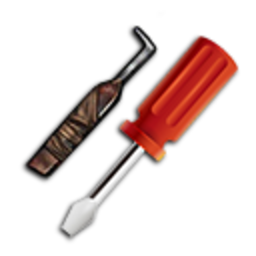

# Відмичка

**Відмичка** — базовий інструмент крайму: відкриття **авто**, **чужих складів** та **дверей** у RP-ситуаціях. На сервері гравці найчастіше користуються **двома** предметами: звичайною відмичкою та **набором для відмикання** (окремий інструмент для [пограбування будинків](houses.md) за контрактом).

> Відмичка — не «магічна кнопка». Описуйте дії в чаті, чекайте реакції власника / поліції.

## Види відмичок

| Предмет | Для чого |
| --- | --- |
|  Звичайна відмичка | Авто, чужі склади [відмивки](money-laundering.md), прості замки |
|  Набір для відмикання | [Пограбування будинків](houses.md) за контрактом — **усі рівні** житла |


**Просунута відмичка** на сервері майже не використовується — її інколи можна знайти в луті, але для основних крайм-механік вона **не потрібна**. Для елітних будинків із сигналізацією замість неї беруть **картку для злому** (див. [чорний ринок](contract-tablet.md) планшета).



При **невдалому** зламі відмичка може **зламатися** (витратиться). Тримайте запас.


---

## Де купити

| Місце | Ціна (орієнтовно) | Що є |
| --- | --- | --- |
| [YouTool](../basics/shops.md) / будівельні магазини | **~500$** | Звичайна відмичка |
| Магазин нелегальної електроніки (відмивка) | **~100$** | Звичайна відмичка |
| [Чорний ринок](contract-tablet.md) планшета | **~500$** | Звичайна відмичка |
| [Чорний ринок](contract-tablet.md) планшета | **7 500$** + крипта | **Набір для відмикання** |
| Крайм-ринок / гравці IC | Договірна | Обидва основні види |

---

## Де використовується

### Автомобілі

#### Звичайні / орендовані / без власника

1. Підійдіть до **закритого авто** (не своєї).
2. Використайте **звичайну відмичку** з інвентаря.
3. Пройдіть **міні-гру** (чим вища складність авто — тим складніше).
4. При успіху — двері відкриті; при провалі — відмичка може зламатись, можливий **виклик поліції**.

#### Персональні авто (електронний замок)

На **особистих авто гравців** (і на деяких преміум-моделях) стоїть **електронна система захисту** — звичайна відмичка **не підійде**. Гра покаже: *«В цьому авто електронний замок»*.

| Що потрібно | Деталі |
| --- | --- |
|  Фантомний USB | Замість відмички — **складніша міні-гра** на злам |
| Репутація контрактів | Мінімум **1 000 XP** на [планшеті](contract-tablet.md) — без неї злам заблоковано |
| Ризик | Власнику авто може прийти **сповіщення** про спробу злому |
| Провал | USB може **пошкодитись** при невдалій спробі |


Не витрачайте звичайні відмички на **чужі гаражні авто** — спочатку перевірте, чи не персональне воно. Для таких — лише USB і досвід з контрактів.


Пов’язано з [викраденням авто](car-theft.md) та контрактами на транспорт у планшеті.

### Будинки

Для [пограбування будинків](houses.md) за контрактом потрібен **набір для відмикання** — окремий предмет, не плутайте зі звичайною відмичкою.

| Крок | Дія |
| --- | --- |
| 1 | Візьміть контракт на [планшеті](contract-tablet.md) |
| 2 | Приїдьте на адресу |
| 3 | Використайте **набір для відмикання** на дверях |
| 4 | На елітних будинках — додатково може знадобитись **картка для злому** для обходу сигналізації |

### Склади та відмивка

- **Чужий склад** для відмивки грошей — **звичайна відмичка** на дверях (див. [Відмивка](money-laundering.md)).
- Після зламу — ризик сигналізації, якщо власник купив захист.

### Інше RP

- Двері бізнесів у подієвих сценаріях (за згодою адміністрації / поліції).
- Багажники (якщо механіка увімкнена на авто).

---

## Правила та ризики

| Ситуація | Що буде |
| --- | --- |
| Відмичка при **обшуку LSPD** | Конфіскація + RP-затримання |
| Злам **без RP-причини** | Порушення правил сервера |
| Провал міні-гри | Втрата відмички, шум → свідки |
| Злам **свого** авто | Не потрібна — використовуйте ключі / [телефон](../basics/phone.md) |

### Що писати в RP

Приклад: *«Бачу, замок старий… спробую підігнати штифт»* — потім міні-гра. Не метагеймте («зараз зламаю скриптом»).

---

## Легальні альтернативи

- Купити **ключ** у власника IC.
- Викликати [механіка](../jobs/mechanic.md) для авто.
- Домовитись з орендодавцем житла.

## Пов’язані гайди

- [Пограбування будинків](houses.md)
- [Викрадення авто](car-theft.md)
- [Відмивка грошей](money-laundering.md) — відмичка для чужих складів
