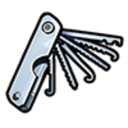
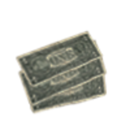

# Відмивка грошей

Готівка з [пограбувань](twenty-four-seven.md), [банкоматів](atms.md) та інших злочинів часто надходить у вигляді **мічених купюр** — їх не приймуть у банку й не витратити як звичайні гроші. **Відмивка** перетворює «брудні» кошти на **легальну готівку**, яку можна носити в [гаманці](../basics/documents.md) або тримати на рахунку.

На сервері є **два шляхи**: власний **склад-пральня** (повний цикл) та **територіальна зона «Відмивання»** (швидкий обмін під контролем банди).

## Звідки беруться «брудні» гроші

| Джерело | Предмет |
| --- | --- |
| Пограбування магазинів, банкоматів, контракти |  Мічені купюри |
| Інші нелегальні операції | Можуть з’являтись проміжні форми (немічені, мокрі, сухі пачки) |


Якщо у вас лише **звичайна готівка** (`cash`) — вона вже «чиста». Відмивка потрібна саме для **мічених** та проміжних форм.


---

## Спосіб 1. Склад-пральня (повний цикл)

Орендуйте або купіть **склад**, обладнайте його та проганяйте гроші через **п’ять етапів** всередині приміщення.

### Де купити склад

Точка продажу — **ангар аеропорту Сенді Шорс** (пустеля, схід штату). Усередині ангару стоїть **продавець** — підійдіть до NPC і відкрийте меню через **`E`** / **`лівий Alt`** ([Керування](../basics/controls.md)).

У каталозі — **10 локацій** складів по всьому штату (двері кожного складу позначені на карті після покупки):

| Склад | Район | Орієнтовна ціна |
| --- | --- | --- |
| №9 | Палето-Бей | ~$1 000 000 |
| №8 | Сенді-Шорс | ~$2 000 000 |
| №3 | Доки (Порт) | ~$2 800 000 |
| №2 | Центр (біля LSPD) | ~$2 500 000 |
| №7 | Вест Міррор | ~$3 000 000 |
| №1 | Доки (Buccaneer) | ~$3 009 000 |
| №6 | Брідж-стріт | ~$3 800 000 |
| №4 | Строберрі | ~$3 500 000 |
| №5 | Оккупейшн | ~$4 500 000 |
| №X | Палето (Procopio) | ~$5 500 000 |

Продати склад можна за **50%** від ціни покупки — через того ж продавця в ангарі.

### Що купити до старту

У **магазині нелегальної електроніки** (Лос-Сантос, промзона):

| Предмет | Ціна | Навіщо |
| --- | --- | --- |
|  Локатор складів | ~$10 000 | Знайти чужі / вільні склади на карті |
|  Хакерський ноутбук | ~$5 000 | Вимкнути сигналізацію на складі |
|  Відмичка | ~$100 | Зламати двері чужого складу (витрачається) |

Покращення складів купуються окремо в **тому ж ангарі Сенді Шорс** — інший NPC поруч із продавцем складів:

| Покращення | Ціна | Ефект |
| --- | --- | --- |
| Обладнання для сушки | $450 000 | Доступ до сушарки |
| Сигналізація | $200 000 | Шанс виклику поліції при вході злодіїв (~5%) |
| Лазерна система | $300 000 | Захист від проникнення |
| Швидша сушарка | $2 000 000 | −10% часу сушіння (потрібна сушка) |
| Швидше прання | $900 000 | −10% часу прання (потрібне прання) |

### Вхід на склад

1. Підійдіть до дверей обраного складу на карті.
2. Якщо склад **ваш** — увійдіть через меню.
3. Якщо **чужий** — потрібна **відмичка**; після зламу вимкніть сигналізацію **ноутбуком**, інакше є шанс виклику поліції.
4. Всередині — гардероб, **камера спостереження**, панель керування, складські зони.

Склад **скидається** через **120 хвилин** без активності власника (якщо увімкнено на сервері).

### П’ять етапів відмивки (всередині складу)

Гроші проходять ланцюжок **строго по порядку**. На кожному етапі — **анімація ~4 сек** і **комісія** (частина суми «зникає» як витрати на процес).

```
Мічені купюри → ① Зняття міток → ② Прання → ③ Сушка → ④ Перерахунок → Чиста готівка
```


**Перерахунок — останній крок.** Не починайте зі столів лічильників, якщо ще не пройшли різку, прання та сушку.


#### Етап 1. Зняття міток (столи різки)

| Вхід | Вихід |
| --- | --- |
|  Мічені купюри |  Немічені гроші |

**Перший крок** для будь-яких мічених купюр з [пограбувань](atms.md) та контрактів.

#### Етап 2. Прання (пральні машини)

| Вхід | Вихід |
| --- | --- |
|  Немічені гроші |  Мокрі гроші |

На складі до **4 машин** (частина відкривається випадково при вході). Час обробки: **~0,2 сек** на одиницю суми.

#### Етап 3. Сушка (сушарка)

Три точки всередині складу:

| Дія | Що робите |
| --- | --- |
| **Завантажити** | Покласти мокрі гроші в сушарку |
| **Увімкнути** | Запустити цикл сушіння |
| **Зібрати** | Забрати  сухі гроші |

Є **звичайна** та **покращена** сушарка (після апгрейду).

#### Етап 4. Перерахунок (столи лічильників) — **в кінці**

| Вхід | Вихід | Ліміт за раз |
| --- | --- | --- |
|  Сухі гроші | **Чиста готівка** | 1–50 000 |

Лише після **сушки** — отримаєте звичайні гроші в [інвентар](../character/inventory.md), які можна витрачати в банку та магазинах.

### Сховище на складі

- **20 слотів**, до **50 кг** ваги.
- Зберігайте проміжні пачки між етапами.
- Поліція з **тараном** може провести **рейд** територіального складу (не житлового).

### Лазери та сигналізація

- У складі можуть бути **лазери** — перетин піднімає тривогу.
- Без **вимкненої сигналізації** (ноутбук) — **5% шанс** повідомлення поліції при вході чужих.

---

## Спосіб 2. Територіальна зона «Відмивання»

Якщо ваша [банда](gangs.md) контролює зону **«Відмивання»** на [карті територій](territory-war.md):

| Параметр | Значення |
| --- | --- |
| Вхід | 200× мічених купюр |
| Вихід | $160 готівки |
| Час циклу | **1 хвилина** |
| Де | Склад зони (район YouTool / Строберрі) |

Покладіть мічені купюри в **склад зони** — через хвилину з’явиться готівка. Швидше, ніж власний склад, але потрібен **контроль території**.

---

## Порівняння способів

| Критерій | Склад-пральня | Зона банди |
| --- | --- | --- |
| Вартість входу | Купівля складу ($1M+) | Захоплення території |
| Швидкість | Довший цикл, більше етапів | ~1 хв на пачку |
| Безпека | Ваше приміщення + апгрейди | Спільний склад, війни за зону |
| Масштаб | До 50 000 за операцію на етапі | Фіксований курс 200→$160 |

## Поради

1. Спочатку купіть **ноутбук** і **локатор** — без них склад важко знайти й захистити.
2. Не тягніть **мічені купюри** в банк — вони не конвертуються автоматично.
3. Робіть відмивку **невеликими партіями**, якщо поруч активна поліція.
4. Поєднуйте з [збутом](illegal-sales.md) та [контрактами](contract-tablet.md) для стабільного доходу.


Великі суми та часті операції привертають увагу в RP. Готуйте план відходу та не залишайте склад відкритим без нагляду.

