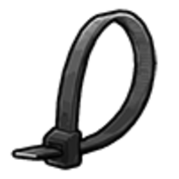

# Грабіж та взаємодія

Грабіж **гравця** на CrimeLand технічно доступний **лише в стані нокдауну** — коли персонаж **без свідомості** на землі. Поки гравець на ногах, з піднятими руками чи в наручниках — **обшук і крадіжка недоступні**.

> Грабіж без RP-причини, на спавні або в заборонених зонах — порушення правил.

## Головне правило

| Стан жертви | Чи можна грабити? |
| --- | --- |
| **Нокдаун** (лежить без свідомості) | ✅ Так |
| Стоїть / бігає | ❌ Ні |
| Підняв руки (`X`) | ❌ Ні |
| У наручниках / стяжках | ❌ Ні (окремі RP-механіки поліції) |
| На ногах, але поранений | ❌ Ні — потрібен саме **нокдаут** |


Система **не дозволяє** «обшукати» свідомого гравця — навіть під дулом зброї. Спочатку доведіть ситуацію до **нокдауну** в RP (бій, ДТП, нокаут), потім обшукуйте.


---

## Як обшукати (покроково)

1. **RP-контекст** — погоня, війна банд, самооборона, домовленість IC.
2. Доведіть жертву до **нокдауну** (без свідомості на землі).
3. Підійдіть **близько** (до **8 м**).
4. Наведіть **зброю** (не кулак / ліхтарик).
5. У меню з’явиться лише **«Обшукати»**.
6. Оберіть **предмети** з інвентаря жертви (в межах дозволеного списку).
7. Між спробами крадіжки — **кулдаун 2 хв** на грабіжника.

---

## Що можна забрати

Система дозволяє забирати **конкретний список** речей (крайм-лут, зброя, наркотики, інструменти пограбувань тощо).

### Приклади дозволеного луту

| Категорія | Приклади |
| --- | --- |
| Наркотики | Косяки, пакети коксу, мет, трава |
| Крайм-інструменти |  USB,  картка, дрилі, терміт |
| Цінності |  Мічені купюри, золото, коштовності |
| Зброя | Пістолети, гвинтівки (з списку сервера) |
| Розхідники |  Відмичка, рація, телефон |

### Що забрати НЕ можна

| Категорія | Приклади |
| --- | --- |
| Документи | ID, права, ліцензії |
| Одяг / рюкзаки | Сумки, косметичні предмети |
| Їжа зі старту | Базовий фастфуд новачка |
| Банківський рахунок | Тільки **готівка** з інвентаря |
| Адмін / донат-речі | Спецпредмети з чорного списку |


**Готівка** зазвичай **дозволена**. Гроші на **банківському рахунку** через обшук не знімаються.


---

## Стяжки та заручники (окремо від грабежу)

| Дія | Для чого |
| --- | --- |
|  Стяжки | Скрутити руки — RP-утримання, **не замінює** обшук |
| Заручник | Окрема механіка утримання — **не дає** доступ до інвентаря |

Обшук можливий **тільки в нокдауні**, незалежно від стяжок.

---

## Заборонені зони

Грабіж **вимкнено** в радіусі **20 м** від точок:

| Зона | Навіщо захист |
| --- | --- |
| Лікарня (Pillbox) | RP медицини |
| Sandy Shores (спавн-подібні зони) | Захист новачків |

Повідомлення в грі: *«У цій зоні грабувати заборонено»*.

---

## Особливі правила (поліція / військові)

Якщо жертва — **коп або військовий** високого рангу:

- Частина **службової зброї** **прихована** від меню обшуку.
- Грабіж копа без вагомого RP — **жорстке порушення** правил.

---

## Базові правила сервера (RP)

1. **Має бути причина** — борг, війна банд, погоня, домовленість IC.
2. **Не чистіть новачків** без сюжету.
3. **Не використовуйте** VDM / RDM — спочатку RP, потім нокдаун, потім обшук.
4. Після обшуку — вирішіть IC (відпустити, передати EMS, везти до банди).

---

## Типовий сценарій (приклад)

1. Після [війни зони](territory-war.md) суперник **падає в нокдаун** у перестрілці.
2. Ви підходите зі зброєю → **«Обшукати»**.
3. Забираєте мічені купюри та наркотику.
4. Викликаєте EMS або залишаєте на місці — на ваш RP.

---

## Пов’язані гайди

- [Статуси персонажа](../character/statuses.md)
- [Інвентар](../character/inventory.md)
- [Банди](gangs.md)
- [Правила сервера](../basics/rules.md)
