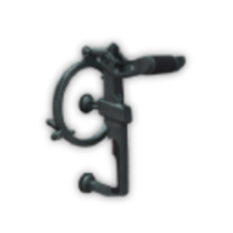
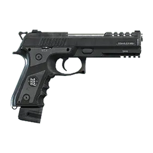

# Пограбування магазинів

Найпростіший старт у краймі: **відмичка**, швидке авто і план відходу до приїзду копів. Працює для **24/7**, **LTD Gasoline**, алкогольних та інших торгових точок.

**Мінімум поліції:** 1 коп онлайн · **Кулдаун після успіху:** 20 хв

## Каса

1. Підійдіть до касового апарата
2. Використайте **відмичку**
3. Пройдіть міні-гру
4. Заберіть гроші

**Винагорода:** $2 000–$5 000 · **5% шанс** на **чорну бухгалтерію** (у магазинах гравців — до **90%**)


Не затримуйтесь на місці після пограбування — виклик поліції надходить одразу.


## Код від сейфа

Під час пограбування каси **75% шанс** знайти записку з кодом. Якщо випала — відкриєте **цифровий сейф** всередині магазину.

## Два типи сейфів

**Цифровий (Keypad)** — 24/7, LTD, супермаркети. Знайдіть код під час пограбування каси, введіть його на кейпаді сейфа й забирайте лут.

**Механічний (Padlock)** — переважно алкогольні. Крутите замок на слух, без коду; довше, але теж варто.

## Винагорода з сейфів

**Готівка:** $3 000–$6 000 (гарантовано після відкриття)

**Рідкісні предмети:**

| Предмет | Шанс |
| --- | --- |
|  **Кутова шліфувальна машина** | 5% |
|  **Плазмовий різак** | 2% |
|  **Люксовий годинник** | 7% |
|  **Підроблена кредитна картка** | 10% |
|  **Золотий ланцюжок** | 20% |
|  **Золотий ланцюжок 10к** | 20% |
|  **Крипто-стік** | 15% |
|  **Пістолет** | 15% |

**Додаткова знахідка** (20% шанс при випадінні годинника або фейкової картки):

| Предмет | Додаткова знахідка | Шанс |
| --- | --- | --- |
|  **Люксовий годинник** |  **Золотий злиток** | 20% |
|  **Підроблена кредитна картка** |  **Мічені купюри** 15–25 тис. | 20% |

## Коротке порівняння

| Джерело | Винагорода |
| --- | --- |
| Каса | $2 000 – $5 000 |
| Сейф | $3 000 – $6 000 |
| Рідкісні предмети | Залежить від випадіння |
| Магазин гравця | + чорна бухгалтерія (до 90%) |
