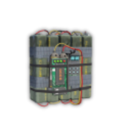
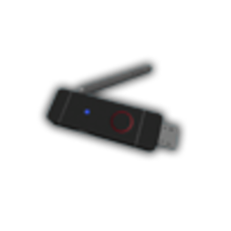
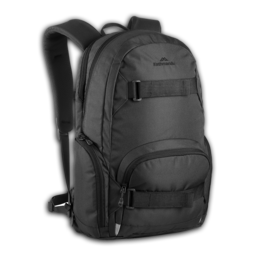

# Пограбування Union (підземне сховище)

Готові на командну вилазку? **Union** — рейд на **підземне сховище** в місті: старт у **пустелі біля Lester**, збір команди на дошці, спецтранспорт, **трос**, **C4**, **злом USB** і до **$1 200 000** готівки на команду.

> Ігрова механіка. Не плутати з [банками](bank-robbery.md) (контракти планшета) чи [казино](casino-robbery.md).

## Де на мапі

- **Старт (Lester)** — пустеля, північно-схід штату — бліп  **«Незнайомець»** (табір біля Lester, як у [Гайзенберга](heisenberg.md))
- **Сховище Union** — підземний комплекс у **західному LS** (район доків / `-494, -628`) — мітка з’являється **після старту** місії на GPS
- **Фініш** — одна з двох точок у пустелі (GPS після збору луту)


Постійного бліпа «Union» на мапі **немає** — лише Lester до старту і **тимчасові мітки** під час пограбування.


## Параметри

- **Мін. поліції** — **3**
- **Час очікування** — **5 хв** між спробами (глобальний)
- **Загальна сума в сховищі** — **$1 200 000**
- **Час збору однієї пачки** — **10 сек**
- **Команда** — До **3** гравців

---

## Необхідні предмети

| Іконка | Предмет | Витрачається? | Навіщо |
| --- | --- | --- | --- |
|  | **C4** | ✅ Так | Підрив дверей сховища |
|  | **Нейлонова мотузка** | ✅ Так | Прикріпити трос до об’єкта / авто |
|  | **Фантомний USB** | ✅ Так | Злам системи безпеки |
|  | **Сумка** | ❌ Ні | Збір готівки |

Закупівля: [магазин нелегальної електроніки](money-laundering.md#що-купити-до-старту) (LS, промзона) + мотузка в крайм-магазинах.

---

## Покроковий сценарій

### Етап 1. Збір команди (Lester)

1. Приїдьте до **Lester** у пустелі .
2. Біля нього — **дошка пограбування** з планом Union.
3. **Почати пограбування** — стати лідером.
4. Інші — **приєднатися до команди** (до 3 учасників).
5. Переконайтесь: **3+ копів** онлайн, у всіх є **C4, мотузка, USB, сумка**.

### Етап 2. Транспорт до кар’єру

1. Після старту на GPS — **3 авто** (кар’єр, схід штату).
2. Команда сідає в **підготовлений транспорт**.
3. Їдьте до **сховища Union** у місті (мітка на GPS).

### Етап 3. Проникнення

1. **Візьміть гак / трос** на місці.
2. **Прикріпіть трос** до конструкції сховища та до авто.
3. **Тягніть** — витягування панелі / дверей.
4. **Встановіть C4** → підрив.
5. **Зламайте** панель (**фантомний USB**).

### Етап 4. Збір грошей

1. Усередині — **пачки готівки** (разом **$1.2M**).
2. Кожна пачка — **10 сек** анімації; потрібна **сумка**.
3. Розподіліть ролі: збір + прикриття виходу.

### Етап 5. Відхід

1. Поліція отримає **виклик** на старті.
2. Везіть лут до **точки фінішу** в пустелі (GPS).
3. Розподіл готівки — **IC** між учасниками.

---

## Керування (підказки в грі)

- **Почати / приєднатися / вийти з команди** — Біля дошки Lester
- **Гак, бомба, збір грошей** — **`E`** / **`лівий Alt`** ([Керування](../basics/controls.md))

---

## Поради

- **USB і мотузку** — по 2 на команду (на випадок фейлу міні-гри).
- Один гравець **на сторожі** біля виходу — LSPD часто піджимає в кінці.
- Готівка **чиста** — [відмивка](money-laundering.md) не потрібна, якщо не несете паралельно мічені купюри.
- Повторити можна вже через **5 хв**, але район запам’ятають.

## Пов’язані гайди

- [Гайзенберг](heisenberg.md) — той самий Lester, інший ланцюг
- [Планшет контрактів](contract-tablet.md) — інші великі пограбування
- [Відмивка](money-laundering.md) — якщо паралельно мічені купюри
