# Трава

Вирощування канабісу дає врожай, нове насіння через мутації та можливість розвивати ферму до рідкісних сортів. Рослина потребує води, захисту від комах і своєчасного збору врожаю.

> Це ігрова механіка CrimeLand. Незаконна діяльність у грі може привернути увагу правоохоронців.

## З чого почати

Для домашнього гровінгу встановіть горщик і гроу-тент у дозволеному місці, посадіть насіння та доглядайте за рослиною до дозрівання. Автополив не є обов'язковим, проте істотно спрощує догляд за великою кількістю рослин.

| Предмет                                                                                                                         | Призначення                                           |
| ------------------------------------------------------------------------------------------------------------------------------- | ----------------------------------------------------- |
|  **Горщик для вирощування**     | Для посадки рослини.                                  |
|  **Гроу-тент**                              | Створює умови для домашнього вирощування.             |
| 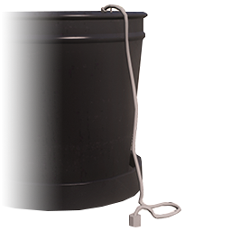 **Система автополиву** | Автоматично підтримує вологу, зокрема коли ви офлайн. |

### Де купити


Точні **мітки на карті** — у **Джессі** в таборі хіппі : «Марихуана» → **«Домашній гровінг»**. Можна одразу поставити waypoint — не треба шукати продавців наосліп.


| Що купити                                                      | Де (загалом)                                                                                      |
| -------------------------------------------------------------- | ------------------------------------------------------------------------------------------------- |
| **Обладнання** (горщик, тент, автополив, папір для самокруток) | Район **гетто**, біля **складу з травою** — там орієнтуються учасники банд                        |
| **Добрива та спрей** від комах                                 | **Байкери на фермі** (Grape Seed)                                                                 |
| **Насіння**                                                    | Та сама **ферма**, поруч — інший продавець; **не плутати** з табором Lost MC, де сидить **Петро** |

Якщо загубились — поверніться до **Джессі**, вона оновить маршрут.

### Де вирощувати

* **Контейнери для гровінгу** — безкоштовні локації, позначені на карті; найзручніший варіант для старту.
* **Польова ферма** — варіант для відкритого вирощування з регулярним доглядом.
* **Власна нерухомість** — можна облаштувати власну лабораторію, але пам’ятайте про ризики нелегальної діяльності.

## Догляд і збір

Під час росту регулярно поливайте рослини, перевіряйте їх на комах і **не пропускайте вікно збору** — після дозрівання кущ **відмирає**, якщо його не зібрати вчасно.

| Що стежити | Як працює                                                                                                                                                                                         |
| ---------- | ------------------------------------------------------------------------------------------------------------------------------------------------------------------------------------------------- |
| **Полив**  | Воду можна лити, коли рівень **нижче 50%**. Якщо пройшов **макс. інтервал** (див. таблицю нижче) — рослина втрачає здоровʼя і **перестає рости** без води.                                        |
| **Комахи** |  **Засіб від комах** — обприскуйте одразу після появи; без лікування кущ гине за **\~5 хв**. |
| **Збір**   | Після 100% росту є обмежений час **«цвітіння»** — далі кущ згорає. У **Purple Haze** це лише **20 хвилин**.                                                                                       |
| **Умови**  | Без **тенту / контейнера / гроу-зони** рослина може **загинути** ще на етапі росту (\~на 20% циклу).                                                                                              |


**Автополив** не скасовує вікно збору. Поставте **нагадування в телефоні** на дозрівання — особливо для White Widow, Purple Haze та AK47 (коротке «цвітіння»).


***

## Таймінги циклу по сортах

Цифри — **базові** (без добрив). У **тенті / контейнері** ріст приблизно на **10–20% швидший**. Добрива змінюють час (див. нижче).

### Гровінг у горщику

| Сорт                                                                                                       | Ріст (база) | \~У тенті | Полив не рідше ніж | Вікно збору після дозрівання |
| ---------------------------------------------------------------------------------------------------------- | ----------- | --------- | ------------------ | ---------------------------- |
|  **OG Kush**             | **48 год**  | \~40 год  | кожні **2 год**    | **3 год**                    |
| 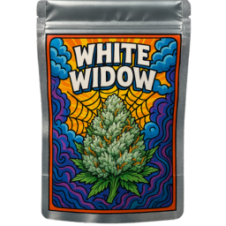 **White Widow** | **54 год**  | \~45 год  | кожні **7 год**    | **1 год**                    |
| 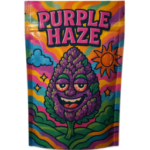 **Purple Haze** | **50 год**  | \~45 год  | кожні **12 год**   | **20 хв** ⚠️                 |
| 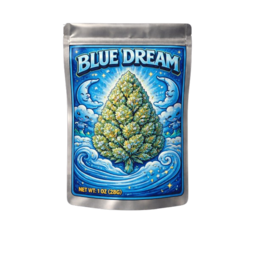 **Blue Dream**         | **24 год**  | \~20 год  | кожні **8 год**    | **3 год**                    |
| 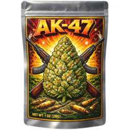 **AK47**                      | **24 год**  | \~20 год  | кожні **8 год**    | **1 год**                    |
| 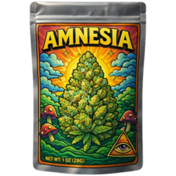 **Amnesia**             | **12 год**  | \~10 год  | кожні **2 год**    | **1 год**                    |
| 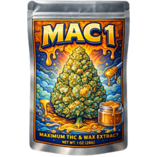 **MAC1**                      | **\~5 год** | \~4 год   | кожні **2 год**    | **2 год**                    |

#### Як не пропустити цикл

1. **Запишіть час посадки** — додайте «ріст» і «+вікно збору» з таблиці.
2. **Purple Haze** — майте **будильник на +20 хв** після дозрівання; інакше втрата врожаю найімовірніша.
3. **White Widow / AK47 / Amnesia** — вікно **1 год**; не залишайте персонажа без нагляду після повідомлення про дозрівання.
4. **OG Kush / Blue Dream** — найдовше «цвітіння» (**3 год**), але полив у Purple Haze все одно рідший (раз на 12 год).
5. **MAC1** — найшвидший цикл; зручний для фарму насіння, але полив кожні 2 год.

### Вплив добрив на час

| Добриво              | Ріст                          | Вікно збору               | Вода                |
| -------------------- | ----------------------------- | ------------------------- | ------------------- |
| Прискорювач росту    | **−23%** часу (\~×1,3 швидше) | трохи **коротше**         | **+40%** споживання |
| Добриво врожайності  | **+33%** часу (повільніше)    | без змін                  | **+20%**            |
| Підсилювач стійкості | майже без змін                | **×2,5 довше** «цвітіння» | **+10%**            |
| Black Market         | **−23%** ріст                 | **коротше** вікно         | **+50%**            |


На **дорогих сортах** (Amnesia, MAC1) для довгого AFK ставте **підсилювач стійкості** — він найкраще рятує від згорання після дозрівання.


### Дика трава (поле, не гровінг)

Окремий ланцюг — збір на **відкритому полі**, не в горщику:

| Параметр             | Значення                                                                           |
| -------------------- | ---------------------------------------------------------------------------------- |
| Респавн однієї точки | **\~90 сек** після збору                                                           |
| Пакування            | Сарай на півночі (\~**2195, 5602**) — лише **дика трава**                          |
| Рецепт пакування     | **1** дика трава + **1** порожній пакет → **1** упакована дика трава (\~**5 сек**) |
| Інші сорти           | На цій точці **не** пакуються (лише вирощені сорти з горщика — окремий цикл)       |
| Збут                 | Порт / Cayo — великими партіями (маршрути підкаже **Джессі** у таборі хіппі)       |

Маршрути полів дикої трави: **Джессі** → «Марихуана» → Маршрут 1 / 2 / 3.

***

## Сорти

| Рідкість    | Сорти                             | Особливість                                         |
| ----------- | --------------------------------- | --------------------------------------------------- |
| Звичайні    | OG Kush, White Widow, Purple Haze | Початкові сорти для першого циклу мутацій.          |
| Рідкісні    | Blue Dream, AK47                  | Прибутковіші, швидше ростуть і дають кращий урожай. |
| Епічний     | Amnesia                           | Єдиний сорт, із якого можна отримати MAC1.          |
| Легендарний | MAC1                              | Найцінніший: швидкий ріст і найбільший урожай.      |

Після збору врожаю можна отримати насіння іншого сорту. Так поступово відкривається шлях від початкового насіння до легендарного MAC1.

## Мутації

Шанс мутації визначається сортом, з якого зібрано врожай.

| Поточний сорт | Можливі мутації                                                                                                |
| ------------- | -------------------------------------------------------------------------------------------------------------- |
| OG Kush       | White Widow — 15%; Purple Haze — 14%; Blue Dream — 1%                                                          |
| White Widow   | OG Kush — 90%; Purple Haze — 9%; Blue Dream — 1%                                                               |
| Purple Haze   | OG Kush — 90%; AK47 — 2%; Blue Dream — 2%                                                                      |
| Blue Dream    | OG Kush — 30%; White Widow — 25%; Purple Haze — 20%; AK47 — 14%; Amnesia — 11%                                 |
| AK47          | OG Kush — 30%; White Widow — 30%; Purple Haze — 30%; AK47 — 9%; Blue Dream — 1%                                |
| Amnesia       | OG Kush — 20%; White Widow — 20%; Purple Haze — 20%; Blue Dream — 10%; AK47 — 10%; Amnesia — 5%; **MAC1 — 1%** |
| MAC1          | Blue Dream — 20%; AK47 — 20%; Amnesia — 20%; MAC1 — 10%                                                        |

> **Важливо:** MAC1 не випадає зі звичайних або рідкісних сортів. Спочатку отримайте Amnesia, а потім продовжуйте збір, доки не спрацює 1% мутація в MAC1.

## Добрива

Добрива дають змогу обрати пріоритет: швидкість, кількість урожаю або стійкість рослини.

| Добриво                                                                                                                                      | Ефект                                                                                                               |
| -------------------------------------------------------------------------------------------------------------------------------------------- | ------------------------------------------------------------------------------------------------------------------- |
| 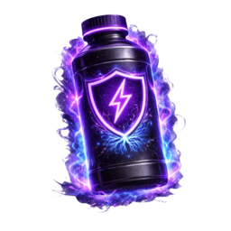 **Прискорювач росту**               | Прискорює ріст, але збільшує споживання води та трохи знижує врожайність і стійкість.                               |
| 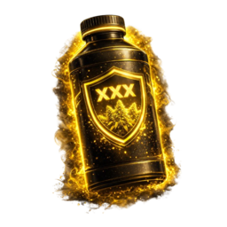 **Добриво врожайності**           | Значно збільшує врожай, але сповільнює ріст і підвищує потребу у воді.                                              |
| 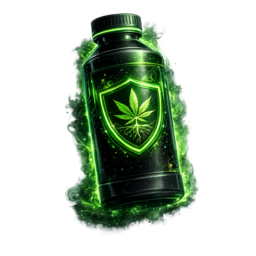 **Підсилювач стійкості**        | Захищає від пересихання, комах і псування після дозрівання; корисний для дорогих сортів.                            |
| 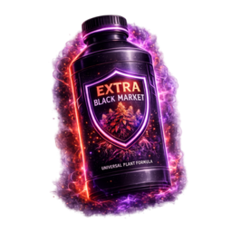 **Black Market Fertilizer** | Універсальний вибір: прискорює ріст і трохи збільшує врожай, але рослина споживає більше води та стає менш стійкою. |

## Поради

* Починайте зі звичайних сортів, а для переходу до Amnesia зосередьтеся на Blue Dream.
* Для дорогих сортів обирайте підсилювач стійкості або Black Market Fertilizer.
* Потрібен максимальний прибуток — використовуйте добриво врожайності; важлива швидкість — прискорювач росту.
* Якщо плануєте велику плантацію, встановіть автополив і регулярно перевіряйте рослини на комах.
