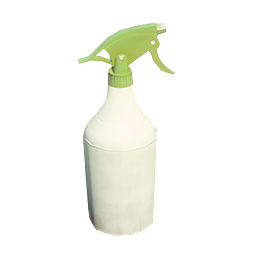

# Трава

Вирощування канабісу дає врожай, нове насіння через мутації та можливість розвивати ферму до рідкісних сортів. Рослина потребує води, захисту від комах і своєчасного збору врожаю.

> Це ігрова механіка CrimeLand. Незаконна діяльність у грі може привернути увагу правоохоронців.

## З чого почати

Для домашнього гровінгу встановіть горщик і гроу-тент у дозволеному місці, посадіть насіння та доглядайте за рослиною до дозрівання. Автополив не є обов'язковим, проте істотно спрощує догляд за великою кількістю рослин.

| Предмет | Призначення |
| --- | --- |
|  | Горщик для посадки рослини. |
|  | Гроу-тент створює умови для домашнього вирощування. |
|  | Автоматично підтримує вологу, зокрема коли ви офлайн. |

### Де вирощувати

- **Контейнери для гровінгу** — безкоштовні локації, позначені на карті; найзручніший варіант для старту.
- **Польова ферма** — варіант для відкритого вирощування з регулярним доглядом.
- **Власна нерухомість** — можна облаштувати власну лабораторію, але пам’ятайте про ризики нелегальної діяльності.

## Догляд і збір

Під час росту регулярно поливайте рослини, перевіряйте їх на комах і не залишайте дозрілий кущ без збору надовго. Нестача води або зараження комахами знижують здоров'я рослини й можуть її знищити.

 Використовуйте засіб від комах, щойно помітите зараження.

## Сорти

| Рідкість | Сорти | Особливість |
| --- | --- | --- |
| Звичайні | OG Kush, White Widow, Purple Haze | Початкові сорти для першого циклу мутацій. |
| Рідкісні | Blue Dream, AK47 | Прибутковіші, швидше ростуть і дають кращий урожай. |
| Епічний | Amnesia | Єдиний сорт, із якого можна отримати MAC1. |
| Легендарний | MAC1 | Найцінніший: швидкий ріст і найбільший урожай. |

Після збору врожаю можна отримати насіння іншого сорту. Так поступово відкривається шлях від початкового насіння до легендарного MAC1.

## Мутації

Шанс мутації визначається сортом, з якого зібрано врожай.

| Поточний сорт | Можливі мутації |
| --- | --- |
| OG Kush | White Widow — 15%; Purple Haze — 14%; Blue Dream — 1% |
| White Widow | OG Kush — 90%; Purple Haze — 9%; Blue Dream — 1% |
| Purple Haze | OG Kush — 90%; AK47 — 2%; Blue Dream — 2% |
| Blue Dream | OG Kush — 30%; White Widow — 25%; Purple Haze — 20%; AK47 — 14%; Amnesia — 11% |
| AK47 | OG Kush — 30%; White Widow — 30%; Purple Haze — 30%; AK47 — 9%; Blue Dream — 1% |
| Amnesia | OG Kush — 20%; White Widow — 20%; Purple Haze — 20%; Blue Dream — 10%; AK47 — 10%; Amnesia — 5%; **MAC1 — 1%** |
| MAC1 | Blue Dream — 20%; AK47 — 20%; Amnesia — 20%; MAC1 — 10% |

> **Важливо:** MAC1 не випадає зі звичайних або рідкісних сортів. Спочатку отримайте Amnesia, а потім продовжуйте збір, доки не спрацює 1% мутація в MAC1.

## Добрива

Добрива дають змогу обрати пріоритет: швидкість, кількість урожаю або стійкість рослини.

| Добриво | Ефект |
| --- | --- |
|  **Прискорювач росту** | Прискорює ріст, але збільшує споживання води та трохи знижує врожайність і стійкість. |
|  **Добриво врожайності** | Значно збільшує врожай, але сповільнює ріст і підвищує потребу у воді. |
| **Підсилювач стійкості** | Захищає від пересихання, комах і псування після дозрівання; корисний для дорогих сортів. |
| **Black Market Fertilizer** | Універсальний вибір: прискорює ріст і трохи збільшує врожай, але рослина споживає більше води та стає менш стійкою. |

## Поради

- Починайте зі звичайних сортів, а для переходу до Amnesia зосередьтеся на Blue Dream.
- Для дорогих сортів обирайте підсилювач стійкості або Black Market Fertilizer.
- Потрібен максимальний прибуток — використовуйте добриво врожайності; важлива швидкість — прискорювач росту.
- Якщо плануєте велику плантацію, встановіть автополив і регулярно перевіряйте рослини на комах.
