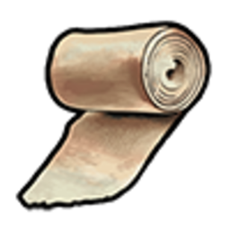
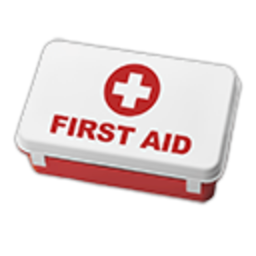

# Обладнання (ЕМС)

Медики використовують спеціальні предмети зі службового спорядження, аптеки лікарні та власного інвентаря. Більшість дій — через **`лівий Alt`** на пацієнта, поки ви **на зміні EMS**.

## Базовий набір

| Предмет | Призначення |
| --- | --- |
|  Бандаж | Зупинка кровотечі, легкі рани |
|  Аптечка | Серйозніші рани, відновлення здоров’я |
| **Медична сумка** | Повний набір для виїзду (видається на зміну) |
| **Ноші** | Транспортування без свідомості до швидкої |
| Морфін / медикаменти | Лікування складних [травм](diseases.md) у лікарні |

## Як застосувати на виїзді

1. Підійдіть до **пацієнта** (на землі або в авто).
2. `лівий Alt` → меню медичних дій (доступно на зміні EMS).
3. Оберіть потрібну дію: **реанімація**, **аптечка**, **бандаж**, **огляд**.
4. Або відкрийте інвентар →  на предметі → **Використати** на цільовому гравці.

## Реанімація

| Стан пацієнта | Що робити |
| --- | --- |
| Без свідомості, є пульс | Аптечка, стабілізація, доставка в лікарню |
| Зупинка серця | Реанімація через меню EMS (тримаєте анімацію до завершення) |
| «Мозкова смерть» (таймер вичерпано) | Лише лікарня / адмін-RP — не воскресайте «на місці» без правил |

Після реанімації перевірте **пошкодження по зонах тіла** (меню скелета) — можливі переломи, що потребують лікарні.

## Швидка та ноші

1. Підкотіть **ноші** до пацієнта.
2. Зафіксуйте потерпілого та відвезіть до  **лікарні** (Aldore, Sandy або інша точка на мапі).
3. Здайте на **реєстрацію** — пацієнт проходить check-in для повного лікування.

## Для цивільних

- Базовий **бандаж** можна купити в [аптеках](../basics/shops.md) — це **тимчасова** допомога.
- При важких ранах викликайте **швидку** через [телефон](../basics/phone.md) → EMS.
- Самолікування не замінює лікаря при переломах і критичних станах.

## Пов’язані гайди

- [Вступ у EMS](getting-started.md)
- [Хвороби та травми](diseases.md)
- [Рація](../basics/radio.md)
