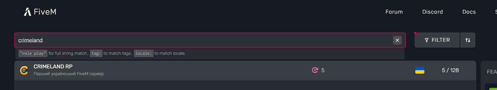

# Як зайти на сервер?

### Встановлення FiveM

Створіть пусту папку та завантажте в неї лаунчер [**FiveM**](https://runtime.fivem.net/client/FiveM.exe)


Якщо лаунчер буде запускатись не з пустої папки, вміст буде автоматично розпаковано в AppData.



Для гри на сервері рекомендовано використовувати SSD-накопичувач з \~50 гб вільного місця.


При першому запуску лаунчера Вам потрібно буде обрати місце розташування файлу GTA5.

#### Як знайти папку GTA V

**Steam**

1. Відкрийте Steam
2. Бібліотека → **Grand Theft Auto V**
3. ПКМ по грі → **Керування → Переглянути локальні файли**

**Epic Games**

1. Відкрийте Epic Games
2. Бібліотека → три крапки біля GTA V
3. **Керування**
4. Натисніть іконку папки біля шляху встановлення

**Rockstar Games Launcher**

1. Налаштування
2. Оберіть GTA V
3. Натисніть **Open Folder / Відкрити папку гри**

### Підключення до сервера

Натисніть Play та в пошуку серверів введіть назву - [CRIMELAND RP](https://servers.fivem.net/servers/detail/a7gbre)

<figure><figcaption></figcaption></figure>

Після цього можете підключатися та починати грати.


Рекомендуємо додати сервер в закладки натиснувши ❤️


