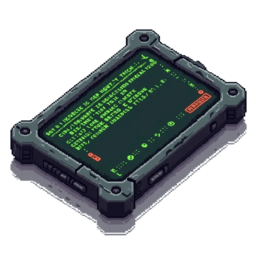

# Фермерство

Вирощуйте й збирайте врожай, а потім продавайте його на ринку ферми. На фермі також можна займатися [самогоноварінням](moonshining.md).

## Як почати

Знайдіть на мапі NPC  **«Фермер»** у сільській зоні та підійдіть до нього, щоб почати. Меню відкривається клавішею **`F7`** або через `Tab` → **Фермерський планшет**  → **ПКМ**  → **Використати**. У меню оберіть місію — збір зерна, фруктові дерева, догляд за худобою чи дрон-полив — і виконуйте етапи за GPS; готовий урожай здайте й продайте там-таки, на ринку ферми. Працювати можна командою до **4 гравців** в одній місії.

Місії відрізняються за характером роботи: на полі — трактор, сівба та тюки на причеп; у саду — збір ящиків з фруктових дерев; на фермі з худобою — годування й догляд за тваринами; а дрон-полив — це полив ділянок з повітря. За цикл місія приносить приблизно **9 600$+** залежно від культури.

Насіння та інструменти продаються в меню ринку ферми. Деякі продукти можна постачати до [кафе](../business/cafe.md) та [магазинів](../business/twenty-four-seven.md) у межах RP.
