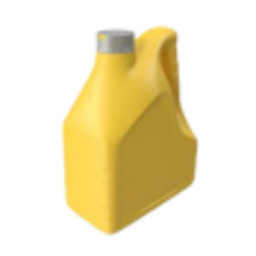
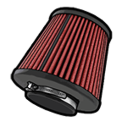
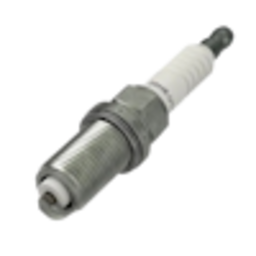
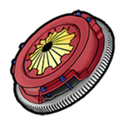
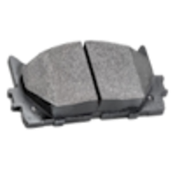
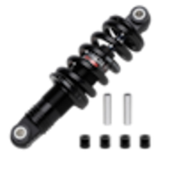
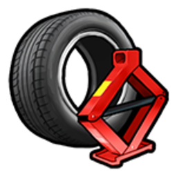
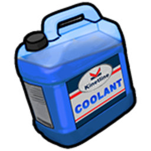
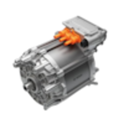
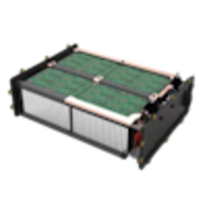

# Механік

Ремонт, тюнінг і обслуговування транспорту — робота в [автомайстерні](../business/auto-repair-shop.md). Це **бізнес гравця**, не вакансія з  [центру зайнятості](../basics/city-hall.md).

## Як влаштуватись

1. Знайдіть **механічну майстерню** на мапі (Benny's, LS Customs, приватні СТО).
2. Напишіть власнику через **«Послуги»** → механіки в [телефоні](../basics/phone.md).
3. Після прийому на роботу отримайте посаду **механік** і службовий планшет.

## Планшет механіка

| Крок | Дія |
| --- | --- |
| 1 | Відкрийте **`Tab`** → [інвентар](../character/inventory.md) |
| 2 | Знайдіть **Планшет механіка** → **ПКМ**  → **Використати** |
| 3 | У планшеті — замовлення, тюнінг, ТО, рахунок клієнту |

Планшет видає майстерня після прийому на роботу. Без предмета в інвентарі меню недоступне.

### Розділи планшета

| Розділ | Коли використовувати |
| --- | --- |
| **Тюнінг** | Stage, swap, привід, дрифт, нітро, вихлоп |
| **Обслуговування** | Планове ТО — знос деталей від пробігу |
| **Нітро** | Встановлення / заправка балонів |
| **Динамометр** | Замір к.с. і Нм після збірки |
| **Замовлення / Рахунки** | Оформлення робіт і оплата |

## Як працювати

| Крок | Дія |
| --- | --- |
| 1 | Клієнт заїжджає в зону підйомника / бай |
| 2 | Відкрийте **планшет механіка** (див. вище) |
| 3 | Встановлюйте деталі (skillcheck / прогрес-бар) |
| 4 | Виставте рахунок — оплата на рахунок майстерні або вам |

## Обслуговування (ТО)

Знос рахується **від пробігу** авто. У розділі **Обслуговування** планшета — % кожної деталі та історія.

### Логіка деградації

| Правило | Пояснення |
| --- | --- |
| **Поріг** | Поки % **вище порогу** — деталь **не впливає** на їзду |
| **Нижче порогу** | Ефект наростає **лінійно** до 0% |
| **≤ 20% будь-яка деталь** | Клієнту прилітає попередження про ТО |
| **Кольори в планшеті** | Зелений ≥ 70% · Жовтий 40–69% · Червоний &lt; 40% |

**Пари деталей:** на тягу й максималку впливає **гірша** з пари — **масло + повітряний фільтр** (ДВЗ) або **охолоджувач + електродвигун** (EV).

### ДВЗ — що від чого, яка запчастина

| | Деталь у планшеті | Впливає на | Деградація з | ~Знос | Що ставити | К-сть |
| --- | --- | --- | --- | --- | --- | --- |
|  | Моторне масло | Тяга, макс. швидкість | **&lt; 20%** | ~700 км | Моторне масло | **1** |
|  | Повітряний фільтр | Тяга, макс. швидкість (з маслом) | **&lt; 20%** | ~1 250 км | Повітряний фільтр | **1** |
|  | Свічки запалювання | Розгін | **&lt; 45%** | ~3 750 км | Свічка запалювання | **4** |
|  | Зчеплення | Перемикання передач | **&lt; 55%** | ~7 500 км | Заміна зчеплення | **1** |
|  | Гальмівні колодки | Гальмування | **&lt; 60%** | ~3 750 км | Заміна гальмівних колодок | **4** |
|  | Підвіска | Стабільність, крени | **&lt; 60%** | ~6 250 км | Деталі підвіски | **1** |
|  | Шини | Зчеплення | **&lt; 50%** | ~1 250 км | Заміна шин | **4** |

### EV — що від чого, яка запчастина

| | Деталь у планшеті | Впливає на | Деградація з | ~Знос | Що ставити | К-сть |
| --- | --- | --- | --- | --- | --- | --- |
|  | Охолоджувач електромобіля | Тяга, макс. швидкість (з електромотором) | **&lt; 20%** | ~7 500 км | Охолоджувач електромобіля | **1** |
|  | Електродвигун | Тяга, макс. швидкість (з охолоджувачем) | **&lt; 20%** | ~25 000 км | Електродвигун | **1** |
|  | Акумулятор електромобіля | Розгін | **&lt; 45%** | ~15 625 км | Акумулятор електромобіля | **1** |
|  | Гальмівні колодки | Гальмування | **&lt; 60%** | ~3 750 км | Заміна гальмівних колодок | **4** |
|  | Підвіска | Стабільність | **&lt; 60%** | ~6 250 км | Деталі підвіски | **1** |
|  | Шини | Зчеплення | **&lt; 50%** | ~1 250 км | Заміна шин | **4** |

### Алгоритм ТО для механіка

1. Підключіть авто в планшеті → **Обслуговування**.
2. Перегляньте % — червоні / жовті позиції пріоритетні.
3. Перевірте **склад Benny's** (розділ **«Сервіс»**) — чи є потрібні деталі в кількості з таблиці.
4. Встановіть запчастини через планшет (прогрес / skillcheck).
5. Після заміни деталь = **100%** — вплив на handling зникає.
6. Виставте рахунок: **деталі + робота**.


**ТО ≠ ремонт кузова.** Ремонтний набір у полі лікує кузов/мотор, але **не відновлює % обслуговування**. Зношені шини в ТО — **4× «Заміна шин»**; пробиті колеса в полі — той самий предмет **«Заміна шин»** (див. [тюнінг](../transport/tuning.md)).


Детальніше для клієнтів — розділ [Знос і ТО](../transport/tuning.md).

## Для клієнта без механіка

Якщо на зміні нікого немає — скористайтесь [самообслуговуванням](../transport/tuning.md) у зонах Customs (доки LS, марина, Sandy Shores).

## Поради

- Закуповуйте запчастини в [магазинах](../basics/shops.md) або на складі Benny's.
- Рекламуйте послуги через **«Послуги»** в [телефоні](../basics/phone.md).
- Передпродажне ТО — популярна послуга для [шоурумів](../business/showroom.md).
