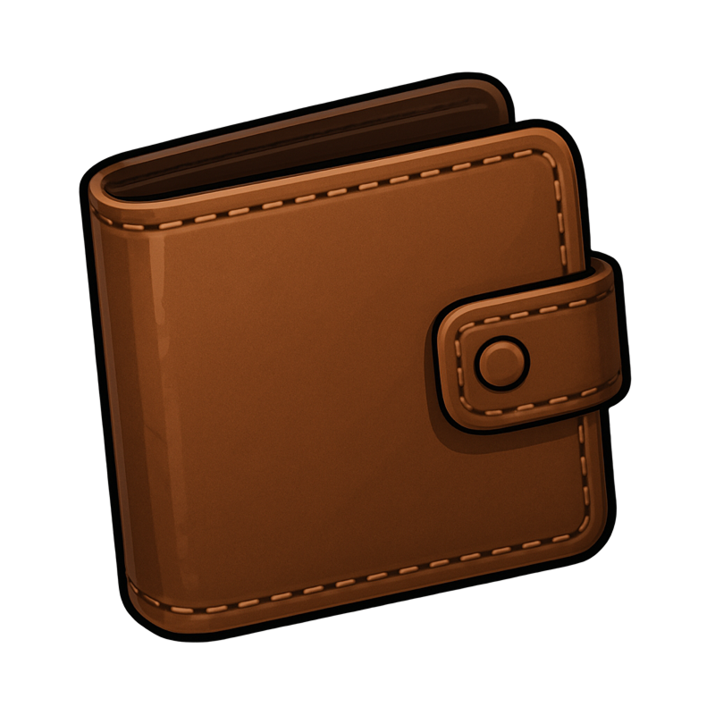

# Мийник вікон

Мийник вікон — цивільна робота на **висоті**: ви піднімаєтесь на платформі, очищуєте скло на фасадах будівель і отримуєте оплату за кожне вікно. **Стаж у штаті не потрібен** — підходить новачкам.

## Коротко про роботу

| Параметр | Значення |
| --- | --- |
| Стаж | **Не потрібен** |
| База | **Набережна / пляж** (захід Лос-Сантоса) |
| Оплата | **~400$** за одне вікно |
| Посвідчення | **Категорія B** |
| Обов’язковий предмет | **Гаманець** |
| Кулдаун між змінами | **2 години** |
| Команда | Можна в групі (множник виплати) |

## Як влаштуватись

1.  [Центр зайнятості](../basics/city-hall.md) → **«Вакансії»** → **Мийник вікон**.
2. Оформіть працевлаштування та прокладіть маршрут.
3. Приїдьте на базу біля набережної.
4. Підійдіть до маркера → **`E`** → почніть / завершите зміну.

## Перед стартом

| Вимога | Деталі |
| --- | --- |
|  Гаманець | У інвентарі (у всієї команди) |
| Посвідчення **категорії B** | Легковий автомобіль; [автошкола](../transport/driving-school.md) |
| Вільна стоянка | Місце появи службового авто з платформою |

## Покрокова зміна

### 1. Початок

1. Відкрийте меню зміни на базі.
2. За бажанням створіть **групу** з друзями.
3. Сядьте в **службове авто** (фургон з підйомною платформою).
4. Їдьте до **об’єкта на мапі** (маркер будівлі з вікнами).

### 2. Підйом на платформу

1. Під’їдьте до будівлі.
2. **Увійдіть на платформу** (підказка на екрані).
3. Керуйте підйомом:
   - **Вгору** — одна клавіша (за замовчуванням стрілка вгору / відповідна підказка).
   - **Вниз** — інша клавіша.

### 3. Миття вікон

1. Підніміть платформу до **позначеного вікна** (маркер на склі).
2. Натисніть **`E`** біля вікна — почнеться міні-гра очищення.
3. Проведіть / очистіть скло за підказками інтерфейсу.
4. За кожне вікно — **~400$** до загальної виплати.


Одне вікно може мити **лише один гравець** одночасно. Якщо хтось уже чистить — оберіть інше вікно або зачекайте.


### 4. Завершення

1. Після потрібної кількості вікон поверніться на **базу**.
2. Завершите зміну в маркері (потрібно бути **водієм** службового авто).
3. Отримайте виплату на рахунок.

Якщо закінчите без службового авто — можливий **штраф ~5 000$**.

## Робота в команді

| Параметр | Пояснення |
| --- | --- |
| Група | Кілька людей на одній платформі / об’єкті |
| Виплата | Базова сума може **множитись** на кількість учасників |
| Лідер | Розподіляє відсотки виплат у меню групи |

## Безпека

- Падіння з висоти **пошкоджує** персонажа — не ризикуйте без потреби.
- Тримайте платформу на рівні вікна, не стрибайте з неї.
- Майте в [інвентарі](../character/inventory.md) бандаж на випадок падіння.

## Поради

1. Обирайте об’єкти з **багатьма вікнами** підряд — менше їзди між точками.
2. Поєднуйте з мультироботою (**`F1`** → **Про мене** → **Робота**), якщо чекаєте кулдаун іншої вакансії.
3. Для роботи **на вулиці з вантажівкою** — [Сміттяр](cleaner.md) (категорія **C**).

## Якщо щось не працює

| Проблема | Рішення |
| --- | --- |
| «Потрібна категорія B» | Здайте на B в [автошколі](../transport/driving-school.md) |
| Не починається миття | Підійдіть ближче до маркера вікна; переконайтесь, що вікно вільне |
| Не завершується зміна | Завершувати має **водій** службового авто на базі |
| Немає виплати | Перевірте, чи не закінчили зміну без машини (штраф) |
