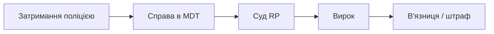

# Судовий кодекс

Судовий кодекс описує роботу судів, ролі **суддів** та **адвокатів**, призначення покарань і оскарження вироків.

## Де прочитати

| Джерело | Як отримати |
| --- | --- |
| Предмет-документ | [Мерія](../basics/city-hall.md) → **Документи** |
| Електронна копія | [Гаманець](../basics/documents.md) |
| Вікі | Навігація; повний текст — в IC-документі |

## Процес (загалом)

1. Поліція передає справу з **доказами** ([криміналістика](../police/forensics.md)).
2. Сторони (обвинувачення / захист) виступають у **суді RP**.
3. Суддя виносить вирок за [кримінальним](criminal-code.md) та [процесуальним](procedural-code.md) кодексами.
4. Відбування покарання — у державній в'язниці або штраф на рахунок.

## Ролі в суді

| Роль | Функція |
| --- | --- |
| Суддя | Керує процесом, оголошує вирок |
| Прокурор / обвинувачення | Представляє державу |
| Адвокат | Захист підозрюваного |
| Свідки | Дають показання IC |

## Цивільні спори

Контракти між бізнесами, розлучення, позови за шкоду — також можуть вирішуватись у суді за **домовленістю фракцій** (DOJ / адвокатура).


У судових спорах посилайтесь на **конкретні статті** з документа в гаманці, а не на пам'ять з вікі.


## Пов’язані кодекси

- [Кримінальний кодекс](criminal-code.md)
- [Процесуальний кодекс](procedural-code.md)
- [Конституція](constitution.md)
