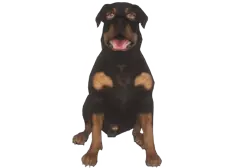
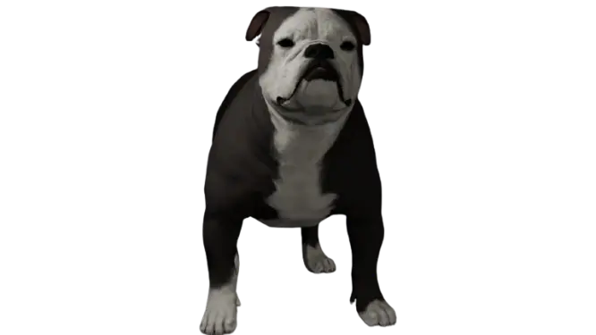

# K9

Підрозділ **K9** — службові собаки для пошуку заборонених речей, утримання втікача та захисту офіцера. На CrimeLand K9 — це **окремі породи** в системі [домашніх улюбленців](../character/pets.md), доступні лише поліції.

## Хто може мати K9

| Умова | Деталі |
| --- | --- |
| Робота | **Поліція** (LSPD) — інші фракції K9 не купують |
| Порода | Лише собаки з позначкою **К9** у [зоомагазині](../character/pets.md) |
| Зміна роботи | Якщо вас перевели з поліції — **викликати K9 не вийде**, поки знову не на службі |

## Як взяти собаку на зміну

1. Придбайте K9-породу в зоомагазині (якщо ще немає).
2. На зміні відкрийте **`F1`** → **Улюбленці** або натисніть **`I`** (сумка улюбленців).
3. **Викличте** собаку поруч із собою.
4. Одягніть **жилет K9** з магазину — для RP та впізнаваності.

## Навички службового собаки

| Навичка | Що робить |
| --- | --- |
| **Нюх (sniff)** | Шукає заборонені предмети в авто, на людині, поблизу |
| **Атака (attack)** | Звалює підозрілого без смертельної шкоди — утримує до підходу офіцера |
| **Спритність / витривалість** | Прокачуються з досвідом у тренуваннях |

Собака **не вбиває** гравців — лише звалює та утримує. Це RP-механіка, не заміна пострілу.

## Для офіцера-кінолога

1. Отримайте **сертифікацію K9** у керівництва відділку IC.
2. Тренуйте нюх і атаку на навчальних вправах (за SOP).
3. Годуйте та доглядайте за собакою — низький настрій погіршує роботу.

## Для патрульних

- Викликайте K9 при підозрі на **наркотики** в авто чи будинку — за наявності **ордера** або законної підстави.
- Не заважайте роботі собаки: тримайте **дистанцію**, не кричіть поверх команд кінолога.
- Якщо K9 на зміні — повідомте диспетчера в [рації](../basics/radio.md).


K9 — дорога інвестиція (до **1 000 000$** за ротвейлера). Купуйте лише якщо відділок реально планує кінологічну службу.


## Пов’язані гайди

- [Домашні улюбленці](../character/pets.md) — покупка, догляд, меню
- [Посібник офіцера](officer-guide.md)
- [Статут LSPD](../laws/lspd-statute.md)
