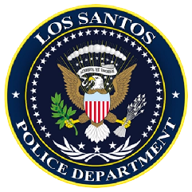
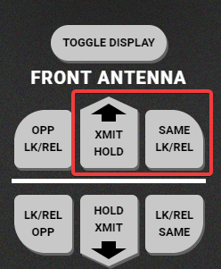

---

## 👋 **Вступ і початок роботи**

Ласкаво просимо до Відділу поліції Лос-Сантоса та округу Блейн. Перед початком служби уважно ознайомтесь із цими положеннями та завжди дотримуйтеся чинного законодавства.

## 🎯 **Основні принципи служби**

* Офіцери відповідають за дотримання закону і підтримку громадського порядку.

* Ви не зобов’язані стежити за дотриманням ігрових правил серверу — це завдання адміністрації.

* Корупція суворо заборонена. Будь-який прояв:

  * призведе до негайного розірвання контракту LSPD, * тягне за собою кримінальну відповідальність згідно з законом.

* Нульова терпимість до участі в незаконній діяльності.    У разі порушення:

  * ви будете усунені від служби, * звільнені без права на відновлення.

## ⚖️ **Законність дій офіцера**

* Не зловживайте ув’язненням чи штрафами.    Завжди посилатись на Кримінальний кодекс та використовуйте MDT для перевірки статей.

* Офіцери можуть конфіскувати тільки:

  * вогнепальну зброю, * наркотики, * відмички підвищеного класу, * незаконні кошти.

  #      Усі легальні речі (документи, звичайні гроші, інструменти тощо) повинні бути залишені власнику.     📌 Пам’ятайте: офіцери — це обличчя міста. Один некоректний вчинок кидає тінь на весь департамент.

## 📜 **Права Міранди**

Ви маєте право зберігати мовчання. Все що ви скажете може і буде використано проти вас в суді. Ви маєте право на правову допомогу та телефонні дзвінки протягом 5 хвилин. Чи розумієте  ви свої права?

У випадку якщо людина не зрозуміла свої права, офіцер повинен зачитати Міранду ще раз (до 2 разів).

Ці права повинні бути зачитані особі, яка наразі обвинувачується і затримується за злочин або під підозрою у злочині до подальшого розпорядження (переконайтесь, що вона свідома).

🔹 **Міранду слід зачитувати:**

* Особі, на яку вже надягнули наручники та взяли під руку.
* Завжди перед проведенням обшуку.
* Якщо особа перебуває у несвідомому стані (наприклад, після перестрілки чи аварії), слід дочекатися прибуття медичної допомоги та відновлення свідомості, після чого зачитати права Міранди.

**Права Міранди в простій формі означають:**

* Ви не зобов’язані визнавати свою провину.
* Ви не повинні відповідати на питання, які можуть вам задати офіцери.
* Ви можете залишатися повністю мовчазними.

**Ви можете:**

* Запитати та представити адвоката або Хабеас.
* Здійснювати телефонні дзвінки протягом 5 хвилин.

Якщо особа вирішує мовчати на запитання: "Ви розумієте ці права, які вам зачитали?" — це мовчання може вважатися актом вираження їх прав.

Після зачитування цих прав ви повинні повідомити їм про пред’явлені обвинувачення та злочини, які вони скоїли і/або у скоєнні яких підозрюються.

## 👮‍♂️ Основні обов'язки та вимоги під час робочої зміни

* Офіцерам рекомендується НЕ реагувати на 10-11 (постріли) самостійно.

* Завжди відповідати 10-77 / 10-78 (підмога / backup).

## **Патрулювання** 🚓

* Дозволено в будь-який час, крім випадків за вказівкою старшого офіцера.
* Рекомендовано патрулювати в парах.

### **Зв’язок / Радіо**📻

* Завжди використовуйте чіткі та точні комунікації під час патрулювання або виконання завдань.
* Негайно припинити передачу, якщо надходить команда “Clear Traffic” або “10-3” — канал повинен бути вільним для пріоритетного зв’язку.
* У ситуаціях переслідування передавайте короткі, зрозумілі повідомлення без зайвих деталей.
* Завжди перевіряйте, що ви на правильній частоті — одна для загального трафіку, інша для спеціальних операцій.

## **Затримання** ✋

* Дозволено при обґрунтованій підозрі.
* Обшук лише у разі підозри у кримінальній діяльності.
* Перевірка особи через документи (для перевірки судимостей/ордерів).
* Арешт при діючому ордері або відмові на обшук.
* Опір/втеча — підстава для арешту.

## **Арешт** 🔒

* Арешт при ймовірній причині або факті злочину.
* Прочитати Права Міранди до допиту (якщо підозрюваний при свідомості).
* Після затримання дозволено обшук і вилучення заборонених предметів.
* Перед вилученням слід фотографувати кишені.
* Підозрюваним надягають кайданки, зачитують права та обшукують перед посадкою в авто.

## **Затримання (етап після арешту)** 🔐

* Права Міранди — після кайданків, до оформлення.
* Доставити на задній в'їзд MRPD.
* Супровід до камер.
* Зброю вилучати перед зняттям наручників.
* Переконатися, що камера закрита перед зняттям наручників.

## **Зупинка руху** 🚗

* Можлива лише при обґрунтованій підозрі порушення.
* Обшук ТЗ — лише при вагомій причині або згоді водія.
* Дозволено виклик підрозділів на власний розсуд.

## **Домашні крадіжки** 🏠

* Використання КОД 1 при під'їзді до місця виклику.
* Заборонено втручатися без 2 офіцерів на місці. Якщо один — чекати за межами.

## **Переслідування транспортних засобів (10-80)** 🚨

* Дотримання обережності.
* Відповідність класу ТЗ (B, A, S).
* PIT/EMP — тільки з дозволу вищого за званням.
* Завжди тримати стрій.
* Відповідальність за переслідування — за найвищим рангом.
* До 4 одиниць ТЗ (6 офіцерів) у погоні.
* При втечі пасажира — основний офіцер за водієм, інші — за пішими.
* EMP — лише другим пілотом в AIR 1\.
* PIT — при швидкості \< 120 км/год та безпечно.
* PIT тільки з дозволу.
* При зміні ТЗ підозрюваним — дозволено шипи / вогонь по шинах (лише задні, лише після 2 заміни  або заміни ТЗ на мототранспорт, з дозволу командування).

## **Піші погоні** 🏃‍♂️

* 3 секунди між застосуванням електрошокера.
* 1 попередження перед застосуванням.
* 5 секунд між затриманням(кайданки) та електрошокером.
* Дубинка — лише при опорі.
* Заборонено нокдаун після тазера. Або одне, або інше.

## Шипи

* Лише з дозволу командування.
* Обов’язкове - радіозв’язок із вказанням місця.

## **Переслідування у воді** 🌊

* Переслідувати плавом.
* Можна викликати морську піхоту або AIR 1\.
* Заборонено стріляти чи використовувати тазер у воді.

## **Ліцензії** 📋

[Інструкція-посилання](https://docs.google.com/document/u/0/d/1SoNtAAb9QdVsk7DqPBKCu19a3vjEhe_KMx-9tuJB2fE/edit)

* Доступ через MDT / MDW.
* Профіль → ПКМ → Ліцензії → Додати/Видалити.

### **Ліцензія на зброю** 🔫

* Видає сержант і вище.
* Кандидат має пройти анкету зі 100% правильністю.

### **Ліцензії на полювання/риболовлю** 🎣 (в розробці)

## 🔫 **Застосування сили**

#### Підготовка та загальні принципи

Офіцери LSPD проходять інтенсивну і постійну підготовку із застосування сили. Вони зобов’язані використовувати мінімально необхідну силу під час арешту, але навчені переходити до ескалації, якщо цього вимагає ситуація.

#### Використання не смертоносних засобів

Несмертоносні пристрої, такі як електрошокери та палиці, видаються всім офіцерам із чіткими інструкціями щодо їх застосування. Їх використання є пріоритетним у випадках, коли немає загрози життю.

#### Озброєння в умовах патрулювання

Через високий рівень насильницьких злочинів у Лос-Сантосі, вогнепальна зброя є необхідним інструментом для забезпечення безпеки як громадськості, так і самих офіцерів. У ситуаціях, коли офіцери стикаються зі смертельною силою, вони повинні бути належним чином озброєні.

## 🚨 **Умови для застосування смертельної сили**

Офіцери мають право застосовувати вогнепальну зброю для:

* Захисту себе чи інших від безпосередньої загрози смерті або серйозних тілесних ушкоджень.
* Затримання злочинця, який вчинив насильницький злочин і чия втеча створює серйозну загрозу для життя або здоров’я інших осіб.
* Смертельна сила не завжди є виправданою, але може бути дозволена за умов, описаних вище.

#### Обмеження та відповідальність

**Клас зброї, яку використовує офіцер, повинен відповідати тій, яка становить загрозу. Якщо злочинці використовують зброю класу В (пістолет), то офіцеру заборонено застосовувати зброю класу А (карабін, автоматична зброя).**

Поліцейські повинні пам’ятати, що їхній основний обов’язок – захист громадськості. Заборонено відкривати вогонь у ситуаціях, де це може призвести до поранення або смерті перехожих або заручників, крім випадків, коли відмова від дій загрожує життю або створює значну загрозу серйозних тілесних ушкоджень.

📌 **Підсумок -** Офіцер має право застосовувати смертельну силу лише тоді, коли це обґрунтовано і відповідає стандартам безпеки.

**Стадії застосування сили поліцією**

### Основний принцип

Поліцейський зобов'язаний застосовувати мінімально необхідний рівень сили, достатній для припинення правопорушення, опору або загрози.

Заборонено: використовувати вогнепальну зброю лише тому, що особа тікає, не виконує накази або чинить словесний опір.

---

## Стадія 1 — Усна вимога

Застосовується, якщо громадянин:

* не виконує законну вимогу;
* порушує громадський порядок;
* намагається втекти, але не становить безпосередньої загрози життю;
* чинить словесний опір.

Дії:

> «Поліція\! Зупиніться та виконуйте законні вимоги\!»

На цій стадії застосування зброї заборонене, якщо немає додаткової загрози життю.

---

## Стадія 2 — Фізичний опір / злочинець без зброї

Якщо злочинець не має зброї та чинить фізичний опір:

Дозволено:

* фізичне затримання;
* боротьба;
* кайданки після припинення опору;

Заборонено:

* відкривати вогонь просто через те, що людина біжить;
* стріляти в беззбройного порушника, який не створює смертельної загрози.

### Важливо

Якщо беззбройний злочинець заволодів транспортом і намагається втекти, це саме по собі не є автоматичною підставою для стрільби. Потрібно оцінювати, чи створює він безпосередню загрозу життю.

---

## Стадія 3 — Холодна зброя

Якщо особа має:

* биту;
* ніж;
* мачете;
* сокиру;
* іншу холодну зброю,

але не створює безпосередньої смертельної загрози, першочергово використовуються несмертельні засоби та дистанція.

Наприклад:

Кайданки / фізичне затримання → Тейзер → вогнепальна зброя лише за наявності смертельної загрози.

### Коли можна стріляти?

Якщо озброєна холодною зброєю особа:

* кидається на поліцейського;
* намагається завдати смертельного удару;
* наближається до громадянина з очевидним наміром його вбити;
* вже здійснює напад, який створює реальну загрозу життю.

Тобто сам факт наявності бити або ножа ≠ автоматичний дозвіл на стрільбу.

---

## Стадія 4 — Пістолет / інша вогнепальна зброя класу В

Якщо злочинець має пістолет, але:

* тримає його опущеним;
* не направляє на людей;
* не робить пострілу;
* не здійснює безпосередньої атаки,

поліцейський повинен оцінити ситуацію та, за можливості, віддати команду здатися.

### Відкриття вогню дозволяється, якщо:

злочинець направляє зброю на поліцейського або цивільного, робить постріл або очевидно готується здійснити смертельний напад.

Приклад:

> Злочинець дістає пістолет → направляє його на поліцейського → поліцейський має право відкрити вогонь для припинення смертельної загрози.

Але якщо Злочинець має пістолет у кобурі → не дістає його → стріляти не можна.

---

## Стадія 5 — Автоматична зброя класу А

Автоматична зброя створює підвищену загрозу через можливість швидкого ведення вогню.

Якщо злочинець:

* озброєний автоматом;
* відкрив вогонь;
* направив зброю на людей;
* здійснює напад;
* готується відкрити вогонь,

поліцейські повинні застосувати вогнепальну зброю для негайного припинення смертельної загрози.

### Але:

наявність автомата сама по собі не означає автоматичний дозвіл стріляти.

Наприклад:

> Людина стоїть з автоматом, але не направляє його та виконує вимоги поліції.

У такій ситуації бажано спочатку вимагати покласти зброю та здатися, якщо обставини дозволяють.

---

## Стадія 6 — Безпосередня смертельна загроза

Це найвища стадія застосування сили.

Поліцейський може відкрити вогонь без додаткового очікування, якщо існує безпосередня загроза життю поліцейського або іншої особи.

До таких ситуацій належать:

* злочинець вже стріляє;
* зброя направлена на людину;
* злочинець намагається застрелити когось;
* злочинець веде активний напад із вогнепальною зброєю;
* озброєна особа здійснює напад, який явно загрожує життю.

Мета стрільби — припинити загрозу, а не покарати злочинця.

---

## 🌊 Затримання у воді

### ❌ У воді ЗАБОРОНЕНО:

* використовувати тайзер;
* надягати кайданки на особу, яка перебуває у воді

### Що робити?

Якщо злочинець знаходиться у воді:

1. Вимагати вийти на берег.
2. Забезпечити спостереження за ним.
3. Не використовувати тайзер.
4. Не надягати кайданки у воді.
5. Після виходу з води провести затримання стандартним порядком.

Тобто простими словами якщо злочинець Тікає від погоні в воду стріляти по ньому забороняється. Використовувати спецзасіб тайзер теж заборонено через підвищений ризик отримати серцевий напад або паралізація тіла, що призведе до утоплення Злочинця.
в таких випадках доцільним буде викликати екіпаж AirOne, також направити вільного юніта до найближчої точки отримання службового катера
Було б доцільніше за катером відправити екіпаж з 2х юнітів ( один кермує катером , інший веде розвідку дроном з тепловізором ). Інші екіпажі розтягуються по береговій лінії щоб забезпечити більше покриття можливих точок виходу з води Злочинця.

У разі втечі підозрюваного у воду поліція має право переслідувати його на водному транспорті, або організувати перехоплення на протилежному березі.

### ✅У воді ДОЗВОЛЕНО:

Бити злочинця дубинкою та\\або ліхтариком (це єдиний логічний спосіб зупинити злочинця)
Стріляти по злочинцям ТІЛЬКИ у випадку коли злочинці на водному транспорті та відкрили вогонь. Якщо вогонь не відкривався з боку злочинців то вести вогонь можна тільки по водному транспорту на якому тікають злочинці

### Автомобільна погоня та застосування вогнепальної зброї

1. Сам факт втечі від співробітників поліції на транспортному засобі не є підставою для відкриття вогню.
2. Заборонено відкривати вогонь по транспортному засобу виключно через перевищення швидкості, невиконання вимоги про зупинку або факт втечі.
3. Відкриття вогню під час погоні дозволяється, якщо водій або пасажир створює безпосередню загрозу життю або тяжкому тілесному ушкодженню поліцейського чи цивільної особи.
4. До смертельної загрози може належати навмисний наїзд на людину, використання автомобіля як зброї, ведення вогню з автомобіля або інша очевидна дія, спрямована на заподіяння смертельної шкоди.
5. Якщо смертельна загроза припинилася, співробітник поліції зобов'язаний припинити застосування вогнепальної зброї.
6. Заборонено використовувати вогнепальну зброю для примусової зупинки транспортного засобу, якщо відсутня безпосередня загроза життю.
7. Таран, PIT або інше примусове припинення руху дозволяється лише тоді, коли це відповідає рівню загрози та ризик від продовження погоні є вищим за ризик застосування такого маневру, та обов'язково з підтвердженням старшого зміни\!

8. ### Після завершення погоні та зупинки транспортного засобу затримання здійснюється відповідно до загальних правил застосування сили та процесуального кодексу      ВАЖЛИВО\!     Попередження про можливе застосування вогнепальної зброї не означає автоматичного дозволу на відкриття вогню. Після попередження співробітник поліції все одно повинен мати передбачену цим регламентом підставу для застосування вогнепальної зброї тобто загроза життю громадян та\\або співробітників поліції

## 🏛️ **Структура департаменту та ранги**

## 🔹 Ієрархія та повага

* Завжди дотримуйтесь командного ланцюга (ієрархії).
* Поважайте всіх співробітників як у PD, EMS, так і в інших міських службах.
* Виконуйте вказівки вищих за званням без зайвих обговорень під час виконання обов’язків.

## 📻 **Радіозв’язок**

* Радіозв’язок має бути в режимі LRT (*лише радіо трафік*) у будь-який час.
* Обов’язково повідомляйте в ефір при:
  * 10-41 — заступив на чергування.
  * 10-42 — завершив чергування.

## 📝 **Документообіг**

* Офіцери зобов’язані заповнювати всі необхідні документи під час чергування.
* Особливу увагу слід приділяти звітам у системі MDT — їх потрібно оформлювати безпосередньо під час інциденту.

## 🚓 **Поведінка на дорозі**

* Дотримуйтеся всіх правил дорожнього руху, крім випадків, коли ситуація вимагає інакше (наприклад, переслідування).
* Керувати дозволено лише сертифікованими та затвердженими службовими авто.

## 🔗 **Ланцюг командування (Chain of Command)**

Ланцюг командування — це ієрархічна структура, яка визначає порядок передачі команд, відповідальність та контроль на різних рівнях у межах департаменту. Дотримання цього принципу гарантує дисципліну та ефективну взаємодію.

#### **Структура**:

1. Шеф / Начальник відділу Найвища посадова особа. Приймає стратегічні рішення та видає накази всьому департаменту

2. Заступник начальника поліції Заміщає шефа за його відсутності, допомагає в управлінні та контролює виконання наказів.

3. Капітан Координує роботу підрозділів, підтримує зв’язок між керівництвом і оперативним складом.

4. Лейтенант Відповідає за виконання наказів на місцях, слідкує за роботою сержантів та офіцерів.

5. Сержант Керує невеликими групами офіцерів, контролює щоденну діяльність, навчає кадетів.

6. Офіцер Основна виконавча одиниця. Патрулює, взаємодіє з громадськістю, оформлює інциденти.

7. Кадет Проходить навчання під наглядом старших офіцерів, виконує базові завдання.

📌 Дотримання ланцюга командування є обов’язковим. Завжди звертайтесь до безпосереднього керівника за званням для вирішення питань.

## 🤝 **Заява та Членство**

Щоб стати частиною LSPD, кандидат має відповідати ряду базових вимог та пройти повноцінне навчання.

## 📋 Вимоги до кандидата на вступ:

* Бути достатньо зрілим, щоб усвідомлювати правила та положення PD і розуміти відповідальність служби.

* Не обіймати державну посаду на момент подання заяви.

* Не мати кримінального минулого або обвинувачень у злочинах.

## 🎓 Процес навчання та вступу:

* Нові рекрути проходять інтенсивну підготовку під керівництвом ФКП (Офіцера Кадрової Підготовки).

* Після завершення навчання кандидати проходять оцінювання Капітаном або Заступником Капітана.

* Навчання обов’язково має тривати не менше тижня перш ніж рекрута можуть розглядати на підвищення до звання Офіцера.

## Радар

🚓 Wraith ARS 2X Посібник з використання радара

### Як увімкнути радар

КРОК 1 Натисніть F5, щоб відкрити пульт керування радаром.

КРОК 2 Натисніть кнопку Toggle Display на пульті, а потім кнопку PWR на панелі радара, щоб увімкнути його прилади.

КРОК 3 Натисніть кнопку XMIT на потрібному радарі (передньому/задньому), щоб увімкнути режим передавання, а потім натисніть SAME або OPP, щоб обрати напрямок для цього радара.

---

### Налаштування радара

Radar Settings

* Fast Target (FAS)
Якщо увімкнено, відображатиметься найшвидша ціль.

* Same Lane Sensitivity (SL SEn)
Змінює чутливість радара для вашої смуги руху (дальність). Чим вище значення, тим більша дальність.

* Opposite Lane Sensitivity (OP SEn)
Те саме, що й для вашої смуги, але для радарів, спрямованих на зустрічну смугу.

* Beep Volume (bEE P)
Регулює гучність сигналів при натисканні кнопок. Менше число — тихіше звучання.

* Voice Volume (VOI CE)
Регулює гучність голосового повідомлення, коли зафіксовано високу швидкість.

* Plate Audio (PLt AUd)
Регулює гучність голосового повідомлення при виявленні номерного знаку з BOLO (розшуку).

* Unit Type (Uni tS)
Змінює одиниці вимірювання швидкості радара: USA — милі/год, iNt — км/год.

* Fast Lock (FAS Loc)
Увімкнення автоматичного блокування швидкості, якщо вона перевищує поріг швидкого режиму.

* Fast Speed (FAS SPd)
Встановлює мінімальну швидкість (з кроком у 5), при якій радар блокуватиме швидке значення.

---

### Використання ALPR та встановлення BOLO-номерів

Стандартні клавіші Ви можете знайти всі призначення клавіш у GTA: Налаштування → Призначення клавіш → FiveM. Там вказано кожну дію та її клавішу. Можна змінювати, як і звичайні GTA-клавіші.

* F5 — Відкриває контролер радара.

* F11 — Вмикає/вимикає блокування клавіш радара (відключає всі комбінації клавіш для нього).

* NUMPAD 8 — Блокує/розблоковує передній радар.

* NUMPAD 5 — Блокує/розблоковує задній радар.

* NUMPAD 9 — Блокує/розблоковує передній ALPR.

* NUMPAD 6 — Блокує/розблоковує задній ALPR.

* ESC — Закриває контролер радара.
