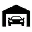

# Салони

Новий транспорт купується в **автосалонах** — на мапі (`P`) у кожного свій бліп. Стартова точка для першого авто —  **Ретро-Салон PDM** у центрі міста; маршрут можна прокласти з  [центру зайнятості](../basics/city-hall.md) → **«Бізнеси в місті»**.

## Як купити авто

1. Приїдьте до потрібного салону (див. [типи нижче](#типи-салонів)).
2. Підійдіть до маркера входу → **`E`** / **`лівий Alt`** ([Керування](../basics/controls.md)) → **«Відкрити шоурум»**.
3. Оберіть **категорію**, **модель**, **колір**.
4. Перегляньте характеристики; за потреби — **тест-драйв** (до **5 хв**).
5. Підтвердіть покупку — кошти спишуться з **банку** / **готівки** (у **Преміум салоні** — **коїнами**).

### Тест-драйв і тюнінг

Під час тест-драйву авто **ваше на час поїздки** — можна спокійно поїхати до найближчого **LS Customs / Benny's** і подивитись, **який тюнінг доступний** для цієї моделі (двигун, підвіска, колір тощо), не купуючи машину всліпу.

| Правило | Деталі |
| --- | --- |
| Тривалість | До **5 хвилин** |
| Завершення | Вийдіть з авто або поверніться до салону |
| Оплата тюнінгу | На тест-драйві лише **перегляд** каталогу — встановлення оплачується після покупки власного авто |


Запишіть собі варіанти кольору та пакетів продуктивності під час тест-драйву — після купівлі одразу поїдете в [тюнінг](tuning.md).


6. Після покупки авто з’являється на паркінгу **«Куби»** (Legion Square) — заберiть його там, коли зручно (див. [Паркінг](parking.md)).

## Вимоги

| Вимога | Деталі |
| --- | --- |
| Водійське | Категорія **A** / **B** / **C** за типом ТЗ — підтвердіть у [автошколі](driving-school.md) |
| Баланс | Достатньо коштів на обраному способі оплати |


**Ліміту на кількість авто немає** — купувати можна скільки завгодно. Машини зберігаються на **публічних паркінгах** по всьому штату. Обмеження **слотів** діє лише для **гаража житла** (коли ставите авто саме туди), а не для покупки в салоні.


## Типи салонів

На сервері **кілька окремих салонів** — у кожного свій асортимент і (зазвичай) свій бліп на мапі. Три головні зони для легкових:

| Зона | Салони | Для кого |
| --- | --- | --- |
| **Центр міста** |  **Ретро-Салон PDM** | Перше авто, економ і повсякденні моделі |
| **Vespucci Beach** |  **Люкс авто** + **Преміум салон** (поруч, маркер на землі) | Дорогі та донатні машини |
| **Порт LS** |  **Дрифт & JDM** | JDM, дрифт, спорт |

### Повний список

| Салон | Бліп | Де шукати | Що продає | Оплата |
| --- | --- | --- | --- | --- |
| **Ретро-Салон PDM** |  | Центр LS, класичний PDM | Компакт, седан, купе, muscle, ретро, SUV, позашляховики, ван | Готівка / банк |
| **Люкс авто** |  | Vespucci Beach | Люкс і спорт: суперкари, muscle, SUV, купе | Готівка / банк |
| **Преміум салон** | — | Vespucci Beach, поруч із люкс-салоном | Донатні та ексклюзивні моделі | **Коїни** |
| **Дрифт & JDM** |  | Порт Los Santos | JDM, дрифт, спорт | Готівка / банк |
| **Just Moto** |  | Центр LS | Мотоцикли | Готівка / банк |
| **Ринок авіатранспорту** |  | Аеропорт LS | Літаки, гелікоптери | Готівка / банк |
| **Магазин човнів** |  | Доки LS | Човни, катери | Готівка / банк |
| **Магазин причепів** |  | Grapeseed (північний схід штату) | Причепи, утилітарні | Готівка / банк |
| **Магазин тягачів** |  | Paleto Bay | Тягачі (категорія **C**) | Готівка / банк |


**Преміум салон** біля пляжу часто **без окремого бліпа** — шукайте **маркер на землі** поруч із люкс-салоном. Донатні авто оплачуються **коїнами**, не доларами.


## Кредит (якщо доступно)

У частини салонів можна оформити **розстрочку**:

| Параметр | Типове значення |
| --- | --- |
| Перший внесок | **10%** ціни |
| Платежів | **12** |
| Відсоток | **10%** |
| Прострочення | Ризик **повернення** авто системою |

Перед оформленням переконайтесь, що зможете платити вчасно.

## Після покупки

- За замовчуванням нове авто — на паркінгу  **Legion Square** (центр міста).
- Інші машини можна **переставляти** між публічними паркінгами через меню гаражу.
- Ремонт і тюнінг — [тюнінг](tuning.md) або [автомайстерня](../business/auto-repair-shop.md).
- Продаж іншому гравцю — [авторинок](market.md), не салон.


На старті зручніше [орендувати](rental.md) авто, поки не накопичите на перше власне.

