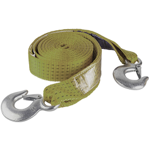
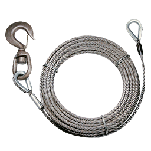

# Бездоріжжя

На **болотах, піску, глибокому ґрунті** та в інших м’яких поверхнях машина **просідає** і може **заглибнути** — особливо в північних болотах біля Zancudo. Звичайний розгін часто не допоможе.

## Як це працює

| Фактор | Ефект |
| --- | --- |
| М’яка поверхня | Колеса втрачають зчеплення, авто **тоне** в ґрунті |
| Швидкість | На слизькому ґрунті легше **заносить** |
| Тип авто | **Позашляховики** та шини **off-road** проходять легше |
| Повний привід (4WD) | Краще тягне на м’якому ґрунті |


На асфальті в місті ця механіка **не діє** — лише на реальному бездоріжжі поза дорогами.


## Якщо застрягли

| Інструмент | Що потрібно |
| --- | --- |
|  **Трос** | **Друге авто** поруч (евакуатор, пікап, позашляховик) — лише між двома машинами |
|  **Лебідка** | **Самостійно** — зачепитися за **дерево** або іншу міцну точку; або друге авто, якщо хтось приїхав на допомогу |


 **Лебідка** — найзручніший варіант, коли ніхто не прибув: можна витягнути авто **одному**, якщо поруч є дерево чи інший надійний об’єкт для кріплення. До **відкритої землі** прив’язати не вийде.


## Трос і лебідка

Купити в **YouTool**  (див. [Магазини](../basics/shops.md)).

| Предмет | Ціна | Дистанція |
| --- | --- | --- |
|  Буксирувальний трос | **~10 000$** | до **10 м** |
|  Лебідка автомобільна | **~15 000$** | до **90 м** |

### Як використати

1. `Tab` → знайдіть предмет у [інвентарі](../character/inventory.md).
2. **ПКМ**  → **Використати** (потрібно бути **поза** транспортом).
3. Далі — за підказками на екрані (`E` для кріплення, `Shift` для лебідки тощо).

### Буксирувальний трос

Коротке буксирування **між двома авто**.

1. Підійдіть до **тягну** → **`E`** — закріпити трос.
2. Підійдіть до **застряглого** авто → **`E`** — прив’язати.
3. Тягніть повільно. Якщо в буксируваному авто **немає водія** — воно само гальмує та тримає курс.
4. Від’єднати: **утримуйте `E`** біля з’єднання **~3 сек**.
5. Скасувати: **`X`**.

### Лебідка автомобільна

Витягування на **великій відстані** (до **90 м**) — зручніше з болота, ніж трос.

#### Самостійно (через дерево)

Якщо допомоги немає — зачепіться за **дерево** або іншу міцну точку:

1. Підійдіть до **застряглого** авто → **`E`** — закріпити лебідку.
2. Підійдіть до **дерева** (або іншого надійного об’єкта) → **`E`** — прив’язати другий кінець.
3. **Утримуйте лівий `Shift`** — витягування; **відпустіть** — зупинити.
4. Від’єднати: **утримуйте `E`** біля з’єднання **~3 сек**.

#### Між двома авто

Якщо хтось приїхав на допомогу:

1. Закріпіть на **тягну** та **застряглому** авто (**`E`** за підказкою).
2. **Утримуйте лівий `Shift`** — тягнути; **відпустіть** — зупинити.
3. Від’єднати: **утримуйте `E`** **~3 сек**.


Підказка **«Занадто далеко»** — під’їдьте ближче. У болоті зазвичай зручніша **лебідка** (90 м), трос — лише коли машини вже поруч (10 м). Поїзди та деякі типи ТЗ не буксируються.


## Поради

- На болоті їдьте повільно — краще не застрягти, ніж витягувати.
- Тримайте  **лебідку** в авто — на бездоріжжі вона часто рятує, коли ніхто не відповідає на виклик.
- Немає дерева поруч — викличте [механіка](../jobs/mechanic.md) або друга з другим авто та тросом.
- Off-road шини та 4WD — найкраща профілактика.
