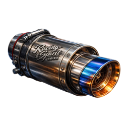
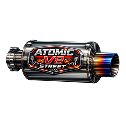
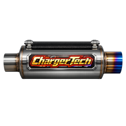
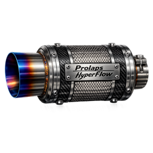
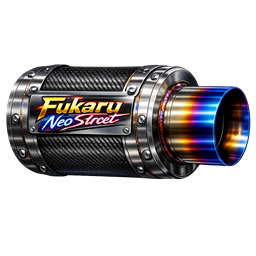
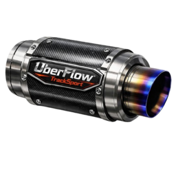
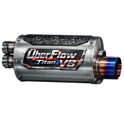
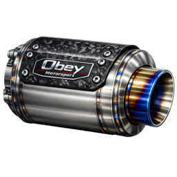

# Тюнінг

На CrimeLand **справжній тюнінг** — не фарба в Customs, а **кастомні апгрейди** через майстерню: Stage ECU, swap мотора, привід, дрифт-пакет, вихлоп, нітро. Усе це ставить **механік** з планшетом — ви обираєте збірку, він встановлює деталі й виставляє рахунок.

***

## Кастомний тюнінг — як це працює

### Де робити

| Майстерня   | Бліп                                  | Що це                           |
| ----------- | ------------------------------------- | ------------------------------- |
| **Benny's** |  | Головна СТО LS, Strawberry      |
| **Beeker**  |  | Північ, Paleto Bay              |
| **SGC**     | службова                              | Аеропорт — за домовленістю / RP |

У **Customs**  (доки, марина, Sandy) — лише **косметика й фарба**. Stage, swap і дрифт — **тільки тут**.

### Сценарій для власника авто

1. Зателефонуйте механіку (**«Послуги»** у [телефоні](../basics/phone.md)) або приїдьте в  Benny's / Beeker IC.
2. Заїдьте на **підйомник** / у зону бай.
3. Опишіть **мету** — механік підбере деталі. Приклади **окремих** збірок (не змішуйте дріфт з іншим тюнінгом):
   * [Дріфт](drift.md) → **лише дрифт-пакет** (Stage, swap, привід тощо не потрібні)
   * Швидкість → «Stage 2 + турбо»
   * Звук JDM → **або** swap **2GT-JDM**, **або** вихлоп Fukaru (разом не ставте — вихлоп перекриє звук мотора)
4. Механік підключає авто в **планшеті** → оформлює **замовлення** → встановлює деталі (міні-гра / прогрес).
5. Ви **оплачуєте рахунок** — зміни зберігаються на авто назавжди (поки не знімете в СТО).


У планшеті видно, **що підходить саме вашій моделі**. Сірий / недоступний пункт = обмеження по авто (донат-кар, вантажівка, електромобіль тощо).


### Планшет механіка — розділи

| Розділ                   | Для чого                                                    |
| ------------------------ | ----------------------------------------------------------- |
| **Тюнінг**               | Stage, двигун, привід, шини, гальма, вихлоп, дрифт, коробка |
| **Нітро**                | Встановлення системи та заправка балонів                    |
| **Обслуговування**       | Знос масла, гальм, підвіски — % по пробігу                  |
| **Динамометр**           | Замір **к.с.** і **Нм** після збірки                        |
| **Замовлення / Рахунки** | Робота з клієнтом і оплата                                  |

Відкриття: `Tab` → предмет **Планшет механіка** →  **Використати**. Детальніше — [робота механіка](../jobs/mechanic.md).

***

## Каталог кастомних апгрейдів

Усі пункти нижче — **лише через майстерню**. Деталі механік бере в **магазині Benny's**; монтаж оплачується **окремо** за рахунком у планшеті.

### Stage ECU — чіп-потужність без swap

Електронні модулі, що знімають обмежувачі й підкручують софт двигуна. **Не ставляться** на частину донат- та гіперкарів.

Головний ефект — **приріст максимальної швидкості** (і тяги) відносно заводських показників:

| Рівень      | Іконка                                                                | Приріст швидкості | Що дає (RP)                                  | Ціна деталі в Benny's\* |
| ----------- | --------------------------------------------------------------------- | ----------------- | -------------------------------------------- | ----------------------- |
| **Stage 1** |  | **+5%**           | Вуличний ECU: м'якший лімітер, живіша педаль | **100 000$**            |
| **Stage 2** |  | **+10%**          | Спортивна прошивка, інша логіка передач      | **1 000 000$**          |
| **Stage 3** |  | **+15%**          | Трековий софт, максимум із штатного мотора   | за наявністю на складі† |

\*Ціна **комплектуючої** з вітрини магазину Benny's (розділ «Кастомний тюнінг»). **+ робота механіка** в рахунку планшета.

†Stage 3 рідше буває на полиці — уточнюйте у механіка IC.

**Кому підходить:** щоденка, перші [гонки](racing.md), коли не хочете міняти мотор цілком. Stage **не сумуються** — ставиться один найвищий доступний рівень.

***

### Заміна двигуна (Engine Swap)

Повна заміна мотора — **інший звук, інша тяга, інший характер** авто.

| Мотор       | Іконка                                                                   | Для кого                                        | Ціна деталі в Benny's\* |
| ----------- | ------------------------------------------------------------------------ | ----------------------------------------------- | ----------------------- |
| **2GT-JDM** |     | Авто з топом **< \~330 км/год**; культовий звук | за наявністю на складі† |
| **V6 3.3L** |  | Базові та середні авто **< \~270 км/год**       | **500 000$**            |

\*Деталь з магазину + робота механіка окремо. †2GT-JDM — рідкісна поставка, ціна за домовленістю з СТО.


Swap **не ставиться** на всі моделі: донат-пак, гіперкари, вантажівки та тягачі в чорному списку. Механік побачить це в планшеті до оплати.



Якщо пізніше поставите **вихлоп** — його звук **замінить** звук swap-мотора. Для 2JZ обирайте **або** двигун, **або** вихлоп, щоб не переплатити за те, що не почуєте.


***

### Привід — AWD / RWD / FWD

Зміна того, **які колеса крутять**. Критично для [дріфту](drift.md).

| Тип                | Іконка                                                                        | Навіщо                             | Ціна деталі в Benny's |
| ------------------ | ----------------------------------------------------------------------------- | ---------------------------------- | --------------------- |
| **Задній (RWD)**   |  | Занос, «бендитський» стиль, погоня | **50 000$**           |
| **Повний (AWD)**   |  | Старт з місця, погоня по мокрому   | **500 000$**          |
| **Передній (FWD)** |  | Економ, місто, FWD-змагання        | **50 000$**           |

* робота механіка в рахунку планшета.

***

### Дрифт-пакет

&#x20;**Набір для тюнінгу дрифту** — окремий **handling-профіль** під довгий занос на [дріфт-майданчику](drift.md): кут керма, тяга, зчеплення, баланс. **Окремий привід ставити не потрібно** — пакет сам переводить авто на задній привід, навіть якщо раніше стояв AWD або FWD.

| Параметр              | Значення                              |
| --------------------- | ------------------------------------- |
| Ціна деталі в Benny's | **300 000$**                          |
| + робота механіка     | окремо в рахунку                      |
| Не для                | Вантажівки, тягачі, робочий транспорт |


**Дрифт-пакет повністю замінює характеристики керування** — після встановлення авто їде за **профілем дріфту**, а не за сумою попередніх апгрейдів.

**Stage, swap, привід, шини, турбо та інший performance-тюнінг не впливають на поведінку**, поки стоїть дрифт-пакет. Деталі лишаються в історії авто, але **не додають ефекту**.

Не переплачуйте за **RWD / AWD / FWD** перед дріфтом — для [дріфт-зони](drift.md) достатньо **лише дрифт-пакета**. Щоб знову відчути Stage, swap або свій привід — **зніміть дрифт-пакет** у майстерні.


***

### Турбо, гальма, шини

| Категорія            | Іконка                                                                        | Ефект                                         | Ціна деталі в Benny's |
| -------------------- | ----------------------------------------------------------------------------- | --------------------------------------------- | --------------------- |
| **Турбонаддув**      |    | Класичне турбо GTA + приріст тяги             | **100 000$**          |
| **Керамічні гальма** |  | Сильніше гальмування під навантаженням        | **75 000$**           |
| **Спортивні шини**   |     | Максимум зчеплення на сухому                  | **200 000$**          |
| Напівспортивні       | semi-slick                                                                    | Баланс дорога / трек                          | **20 000$**           |
| Зимові / offroad     | offroad                                                                       | Краще на бездоріжжі ([off-road](off-road.md)) | **25 000$**           |

* робота механіка на кожну позицію.

***

### Вихлоп — звук і характер

Окремі **звукові пакети** — авто починає **ревіти по-іншому**. Вибір у планшеті:

| Назва                    | Іконка                                                                       | Стиль                        |
| ------------------------ | ---------------------------------------------------------------------------- | ---------------------------- |
| Fukaru TurboSport        |      | JDM-турбо, свист             |
| Atomic V8 Street         |     | Американський V8, бас        |
| ChargerTech Supercharged |  | Компресорний рев             |
| Prolaps HyperFlow W16    |          | Гіперкар, високі оберти      |
| Fukaru NeoStreet         |       | Сучасний JDM                 |
| ÜberFlow TrackSport      |   | Crackle при відпусканні газу |
| ÜberFlow Titan V8        |         | Європейський V8              |
| Obey Motorsport Race     |      | Агресивний гоночний Obey     |

Ціна залежить від конкретного вихлопа в каталозі майстерні — часто це **найдешевший** спосіб змінити звук авто.


**Вихлоп перекриває звук двигуна** — якщо на авто вже стоїть swap (2GT-JDM, V6 тощо), після встановлення вихлопу чути буде **лише звук вихлопа**, а не мотора. Обирайте **один** варіант під звук або знімайте зайве в майстерні.


***

### Ручна коробка

&#x20;**Ручна коробка** — перемикання передач **самостійно** — для тих, хто любить контроль. Деталь + робота механіка. Потребує звички; на довгих змінах [тракера](../jobs/trucker.md) зазвичай залишають автомат.

***

### Stance, неон і «візуал у СТО»

У майстерні (не в Customs!) також доступні:

| Категорія          | Що дає                              |
| ------------------ | ----------------------------------- |
| **Stance**         | Висота підвіски, camber, колія      |
| **Неон / дим шин** | Підсвітка, кольоровий дим           |
| **Косметика GTA**  | Спойлери, бампери, екстри           |
| **Фарба / диски**  | Повний візуал без поїздки в Customs |

Зручно зібрати **один візит** — і потужність, і вигляд.

***

### Нітро

| Крок            | Іконка                                                                             | Дія                                           | Ціна деталі в Benny's |
| --------------- | ---------------------------------------------------------------------------------- | --------------------------------------------- | --------------------- |
| 1. Встановлення |  | Комплект нітро (механік, один раз)            | **500 000$**          |
| 2. Заправка     |       | Балон — до **3 шт.** на авто                  | **50 000$** / шт.     |
| 3. У дорозі     | —                                                                                  | **`RMENU`** — прискорення \~**10 с** на балон | —                     |

* робота механіка на встановлення системи.

Вночі видно **вогонь з вихлопу** — на публічних дорогах це привід до уваги [поліції](../police/radar-scanner.md).

***

## Готові збірки — що замовити механіку

| Стиль                 | Рекомендований набір                                                               |
| --------------------- | ---------------------------------------------------------------------------------- |
| **Дріфт**             | **Лише дрифт-пакет** — привід і інший performance-тюнінг на поведінку не впливають |
| **Вулична швидкість** | Stage 1 (**+5%**) або 2 (**+10%**) + турбо + керамічні гальма                      |
| **Трек / погоня**     | Stage 3 (**+15%**) + спортивні шини + гальма; за бюджетом — swap                   |
| **JDM-звук**          | **Або** 2GT-JDM (swap), **або** Fukaru-вихлоп — не обидва                          |
| **Щоденка**           | Stage 1 + фарба в Customs — дешево й помітно                                       |
| **Шоу-кар**           | Stance + неон + вихлоп UberFlow / Obey Race                                        |

Після збірки попросіть **тест на динамометрі** — побачите к.с. і Нм до/після.


Перед продажем на [ринку](market.md) зробіть **повне ТО + динамо-протокол** — покупець платить більше за прозору історію.


***

## Обмеження — читайте до оплати

| Ситуація                     | Що буде                                                                                                         |
| ---------------------------- | --------------------------------------------------------------------------------------------------------------- |
| Донат / ексклюзивне авто     | Частина Stage і swap **недоступна**                                                                             |
| Вантажівка, тягач            | Немає дрифту, обмежений вихлоп                                                                                  |
| **Електромобіль**            | Swap і турбо для ДВЗ не підходять — свої EV-деталі                                                              |
| Кілька Stage одночасно       | Не ставляться — лише **один** рівень (1 → 2 → 3)                                                                |
| **Дрифт-пакет встановлений** | Поведінка = **лише профіль дріфту** (включно з RWD); привід, Stage, swap, шини, турбо **не змінюють** керування |

Якщо механік каже «на цю машину не ляже» — це не відмова RP, а **чорний список моделі** в системі.

***

## Косметика без механіка (Customs)

Швидкий візуал без очікування майстра — бліп :

| Локація   | Доки LS · Марина · Sandy Shores                  |
| --------- | ------------------------------------------------ |
| Дія       | **`E`** → «Налаштувати транспортний засіб»       |
| Доступно  | Ремонт, косметика, фарба, диски, фари            |
| **Немає** | Stage, swap, дрифт, stance, неон, продуктивність |

***

## Знос і ТО

Деталі **зношуються від пробігу** і зберігаються на авто. Перевірити стан може **механік** у планшеті (розділ **Обслуговування**) — ви побачите % перед оплатою ТО.

### Як читати відсотки

| Ситуація                  | Що означає                                                              |
| ------------------------- | ----------------------------------------------------------------------- |
| **100% → поріг**          | Деталь ще **не впливає** на їзду — авто їде як після ТО                 |
| **Нижче порогу**          | Ефект **наростає лінійно**: чим менше %, тим гірше відчувається в кермі |
| **0%**                    | Максимальна деградація по цій деталі                                    |
| **Будь-яка деталь ≤ 20%** | Система попереджає: **«Скоро потрібно обслужити транспортний засіб»**   |

У планшеті кольори: **зелений** ≥ 70% · **жовтий** 40–69% · **червоний** < 40%.


**Масло + повітряний фільтр** (бензин/дизель) і **охолоджувач + електродвигун** (EV) рахуються **парою** — на тягу й максималку впливає **гірша** з двох деталей у парі.


### Бензин / дизель (ДВЗ)

|                                                                                     | Деталь                 | Впливає на                                    | Деградація з | \~Знос     | Запчастина                | К-сть |
| ----------------------------------------------------------------------------------- | ---------------------- | --------------------------------------------- | ------------ | ---------- | ------------------------- | ----- |
|            | **Моторне масло**      | Тяга, максимальна швидкість, звук мотора      | **< 20%**    | \~700 км   | Моторне масло             | **1** |
|            | **Повітряний фільтр**  | Тяга, максимальна швидкість (разом із маслом) | **< 20%**    | \~1 250 км | Повітряний фільтр         | **1** |
|            | **Свічки запалювання** | Розгін, відгук педалі                         | **< 45%**    | \~3 750 км | Свічка запалювання        | **4** |
|    | **Зчеплення**          | Швидкість перемикання передач                 | **< 55%**    | \~7 500 км | Заміна зчеплення          | **1** |
|  | **Гальмівні колодки**  | Сила гальмування, гальмівний шлях             | **< 60%**    | \~3 750 км | Заміна гальмівних колодок | **4** |
|      | **Підвіска**           | Стабільність, крени, жорсткість ходової       | **< 60%**    | \~6 250 км | Деталі підвіски           | **1** |
|      | **Шини**               | Зчеплення, керованість, занос                 | **< 50%**    | \~1 250 км | Заміна шин                | **4** |

### Електромобілі (EV)

|                                                                                     | Деталь                        | Впливає на                                 | Деградація з | \~Знос      | Запчастина                | К-сть |
| ----------------------------------------------------------------------------------- | ----------------------------- | ------------------------------------------ | ------------ | ----------- | ------------------------- | ----- |
|            | **Охолоджувач електромобіля** | Тяга, максималка (разом із електромотором) | **< 20%**    | \~7 500 км  | Охолоджувач електромобіля | **1** |
|              | **Електродвигун**             | Тяга, максималка (разом із охолоджувачем)  | **< 20%**    | \~25 000 км | Електродвигун             | **1** |
|            | **Акумулятор електромобіля**  | Розгін, відгук педалі                      | **< 45%**    | \~15 625 км | Акумулятор електромобіля  | **1** |
|  | **Гальмівні колодки**         | Гальмування                                | **< 60%**    | \~3 750 км  | Заміна гальмівних колодок | **4** |
|      | **Підвіска**                  | Стабільність, крени                        | **< 60%**    | \~6 250 км  | Деталі підвіски           | **1** |
|      | **Шини**                      | Зчеплення                                  | **< 50%**    | \~1 250 км  | Заміна шин                | **4** |

### Як зробити ТО

1. Приїдьте в  Benny's / Beeker — авто на підйомник.
2. Механік відкриває **планшет** → **Обслуговування** → бачить % по кожній деталі.
3. Встановлює потрібні запчастини зі складу — після заміни деталь знову **100%**.
4. Оплачуєте рахунок (деталі + робота).

Запчастини для ТО — розділ **«Сервіс»** у магазині Benny's або [24/7](../business/twenty-four-seven.md). Орієнтовні ціни деталей: масло **5 000$** · фільтр **2 000$** · шина (1 шт.) **2 500$** · колодки (1 шт.) **3 750$** · підвіска **10 000$** · зчеплення **15 000$** · свічка **1 750$**.

***

## Ремонт у полі

|                                                                                 | Предмет                 | Ефект                                                        |
| ------------------------------------------------------------------------------- | ----------------------- | ------------------------------------------------------------ |
|        | **Ремонтний набір**     | Ремонт кузова й мотора — **шини не відновлює**               |
|  | **Заміна шин**          | Пробиті колеса: вийдіть з авто → підійдіть до шини → **`E`** |
|         | **Клейка стрічка**      | Тимчасово підняти мотор — **лише доїхати** до СТО            |
|      | **Комплект для чистки** | Миття без мийки                                              |

Кастомний тюнінг стрічкою не полагодиш — тільки в майстерні.

***

## Службовий транспорт

Поліція / EMS ремонтують на **службових точках** , не в Benny's.

***

## Пов’язані гайди

* [Автомайстерня (бізнес)](../business/auto-repair-shop.md)
* [Робота механіка](../jobs/mechanic.md)
* [Дріфт](drift.md)
* [Гонки](racing.md)
* [Автосалони](dealerships.md)
