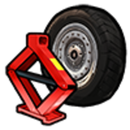

# Тюнінг і обслуговування

На CrimeLand **справжній тюнінг** — не фарба в Customs, а **кастомні апгрейди** через майстерню: Stage ECU, swap мотора, привід, дрифт-пакет, вихлоп, нітро. Усе це ставить **механік** з планшетом — ви обираєте збірку, він встановлює деталі й виставляє рахунок.

---

## Кастомний тюнінг — як це працює

### Де робити

| Майстерня | Бліп | Що це |
| --- | --- | --- |
| **Benny's** |  | Головна СТО LS, Strawberry |
| **Beeker** |  | Північ, Paleto Bay |
| **SGC** | службова | Аеропорт — за домовленістю / RP |

У **Customs**  (доки, марина, Sandy) — лише **косметика й фарба**. Stage, swap і дрифт — **тільки тут**.

### Сценарій для власника авто

1. Зателефонуйте механіку (**«Послуги»** у [телефоні](../basics/phone.md)) або приїдьте в  Benny's / Beeker IC.
2. Заїдьте на **підйомник** / у зону бай.
3. Опишіть **збірку**: «Stage 2 + RWD + дрифт», «2JZ + турбо», «тільки вихлоп Obey».
4. Механік підключає авто в  **планшеті** → оформляє **замовлення** → встановлює деталі (міні-гра / прогрес).
5. Ви **оплачуєте рахунок** — зміни зберігаються на авто назавжди (поки не знімете в СТО).


У планшеті видно, **що підходить саме вашій моделі**. Сірий / недоступний пункт = обмеження по авто (донат-кар, вантажівка, електромобіль тощо).


### Планшет механіка — розділи

| Розділ | Для чого |
| --- | --- |
| **Тюнінг** | Stage, двигун, привід, шини, гальма, вихлоп, дрифт, коробка |
| **Нітро** | Встановлення системи та заправка балонів |
| **Обслуговування** | Знос масла, гальм, підвіски — % по пробігу |
| **Динамометр** | Замір **к.с.** і **Нм** після збірки |
| **Замовлення / Рахунки** | Робота з клієнтом і оплата |

Відкриття: `Tab` →  →  **Використати**. Детальніше — [робота механіка](../jobs/mechanic.md).

---

## Каталог кастомних апгрейдів

Усі пункти нижче — **лише через майстерню**. Механік купує/бере деталь зі складу Benny's і ставить на ваше авто.

### Stage ECU — чіп-потужність без swap

Електронні модулі, що знімають обмежувачі й підкручують софт двигуна. **Не ставляться** на частину донат- та гіперкарів.

| Рівень | Предмет | Ефект (RP) | Орієнтир ціни деталі* |
| --- | --- | --- | --- |
| **Stage 1** | 

 Вуличний модуль ECU | Знімає лімітер, оживляє відгук педалі | ~**20 000$** |
| **Stage 2** | 

 Спортивний модуль ECU | Сильніший приріст, інша логіка передач | ~**30 000$** |
| **Stage 3** | 

 Трековий модуль ECU | Максимум із заводського мотора | ~**100 000$** |

\*Ціна **запчастини** для майстерні; у вашому рахунку ще буде робота та націнка СТО.

**Кому підходить:** щоденка, перші [гонки](racing.md), коли не хочете міняти мотор цілком.

---

### Заміна двигуна (Engine Swap)

Повна заміна мотора — **інший звук, інша тяга, інший характер** авто.

| Мотор | Предмет | Для кого | Орієнтир* |
| --- | --- | --- | --- |
| **2GT-JDM** | 

 Легендарний JDM-блок | Авто з топом **&lt; ~330 км/год**; культовий звук | ~**100 000$** |
| **V6 3.3L** | 

 Затюнений V6 | Базові та середні авто **&lt; ~270 км/год** | ~**30 000$** |


Swap **не ставиться** на всі моделі: донат-пак, гіперкари, вантажівки та тягачі в чорному списку. Механік побачить це в планшеті до оплати.


---

### Привід — AWD / RWD / FWD

Зміна того, **які колеса крутять**. Критично для [дріфту](drift.md).

| Тип | Предмет | Навіщо |
| --- | --- | --- |
| **Задній (RWD)** | 

 | Дріфт, занос, «бендитський» стиль |
| **Повний (AWD)** | 

 | Старт з місця, погоня по мокрому |
| **Передній (FWD)** | 

 | Економ, місто, FWD-змагання |

Орієнтир деталі: ~**10 000$** кожен.

---

### Дрифт-пакет

Спеціальний **handling-пакет** під довгий занос: більший кут керма, налаштоване зчеплення. Ставиться **разом із RWD** на [дріфт-майданчик](drift.md).

| Параметр | Значення |
| --- | --- |
| Орієнтир деталі | ~**50 000$** |
| Не для | Вантажівки, тягачі, робочий транспорт |

---

### Турбо, гальма, шини

| Категорія | Предмет | Ефект |
| --- | --- | --- |
| **Турбонаддув** | 

 | Класичне турбо GTA + приріст тяги |
| **Керамічні гальма** | 

 | Сильніше гальмування під навантаженням |
| **Спортивні шини** | 

 | Максимум зчеплення на сухому |
| Напівспортивні | semi-slick | Баланс дорога / трек |
| Зимові / offroad | offroad | Краще на бездоріжжі ([off-road](off-road.md)) |

Орієнтир деталей: турбо ~**30 000$**, шини/гальма ~**5 000$**.

---

### Вихлоп — звук і характер

Окремі **звукові пакети** — авто починає **ревіти по-іншому**. Вибір у планшеті:

| Назва | Стиль |
| --- | --- |
| Fukaru TurboSport | JDM-турбо, свист |
| Atomic V8 Street | Американський V8, бас |
| ChargerTech Supercharged | Компресорний рев |
| Prolaps HyperFlow W16 | Гіперкар, високі оберти |
| Fukaru NeoStreet | Сучасний JDM |
| ÜberFlow TrackSport | Crackle при відпусканні газу |
| ÜberFlow Titan V8 | Європейський V8 |
| Obey Motorsport Race | Агресивний гоночний Obey |

Часто це **найдешевший** спосіб змінити враження від авто (~**5 000$** деталь) — ідеально для RP-зустрічей і TikTok.

---

### Ручна коробка

Перемикання передач **самостійно** — для тих, хто любить контроль. Орієнтир ~**10 000$**. Потребує звички; на довгих змінах [тракера](../jobs/trucker.md) зазвичай залишають автомат.

---

### Stance, неон і «візуал у СТО»

У майстерні (не в Customs!) також доступні:

| Категорія | Що дає |
| --- | --- |
| **Stance** | Висота підвіски, camber, колія |
| **Неон / дим шин** | Підсвітка, кольоровий дим |
| **Косметика GTA** | Спойлери, бампери, екстри |
| **Фарба / диски** | Повний візуал без поїздки в Customs |

Зручно зібрати **один візит** — і потужність, і вигляд.

---

### Нітро

| Крок | Предмет / дія |
| --- | --- |
| 1. Встановлення | 

 Комплект нітро (механік, один раз) |
| 2. Заправка | 

 Балон — до **3 шт.** на авто |
| 3. У дорозі | **`RMENU`** — прискорення ~**10 с** на балон |

Вночі видно **вогонь з вихлопу** — на публічних дорогах це привід до уваги [поліції](../police/radar-scanner.md).

---

## Готові збірки — що замовити механіку

| Стиль | Рекомендований набір |
| --- | --- |
| **Дріфт** | RWD + 

 дрифт-пакет + напівспортивні шини |
| **Вулична швидкість** | Stage 1 або 2 + турбо + керамічні гальма |
| **Трек / погоня** | Stage 3 + спортивні шини + гальма; за бюджетом — swap |
| **JDM-звук** | 

 2GT-JDM або Fukaru-вихлоп |
| **Щоденка** | Stage 1 + фарба в Customs — дешево й помітно |
| **Шоу-кар** | Stance + неон + вихлоп UberFlow / Obey Race |

Після збірки попросіть **тест на динамометрі** — побачите к.с. і Нм до/після.


Перед продажем на [ринку](market.md) зробіть **повне ТО + динамо-протокол** — покупець платить більше за прозору історію.


---

## Обмеження — читайте до оплати

| Ситуація | Що буде |
| --- | --- |
| Донат / ексклюзивне авто | Частина Stage і swap **недоступна** |
| Вантажівка, тягач | Немає дрифту, обмежений вихлоп |
| **Електромобіль** | Swap і турбо для ДВЗ не підходять — свої EV-деталі |
| Кілька Stage одночасно | Ставиться **найвищий** актуальний рівень, не дублюйте |

Якщо механік каже «на цю машину не ляже» — це не відмова RP, а **чорний список моделі** в системі.

---

## Косметика без механіка (Customs)

Швидкий візуал без очікування майстра — бліп :

| Локація | Доки LS · Марина · Sandy Shores |
| --- | --- |
| Дія | **`E`** → «Налаштувати транспортний засіб» |
| Доступно | Ремонт, косметика, фарба, диски, фари |
| **Немає** | Stage, swap, дрифт, stance, неон, продуктивність |

---

## Знос і ТО

Деталі **зношуються від пробігу**. У планшеті (розділ **Обслуговування**) — % кожної частини. Нижче **20%** — погіршується керованість.

| Деталь | Орієнтир заміни |
| --- | --- |
| Моторне масло | ~700 км |
| Шини | ~1 250 км |
| Гальма | ~3 750 км |
| Підвіска | ~6 250 км |

Запчастини:  масло,  шини тощо — склад Benny's або [магазин](../business/twenty-four-seven.md).

---

## Ремонт у полі

| Предмет | Ефект |
| --- | --- |
| 

 Ремонтний набір | Повний ремонт кузова |
| 

 Клейка стрічка | Тимчасово підняти мотор — **лише доїхати** до СТО |
| 

 Комплект чистки | Миття без мийки |

Кастомний тюнінг стрічкою не полагодиш — тільки в майстерні.

---

## Службовий транспорт

Поліція / EMS ремонтують на **службових точках** , не в Benny's.

---

## Пов’язані гайди

- [Автомайстерня (бізнес)](../business/auto-repair-shop.md)
- [Робота механіка](../jobs/mechanic.md)
- [Дріфт](drift.md)
- [Гонки](racing.md)
- [Автосалони](dealerships.md)
