# Тюнінг і обслуговування

На CrimeLand **справжній тюнінг** — не фарба в Customs, а **кастомні апгрейди** через майстерню: Stage ECU, swap мотора, привід, дрифт-пакет, вихлоп, нітро. Усе це ставить **механік** з планшетом — ви обираєте збірку, він встановлює деталі й виставляє рахунок.

---

## Кастомний тюнінг — як це працює

### Де робити

| Майстерня | Бліп | Що це |
| --- | --- | --- |
| **Benny's** |  | Головна СТО LS, Strawberry |
| **Beeker** |  | Північ, Paleto Bay |
| **SGC** | службова | Аеропорт — за домовленістю / RP |

У **Customs**  (доки, марина, Sandy) — лише **косметика й фарба**. Stage, swap і дрифт — **тільки тут**.

### Сценарій для власника авто

1. Зателефонуйте механіку (**«Послуги»** у [телефоні](../basics/phone.md)) або приїдьте в  Benny's / Beeker IC.
2. Заїдьте на **підйомник** / у зону бай.
3. Опишіть **збірку**: «RWD + дрифт», «Stage 2 + турбо», «2JZ + вихлоп Fukaru».
4. Механік підключає авто в **планшеті** → оформлює **замовлення** → встановлює деталі (міні-гра / прогрес).
5. Ви **оплачуєте рахунок** — зміни зберігаються на авто назавжди (поки не знімете в СТО).


У планшеті видно, **що підходить саме вашій моделі**. Сірий / недоступний пункт = обмеження по авто (донат-кар, вантажівка, електромобіль тощо).


### Планшет механіка — розділи

| Розділ | Для чого |
| --- | --- |
| **Тюнінг** | Stage, двигун, привід, шини, гальма, вихлоп, дрифт, коробка |
| **Нітро** | Встановлення системи та заправка балонів |
| **Обслуговування** | Знос масла, гальм, підвіски — % по пробігу |
| **Динамометр** | Замір **к.с.** і **Нм** після збірки |
| **Замовлення / Рахунки** | Робота з клієнтом і оплата |

Відкриття: `Tab` → предмет **Планшет механіка** →  **Використати**. Детальніше — [робота механіка](../jobs/mechanic.md).

---

## Каталог кастомних апгрейдів

Усі пункти нижче — **лише через майстерню**. Деталі механік бере в **магазині Benny's**; монтаж оплачується **окремо** за рахунком у планшеті.

### Stage ECU — чіп-потужність без swap

Електронні модулі, що знімають обмежувачі й підкручують софт двигуна. **Не ставляться** на частину донат- та гіперкарів.

Головний ефект — **приріст максимальної швидкості** (і тяги) відносно заводських показників:

| Рівень | Іконка | Приріст швидкості | Що дає (RP) | Ціна деталі в Benny's* |
| --- | --- | --- | --- | --- |
| **Stage 1** | 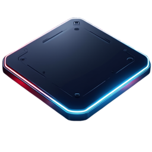 | **+5%** | Вуличний ECU: м'якший лімітер, живіша педаль | **100 000$** |
| **Stage 2** |  | **+10%** | Спортивна прошивка, інша логіка передач | **1 000 000$** |
| **Stage 3** | 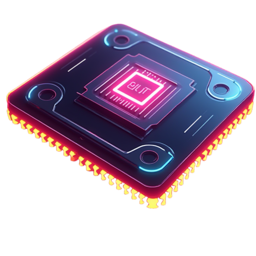 | **+15%** | Трековий софт, максимум із штатного мотора | за наявністю на складі† |

\*Ціна **комплектуючої** з вітрини магазину Benny's (розділ «Кастомний тюнінг»). **+ робота механіка** в рахунку планшета.

†Stage 3 рідше буває на полиці — уточнюйте у механіка IC.

**Кому підходить:** щоденка, перші [гонки](racing.md), коли не хочете міняти мотор цілком. Stage **не сумуються** — ставиться один найвищий доступний рівень.

---

### Заміна двигуна (Engine Swap)

Повна заміна мотора — **інший звук, інша тяга, інший характер** авто.

| Мотор | Іконка | Для кого | Ціна деталі в Benny's* |
| --- | --- | --- | --- |
| **2GT-JDM** | 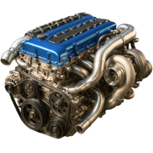 | Авто з топом **&lt; ~330 км/год**; культовий звук | за наявністю на складі† |
| **V6 3.3L** | 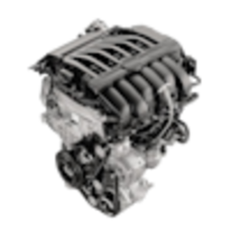 | Базові та середні авто **&lt; ~270 км/год** | **500 000$** |

\*Деталь з магазину + робота механіка окремо. †2GT-JDM — рідкісна поставка, ціна за домовленістю з СТО.


Swap **не ставиться** на всі моделі: донат-пак, гіперкари, вантажівки та тягачі в чорному списку. Механік побачить це в планшеті до оплати.


---

### Привід — AWD / RWD / FWD

Зміна того, **які колеса крутять**. Критично для [дріфту](drift.md).

| Тип | Іконка | Навіщо | Ціна деталі в Benny's |
| --- | --- | --- | --- |
| **Задній (RWD)** | 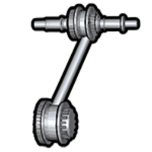 | Дріфт, занос, «бендитський» стиль | **50 000$** |
| **Повний (AWD)** | 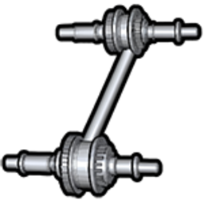 | Старт з місця, погоня по мокрому | **50 000$** |
| **Передній (FWD)** | 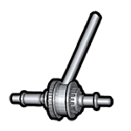 | Економ, місто, FWD-змагання | **50 000$** |

+ робота механіка в рахунку планшета.

---

### Дрифт-пакет

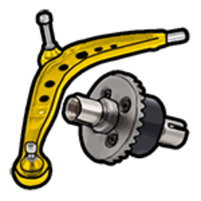 **Набір для тюнінгу дрифту** — окремий **handling-профіль** під довгий занос: кут керма, тяга, зчеплення, баланс — усе під дріфт. Ставиться **разом із RWD** на [дріфт-майданчик](drift.md).

| Параметр | Значення |
| --- | --- |
| Ціна деталі в Benny's | **300 000$** |
| + робота механіка | окремо в рахунку |
| Не для | Вантажівки, тягачі, робочий транспорт |


**Дрифт-пакет повністю замінює характеристики керування** — після встановлення авто їде за **профілем дріфту**, а не за сумою попередніх апгрейдів.

**Stage, swap двигуна, шини, турбо та інший performance-тюнінг не впливають на поведінку**, поки на авто стоїть дрифт-пакет. Деталі лишаються в історії авто, але **не додають ефекту** до заносу й керованості.

Не витрачайте бюджет на Stage перед дріфтом — для [дріфт-зони](drift.md) достатньо **RWD + дрифт-пакет**. Щоб знову відчути Stage або swap — **зніміть дрифт-пакет** у майстерні.


---

### Турбо, гальма, шини

| Категорія | Іконка | Ефект | Ціна деталі в Benny's |
| --- | --- | --- | --- |
| **Турбонаддув** | 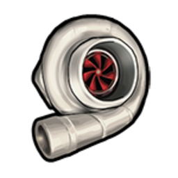 | Класичне турбо GTA + приріст тяги | **100 000$** |
| **Керамічні гальма** | 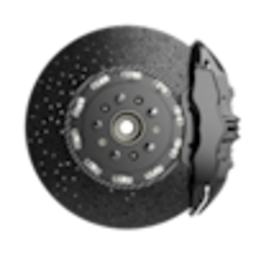 | Сильніше гальмування під навантаженням | **75 000$** |
| **Спортивні шини** | 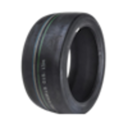 | Максимум зчеплення на сухому | **200 000$** |
| Напівспортивні | semi-slick | Баланс дорога / трек | **20 000$** |
| Зимові / offroad | offroad | Краще на бездоріжжі ([off-road](off-road.md)) | **25 000$** |

+ робота механіка на кожну позицію.

---

### Вихлоп — звук і характер

Окремі **звукові пакети** — авто починає **ревіти по-іншому**. Вибір у планшеті:

| Назва | Стиль |
| --- | --- |
| Fukaru TurboSport | JDM-турбо, свист |
| Atomic V8 Street | Американський V8, бас |
| ChargerTech Supercharged | Компресорний рев |
| Prolaps HyperFlow W16 | Гіперкар, високі оберти |
| Fukaru NeoStreet | Сучасний JDM |
| ÜberFlow TrackSport | Crackle при відпусканні газу |
| ÜberFlow Titan V8 | Європейський V8 |
| Obey Motorsport Race | Агресивний гоночний Obey |

Ціна залежить від конкретного вихлопа в каталозі майстерні — часто це **найдешевший** спосіб змінити звук авто. Ідеально для RP-зустрічей і TikTok.

---

### Ручна коробка

 **Ручна коробка** — перемикання передач **самостійно** — для тих, хто любить контроль. Деталь + робота механіка. Потребує звички; на довгих змінах [тракера](../jobs/trucker.md) зазвичай залишають автомат.

---

### Stance, неон і «візуал у СТО»

У майстерні (не в Customs!) також доступні:

| Категорія | Що дає |
| --- | --- |
| **Stance** | Висота підвіски, camber, колія |
| **Неон / дим шин** | Підсвітка, кольоровий дим |
| **Косметика GTA** | Спойлери, бампери, екстри |
| **Фарба / диски** | Повний візуал без поїздки в Customs |

Зручно зібрати **один візит** — і потужність, і вигляд.

---

### Нітро

| Крок | Іконка | Дія | Ціна деталі в Benny's |
| --- | --- | --- | --- |
| 1. Встановлення | 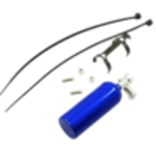 | Комплект нітро (механік, один раз) | **500 000$** |
| 2. Заправка | 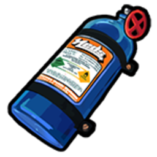 | Балон — до **3 шт.** на авто | **50 000$** / шт. |
| 3. У дорозі | — | **`RMENU`** — прискорення ~**10 с** на балон | — |

+ робота механіка на встановлення системи.

Вночі видно **вогонь з вихлопу** — на публічних дорогах це привід до уваги [поліції](../police/radar-scanner.md).

---

## Готові збірки — що замовити механіку

| Стиль | Рекомендований набір |
| --- | --- |
| **Дріфт** | **RWD + дрифт-пакет** — інший performance-тюнінг на поведінку не впливає |
| **Вулична швидкість** | Stage 1 (**+5%**) або 2 (**+10%**) + турбо + керамічні гальма |
| **Трек / погоня** | Stage 3 (**+15%**) + спортивні шини + гальма; за бюджетом — swap |
| **JDM-звук** | 2GT-JDM або Fukaru-вихлоп |
| **Щоденка** | Stage 1 + фарба в Customs — дешево й помітно |
| **Шоу-кар** | Stance + неон + вихлоп UberFlow / Obey Race |

Після збірки попросіть **тест на динамометрі** — побачите к.с. і Нм до/після.


Перед продажем на [ринку](market.md) зробіть **повне ТО + динамо-протокол** — покупець платить більше за прозору історію.


---

## Обмеження — читайте до оплати

| Ситуація | Що буде |
| --- | --- |
| Донат / ексклюзивне авто | Частина Stage і swap **недоступна** |
| Вантажівка, тягач | Немає дрифту, обмежений вихлоп |
| **Електромобіль** | Swap і турбо для ДВЗ не підходять — свої EV-деталі |
| Кілька Stage одночасно | Не ставляться — лише **один** рівень (1 → 2 → 3) |
| **Дрифт-пакет встановлений** | Поведінка авто = **лише профіль дріфту**; Stage, swap, шини, турбо **не змінюють** керування |

Якщо механік каже «на цю машину не ляже» — це не відмова RP, а **чорний список моделі** в системі.

---

## Косметика без механіка (Customs)

Швидкий візуал без очікування майстра — бліп :

| Локація | Доки LS · Марина · Sandy Shores |
| --- | --- |
| Дія | **`E`** → «Налаштувати транспортний засіб» |
| Доступно | Ремонт, косметика, фарба, диски, фари |
| **Немає** | Stage, swap, дрифт, stance, неон, продуктивність |

---

## Знос і ТО

Деталі **зношуються від пробігу** і зберігаються на авто. Перевірити стан може **механік** у планшеті (розділ **Обслуговування**) — ви побачите % перед оплатою ТО.

### Як читати відсотки

| Ситуація | Що означає |
| --- | --- |
| **100% → поріг** | Деталь ще **не впливає** на їзду — авто їде як після ТО |
| **Нижче порогу** | Ефект **наростає лінійно**: чим менше %, тим гірше відчувається в кермі |
| **0%** | Максимальна деградація по цій деталі |
| **Будь-яка деталь ≤ 20%** | Система попереджає: **«Скоро потрібно обслужити транспортний засіб»** |

У планшеті кольори: **зелений** ≥ 70% · **жовтий** 40–69% · **червоний** &lt; 40%.


**Масло + повітряний фільтр** (бензин/дизель) і **охолоджувач + електродвигун** (EV) рахуються **парою** — на тягу й максималку впливає **гірша** з двох деталей у парі.


### Бензин / дизель (ДВЗ)

| | Деталь | Впливає на | Деградація з | ~Знос | Запчастина | К-сть |
| --- | --- | --- | --- | --- | --- | --- |
|  | **Моторне масло** | Тяга, максимальна швидкість, звук мотора | **&lt; 20%** | ~700 км | Моторне масло | **1** |
|  | **Повітряний фільтр** | Тяга, максимальна швидкість (разом із маслом) | **&lt; 20%** | ~1 250 км | Повітряний фільтр | **1** |
|  | **Свічки запалювання** | Розгін, відгук педалі | **&lt; 45%** | ~3 750 км | Свічка запалювання | **4** |
|  | **Зчеплення** | Швидкість перемикання передач | **&lt; 55%** | ~7 500 км | Заміна зчеплення | **1** |
|  | **Гальмівні колодки** | Сила гальмування, гальмівний шлях | **&lt; 60%** | ~3 750 км | Заміна гальмівних колодок | **4** |
|  | **Підвіска** | Стабільність, крени, жорсткість ходової | **&lt; 60%** | ~6 250 км | Деталі підвіски | **1** |
|  | **Шини** | Зчеплення, керованість, занос | **&lt; 50%** | ~1 250 км | Заміна шин | **4** |

### Електромобілі (EV)

| | Деталь | Впливає на | Деградація з | ~Знос | Запчастина | К-сть |
| --- | --- | --- | --- | --- | --- | --- |
|  | **Охолоджувач електромобіля** | Тяга, максималка (разом із електромотором) | **&lt; 20%** | ~7 500 км | Охолоджувач електромобіля | **1** |
|  | **Електродвигун** | Тяга, максималка (разом із охолоджувачем) | **&lt; 20%** | ~25 000 км | Електродвигун | **1** |
|  | **Акумулятор електромобіля** | Розгін, відгук педалі | **&lt; 45%** | ~15 625 км | Акумулятор електромобіля | **1** |
|  | **Гальмівні колодки** | Гальмування | **&lt; 60%** | ~3 750 км | Заміна гальмівних колодок | **4** |
|  | **Підвіска** | Стабільність, крени | **&lt; 60%** | ~6 250 км | Деталі підвіски | **1** |
|  | **Шини** | Зчеплення | **&lt; 50%** | ~1 250 км | Заміна шин | **4** |

### Як зробити ТО

1. Приїдьте в  Benny's / Beeker — авто на підйомник.
2. Механік відкриває **планшет** → **Обслуговування** → бачить % по кожній деталі.
3. Встановлює потрібні запчастини зі складу — після заміни деталь знову **100%**.
4. Оплачуєте рахунок (деталі + робота).

Запчастини для ТО — розділ **«Сервіс»** у магазині Benny's або [24/7](../business/twenty-four-seven.md). Орієнтовні ціни деталей: масло **5 000$** · фільтр **2 000$** · шина (1 шт.) **2 500$** · колодки (1 шт.) **3 750$** · підвіска **10 000$** · зчеплення **15 000$** · свічка **1 750$**.

---

## Ремонт у полі

| | Предмет | Ефект |
| --- | --- | --- |
| 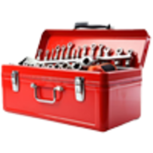 | **Ремонтний набір** | Ремонт кузова й мотора — **шини не відновлює** |
|  | **Заміна шин** | Пробиті колеса: вийдіть з авто → підійдіть до шини → **`E`** |
| 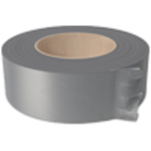 | **Клейка стрічка** | Тимчасово підняти мотор — **лише доїхати** до СТО |
| 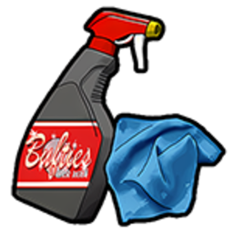 | **Комплект для чистки** | Миття без мийки |

Кастомний тюнінг стрічкою не полагодиш — тільки в майстерні.

---

## Службовий транспорт

Поліція / EMS ремонтують на **службових точках** , не в Benny's.

---

## Пов’язані гайди

- [Автомайстерня (бізнес)](../business/auto-repair-shop.md)
- [Робота механіка](../jobs/mechanic.md)
- [Дріфт](drift.md)
- [Гонки](racing.md)
- [Автосалони](dealerships.md)
